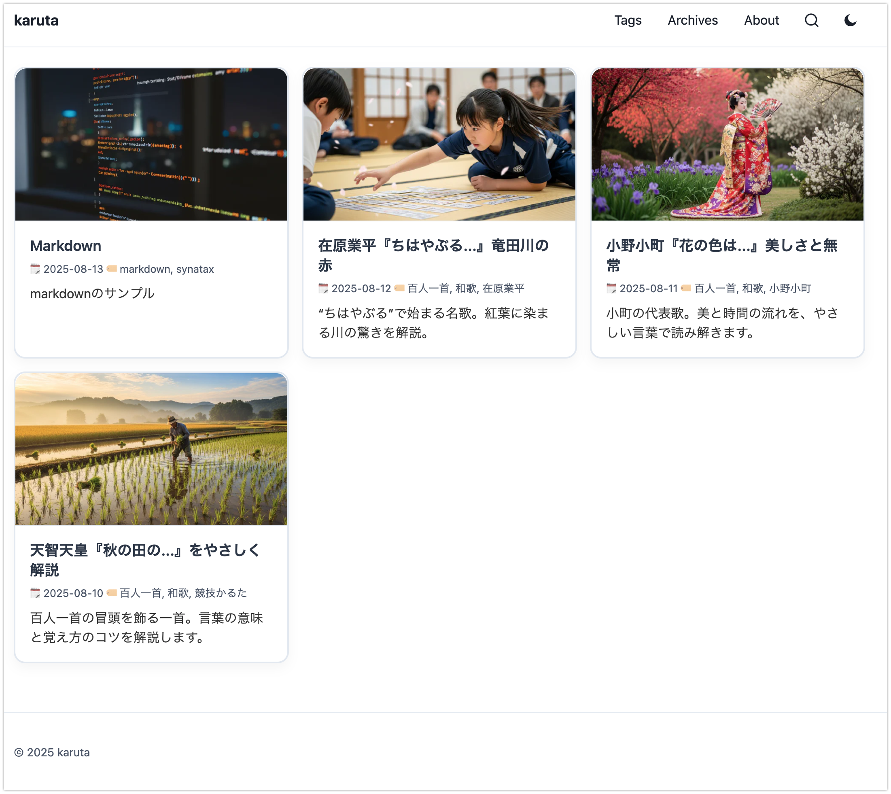

# Hugo Theme: karuta

シンプルで読みやすさ重視の Hugo テーマ「karuta」です。

このリポジトリはテーマ同梱のサンプルサイト構成です（`themes/karuta/` がテーマ本体）。

テーマ名のkarutaはドラマ「ちはやふる めぐり」に感銘を受けて名付けました。




## 作成した背景

以下の希望にあったテーマを探していましたが、見つけることができなかったので自分で作りました。

- カード型
- 検索きる
- 日本語が読みやすい

## 特徴

- ダーク/ライト切替
- 検索モーダル
- レスポンシブ
- タグ/アーカイブ
- シンタックスハイライト
- Mermaid表示
- 画像最適化
- 軽量実装(依存の少ないプレーン HTML/CSS/JS)

## 要件

- Hugo Extended v0.115+（画像処理を使用）

## インストール

既存サイトにテーマを追加する方法は2つあります。

### Git Submodule（推奨）

```bash
git submodule add https://github.com/yourname/karuta themes/karuta
```

### Go Module

Hugo v0.110.0以降では Go modules を使用してテーマを管理できます。

サイトルートで以下を実行:

```bash
hugo mod init github.com/yourusername/yoursite
hugo mod get github.com/yourname/karuta
```

`hugo.toml`（または `config.toml`）に以下を追加:

```toml
[module]
  [[module.imports]]
    path = "github.com/yourname/karuta"
```

`config.toml` にテーマを指定します。

```toml
baseURL = "https://example.com/"
theme   = "karuta"

[params]
  description      = "サイトの説明"
  hideTitleIcon    = true                    # タイトル左の丸アイコンを隠す
  defaultCover     = "/img/default-cover.svg" # 既定サムネイル
  popularTagsCount = 8                       # 人気タグの表示件数

[markup.highlight]
  noClasses = false
  style     = "xcode"
```

