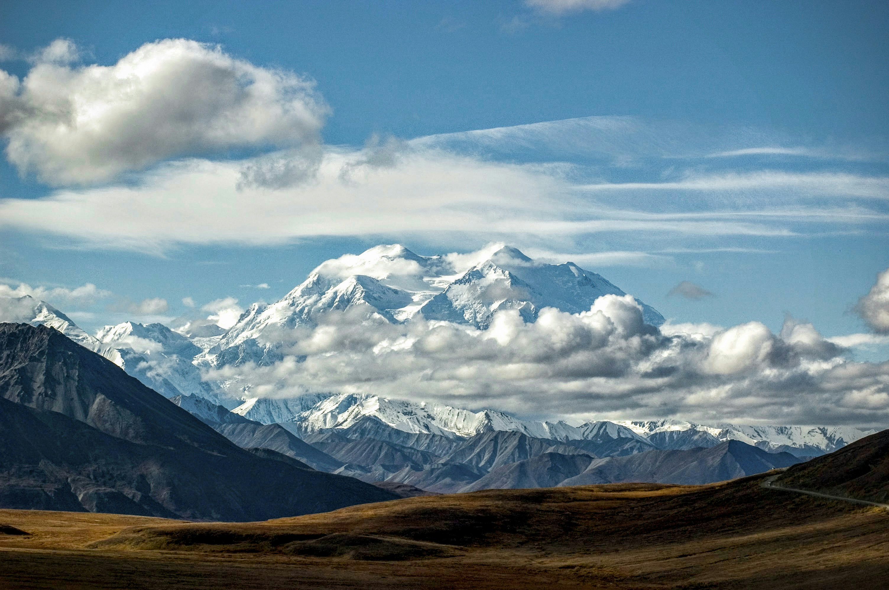
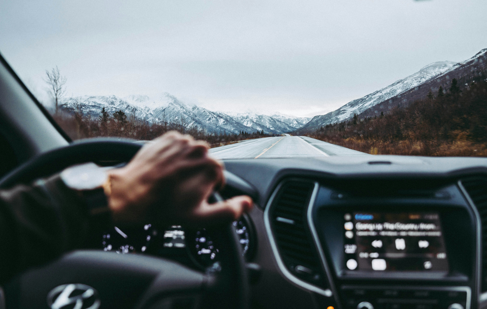

Alaska is scale: long horizons, deep silence, and weather that writes the rules. This photo guide covers Denali, Kenai Fjords, glaciers, wildlife viewing, and road-trip rhythms.

_First light on peaks — Placeholder_

## Classic Routes

Denali viewpoints, Seward + Kenai Fjords, Matanuska or Exit Glacier hikes, and ferry legs on the Marine Highway.

_Deep fjord blues — Placeholder_

_Road and range — Placeholder_

## Wildlife and Seasons

Bears, moose, eagles, whales — read distance and respect space. Summer long days; winter brings auroras and crisp stars.

_On the water — Placeholder_

## Safety and Logistics

Layers, rain protection, spare fuel, and redundancy. Tell someone your plan; watch forecasts, winds, and rivers.

_Glacier edge — Placeholder_

—

Credits are embedded in each caption (Placeholder).

