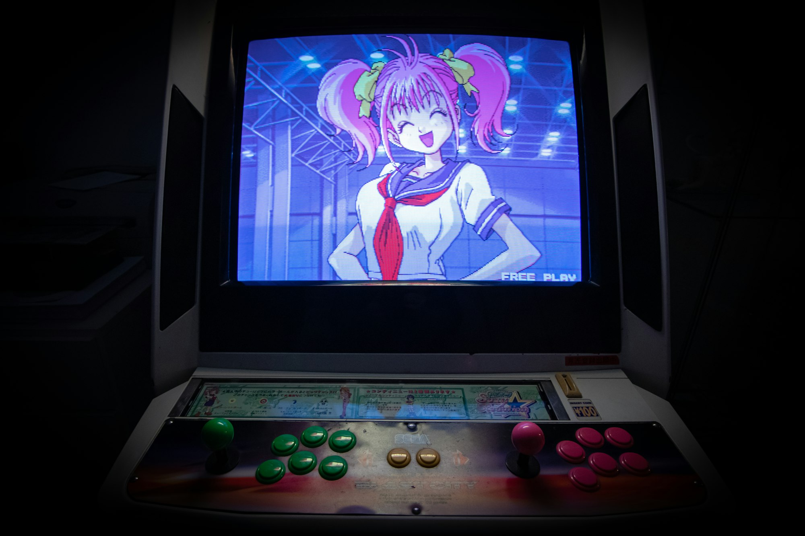

Anime is a wide, evolving medium — from slice-of-life to space opera — united by bold visual storytelling and music-driven emotion. This photo-forward guide touches on genres, visual language, the production pipeline, and ways to discover what you’ll love next.

_City glow, story seeds — Placeholder_

## Genres and Gateways

Shōnen, shōjo, seinen, josei, isekai, mecha, sports, music — genres are tools, not boxes. Start with themes you enjoy: coming-of-age, mystery, romance, or found-family adventures.

_Adventure energy — Placeholder_

_Quiet slice-of-life — Placeholder_

## Visual Language

Silhouette clarity, color scripts, and expressive timing. Choreography uses speed lines, smears, holds, and impact frames; lighting and framing carry mood.

_Color and light — Placeholder_

_Motion and framing — Placeholder_

## Characters and Tropes

Archetypes are starting points: the determined lead, the quiet strategist, the chaos gremlin, the mentor. The best shows twist expectations and let characters grow.

_Character vibes — Placeholder_

_Found family — Placeholder_

## From Board to Broadcast

Concept → script → storyboards → layouts → key animation → in-betweens → backgrounds → compositing → sound/music → final. Production balances schedule, budget, and the director’s vision.

_Boards and layouts — Placeholder_

## Fandom and Events

Conventions, screenings, cosplay, music shows — community keeps the medium alive. Share recs, respect cosplayers, and support creators and local theaters.

_Cosplay and community — Placeholder_

## How to Explore

- **Follow creators:** Directors, studios, composers, animators.
- **Pair with music:** Openings/endings set tone; soundtrack matters.
- **Mix old and new:** Classic films/OVAs + current seasonals.
- **Try themes, not tags:** Pick mood first, then pick a show.

_Late-night rewatch — Placeholder_

## Quick Tips

- **Three-episode rule:** Sample before dropping a show.
- **Keep a list:** Track recs and ratings.
- **Support legally:** Streams, screenings, Blu-rays, merch.
- **Be kind:** Fandom thrives on welcome and curiosity.

_Credits roll glow — Placeholder_

Anime invites you to new worlds — big, small, and wonderfully strange. Find the feelings you chase, then follow the creators who deliver them.

—

Credits are embedded in each caption (Placeholder). After selecting specific images, replace with photographer names/links as needed.

