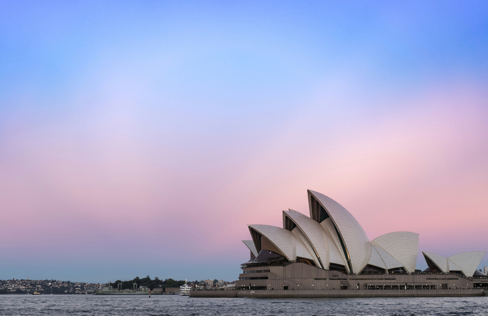
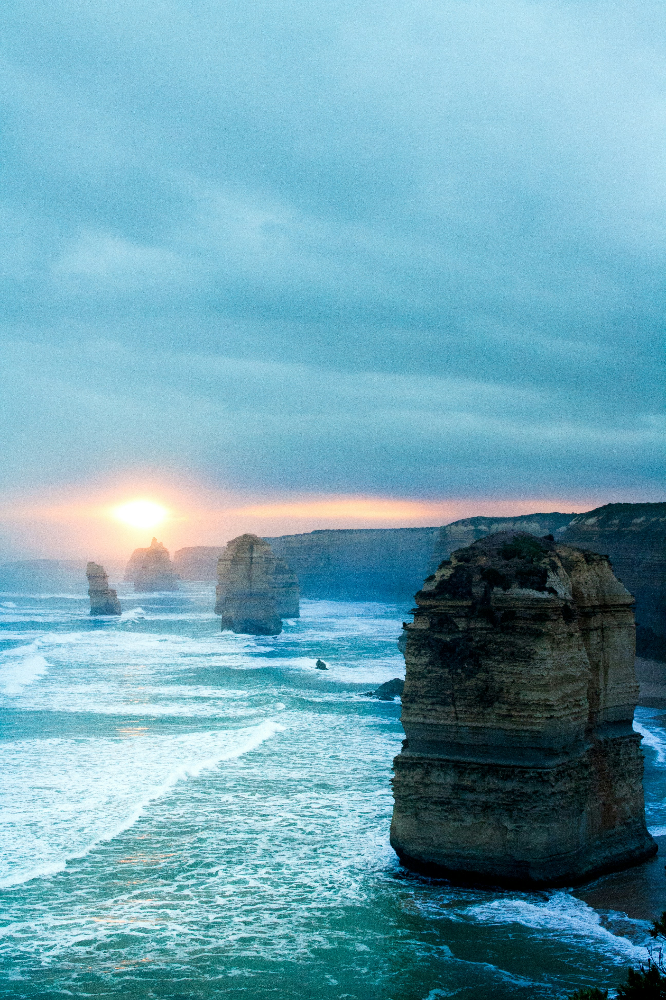
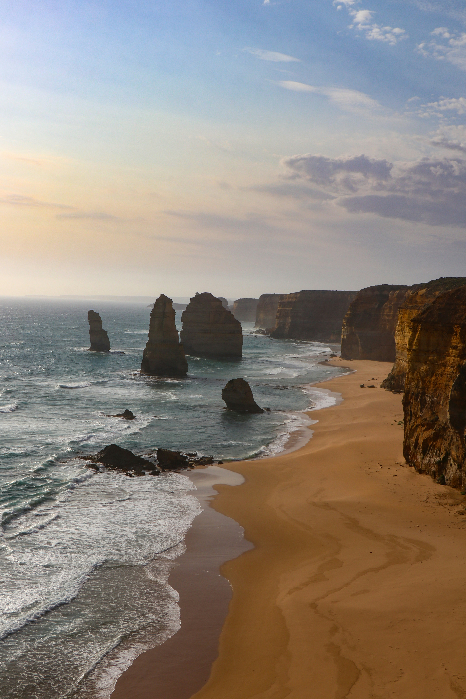
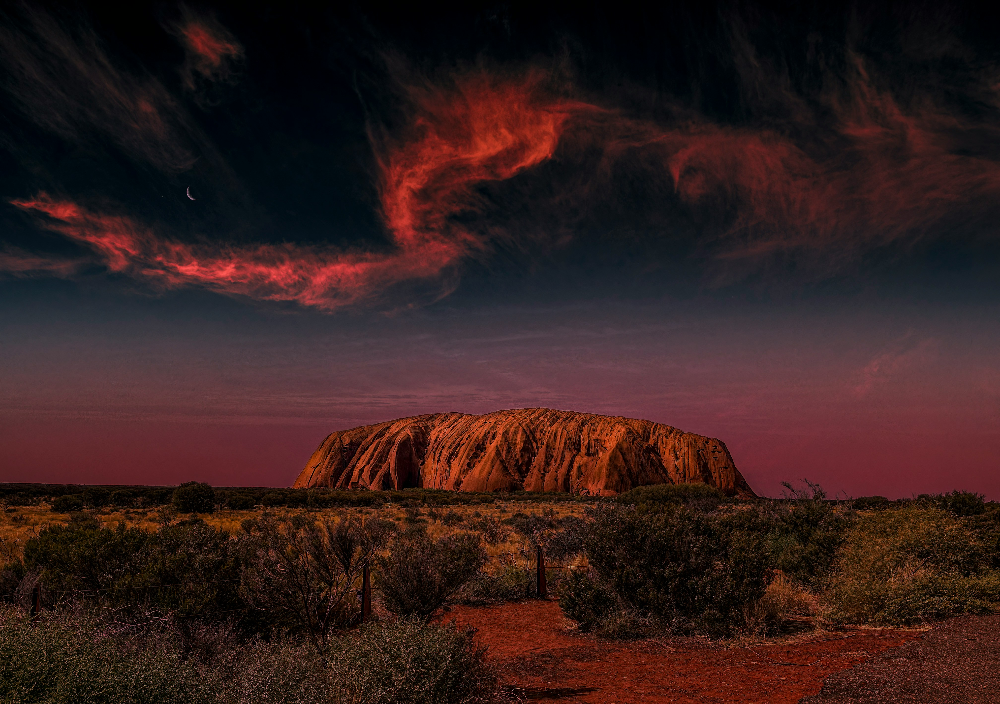

Australia is scale and contrast — surf breaks and reefs, eucalyptus and red desert, modern cities and long roads. This photo-driven guide sketches classic highlights, seasons, and light-touch planning to keep days smooth.

_Sydney first light — Placeholder_

## Cities and Coasts

- **Sydney:** Opera House, Harbour Bridge, coastal walks (Bondi → Coogee).
- **Melbourne:** Laneways and coffee, Great Ocean Road day trips.
- **Brisbane/Gold Coast:** Warm water and easy beaches.

_Coastal walk — Placeholder_

_Great Ocean Road — Placeholder_

## Desert Icons

- **Uluru & Kata Tjuta:** Sunrise/ sunset color shifts; respect Anangu culture.
- **Kings Canyon:** Rim walk in cool hours; carry water.

_Uluru glow — Placeholder_

## Reef and Rainforest

- **Great Barrier Reef:** Snorkel or intro dive; choose reputable operators.
- **Daintree:** Oldest rainforest feel; watch croc safety near rivers.

_Reef blues — Placeholder_

## West and Wide Open

- **WA coast:** Ningaloo whale sharks (in season), Pinnacles, pink lakes.
- **South Australia:** Eyre Peninsula, Fleurieu, wine valleys.

_Wide road, big sky — Placeholder_

## Seasons and Safety

Southern states: warm summers, crisp winters; tropics: wet/dry seasons. Sun is strong — hat, SPF, water; drive fresh and watch wildlife at dusk.

_Late sun on the coast — Placeholder_

## Easy Itineraries

- **3–4 days (Sydney):** Harbour → coastal walk → Blue Mountains.
- **5–7 days (VIC):** Melbourne → Great Ocean Road → Grampians.
- **7–10 days (NT/QLD):** Red Centre loop or Cairns + reef + rainforest.

_Blue Mountains edge — Placeholder_

## Quick Tips

- **Start early:** Beat heat and crowds; golden hours win.
- **Book ahead:** Reef trips/Uluru sunrise spots can fill.
- **Respect Country:** Learn local guidance; leave no trace.

_Harbour evening — Placeholder_

Australia rewards unhurried days — leave space between highlights, follow the weather, and let the road (or sea) set the pace.

—

Credits are embedded in each caption (Placeholder). After selecting specific images, replace with photographer names/links as needed.

