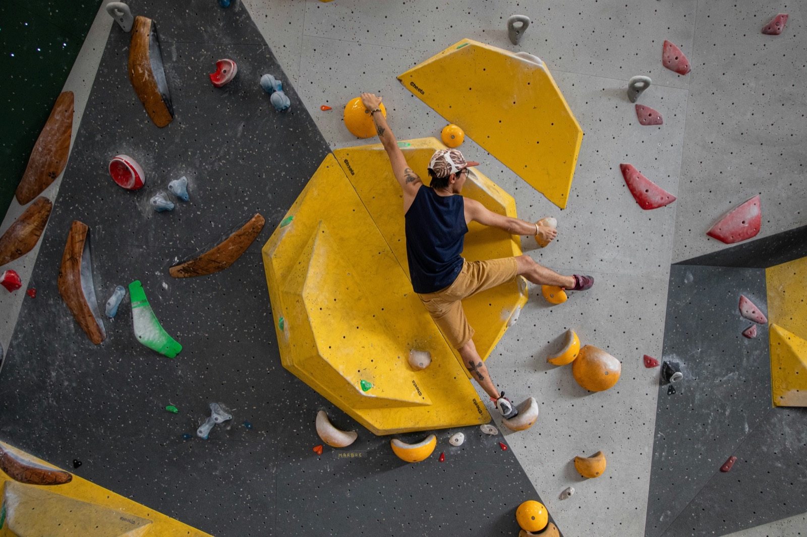
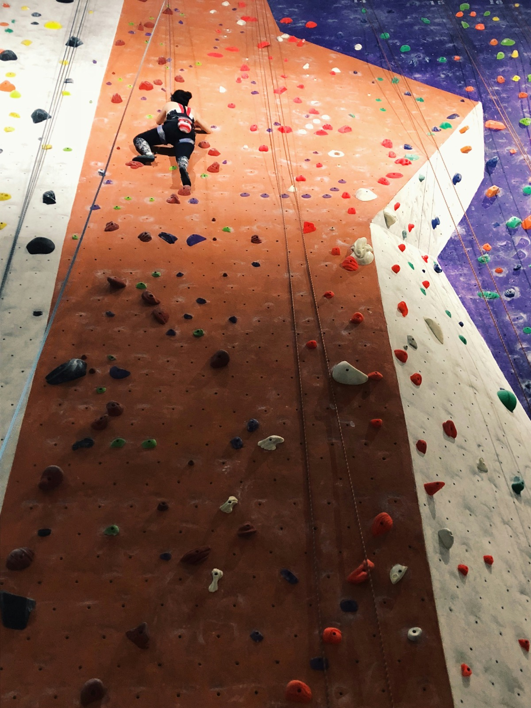
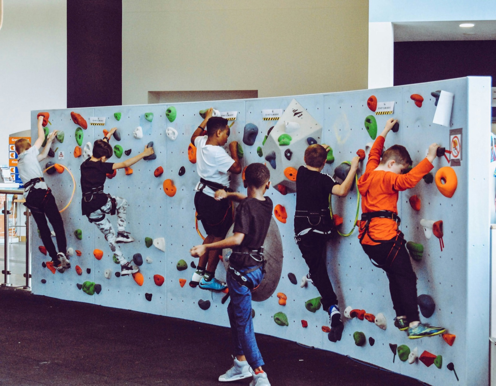
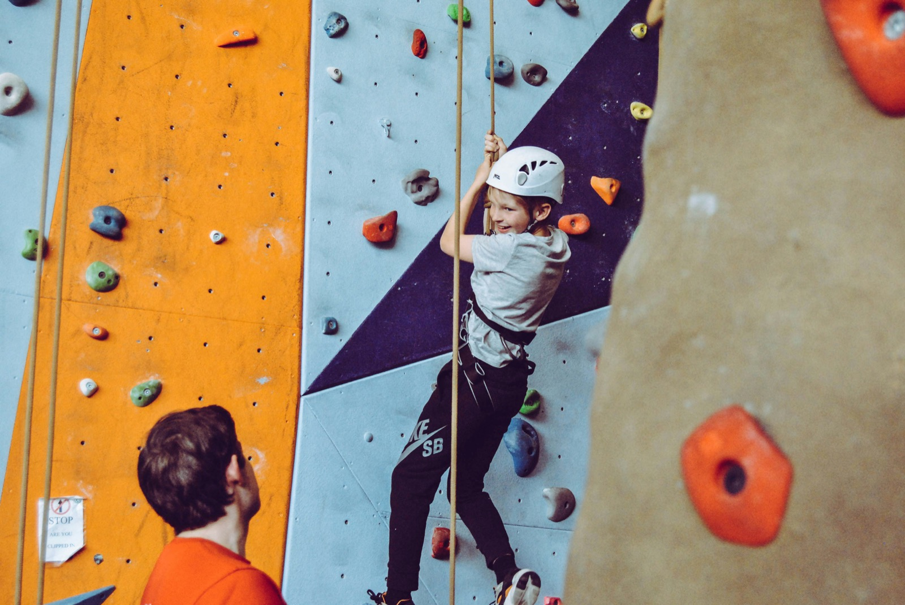

Short climbs, big puzzles — bouldering sharpens body and focus. This photo guide covers technique, projecting, falls, and good sessions.

_Warm-up arcs — Photo: Nathan Cima (Unsplash)_

## Technique First

Hips close, feet quiet, eyes lead; use flags, drop knees, and toe hooks.

_Footwork attention — Photo: Unsplash_

_Body tension — Photo: Stephanie Cook (Unsplash)_

## Projecting and Training

Read sequences, rest smart, and track attempts. Hangboard carefully; complement with shoulders/core.

_Beta talk — Photo: Unsplash_

## Pads and Spotting

Pad placement for landings; clear calls; protect head/hips.

_Safe fall — Photo: Unsplash_

—

Credits: Selected photos courtesy of Unsplash photographers including Nathan Cima, Stephanie Cook, Mark McGregor, Lionello DelPiccolo, Amanda Perez, and others. Links available on request.

