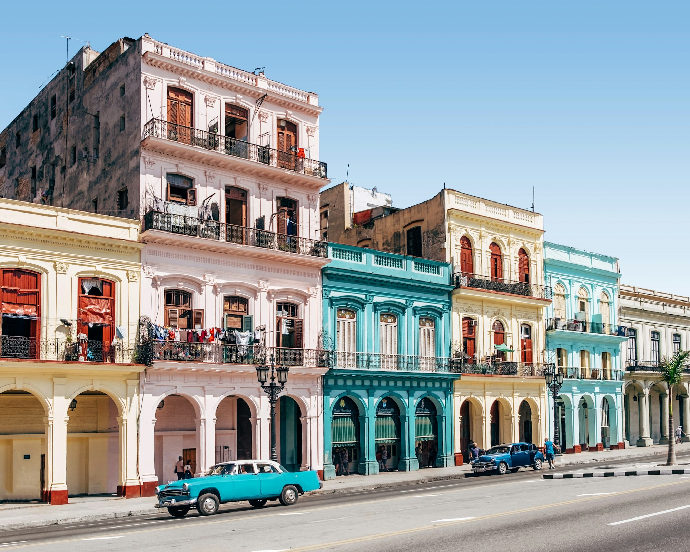
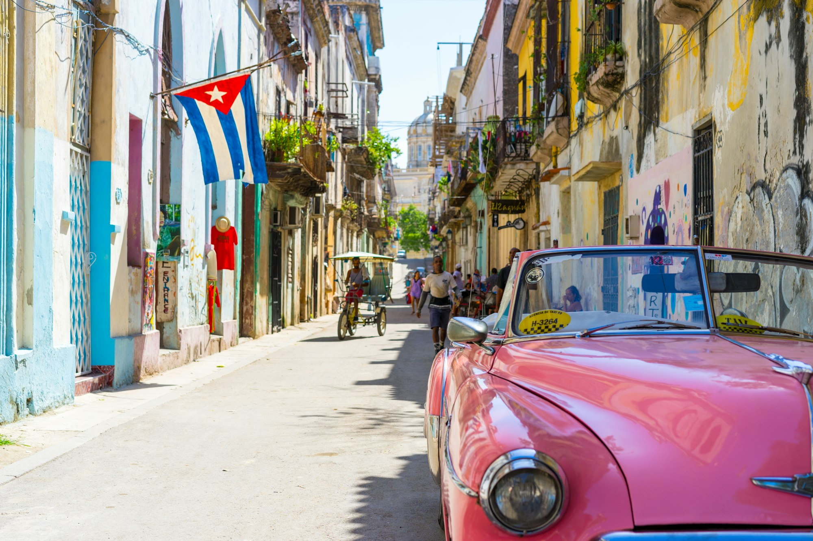
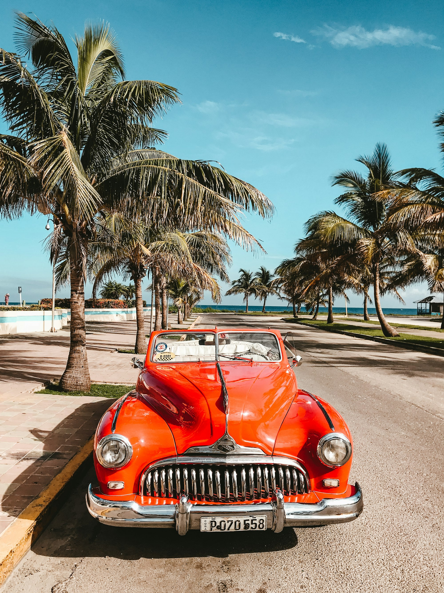
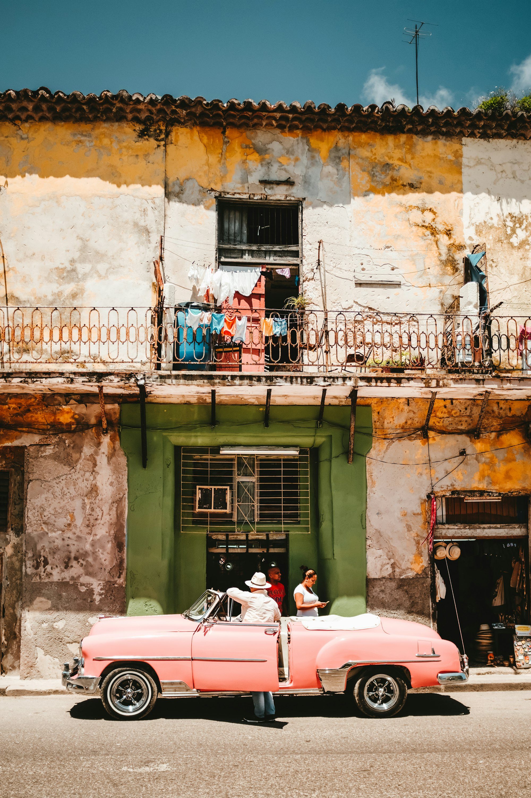
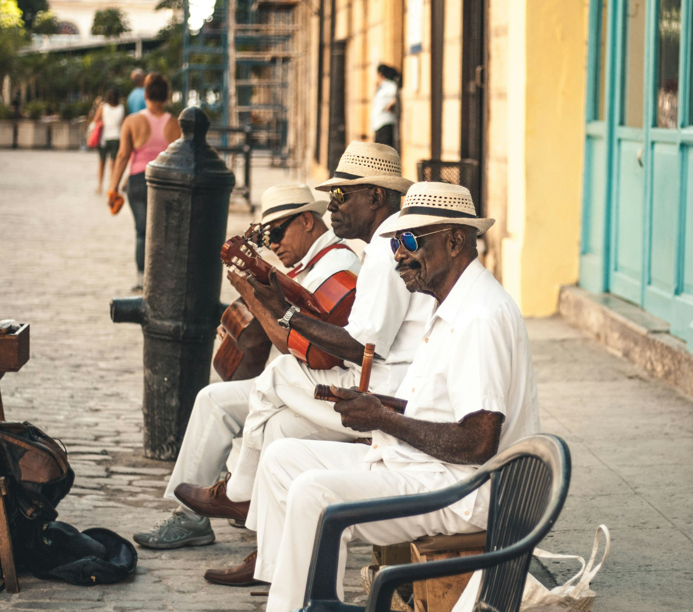
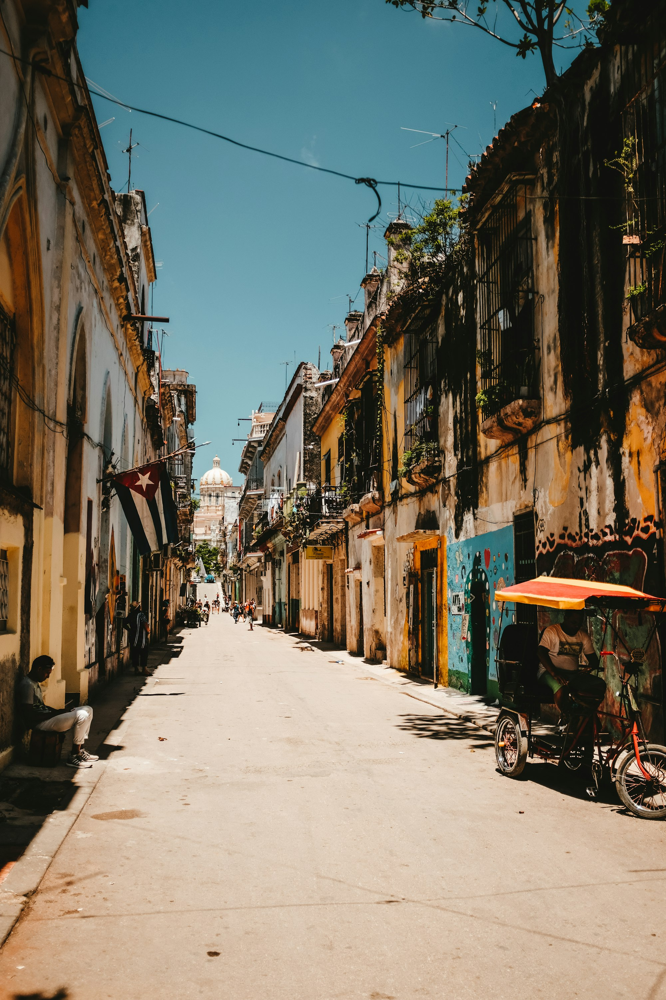
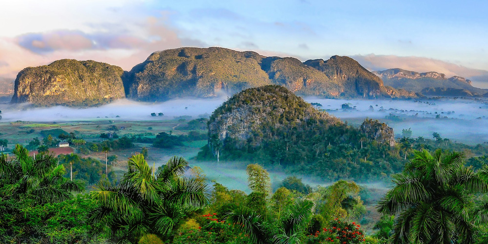

Cuba moves to its own tempo — pastel streets, classic cars, music at every corner. This photo-driven primer highlights Havana, Trinidad, Viñales, and the pace that makes the island unforgettable.

_Havana first pass — Placeholder_

## Havana Essentials

Malecón walks, Old Havana plazas, and late-night music. Step between restored blocks and crumbling beauty — both tell the story.

_Old town textures — Placeholder_

_Malecón blue hour — Placeholder_

## Beyond the Capital

- **Trinidad:** Cobblestones and colonial color.
- **Viñales:** Tobacco fields and limestone mogotes.
- **Varadero/Cayos:** Long beaches and calm water.

_Trinidad glow — Placeholder_

_Valley of Viñales — Placeholder_

## Music, Food, and Rhythm

Son, salsa, and trova spill into streets. Try ropa vieja, congrí, fresh seafood; sip coffee slow.

_Corner band — Placeholder_

## Practical Notes

Internet is improving but patchy; book casas, carry small cash, and expect slow travel — it’s part of the charm.

_Evening ride — Placeholder_

## Quick Tips

- **Golden hours:** Best for color + heat.
- **Local stays:** Casas show daily life.
- **Learn a few phrases:** Opens doors instantly.

_Sunset on the Malecón — Placeholder_

—

Credits are embedded in each caption (Placeholder). Replace with photographer names/links as needed.

