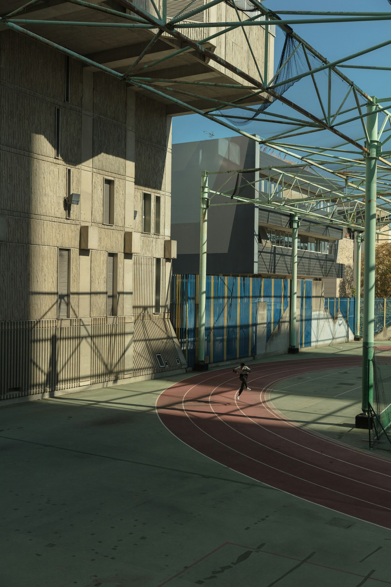
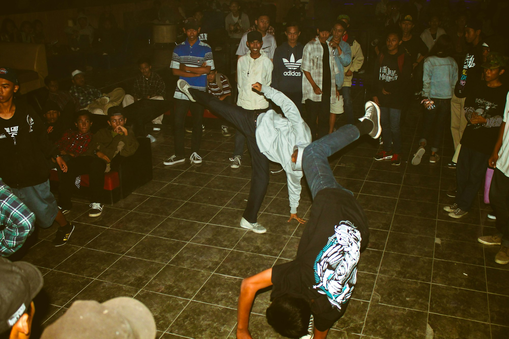
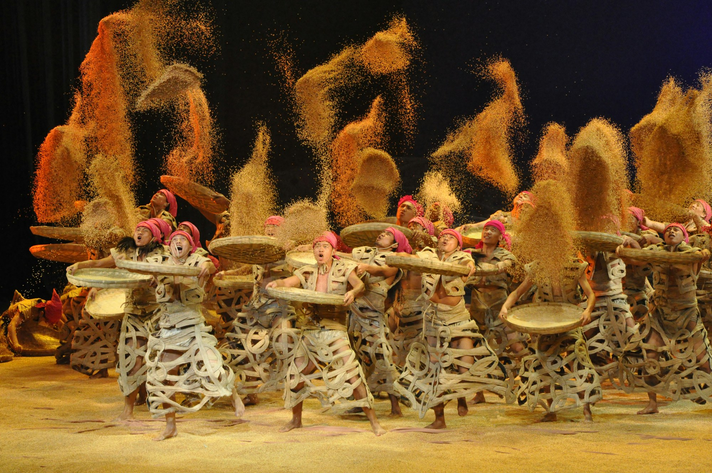

Krump is a raw, expressive street dance — a language of power, musicality, and story. It lives in sessions and battles, where characters (personas) and emotions drive movement. This photo-driven piece breaks down foundations, training methods, and the culture that keeps the scene alive.

_Cypher heat — Placeholder_

## Origins and Culture

Born in early-2000s Los Angeles, Krump channeled energy into art: sessions, call-outs, and mentorship. Crews form fams; battles sharpen style and character.

_Session energy — Placeholder_

_Call-out moment — Placeholder_

## Foundations: Stomp, Chest Pop, Arm Swing

- **Stomp:** Grounded power and timing.
- **Chest Pop:** Explosive accents to mark the beat.
- **Arm Swing/Jab:** Direction, attack, and punctuation.

_Timing the stomp — Placeholder_

_Sharp chest pop — Placeholder_

## Character and Story

Build a persona (character) with a clear narrative — triumph, struggle, humor. Let intent lead shapes; use contrast (slow/fast, big/small) to reveal emotion.

_Character work — Placeholder_

_Control and contrast — Placeholder_

## Music and Musicality

From heavy bass to chopped snares, listen for textures. Hit drums with pops, ride hi-hats with grooves, and breathe between accents.

_Riding the beat — Placeholder_

## Training: Drills to Session

- **Power drills:** Reps of stomps, pops, and swings to build stamina.
- **Texture practice:** Vary weight and speed for nuance.
- **Session rounds:** Short timed rounds to simulate battles.

_Drills under lights — Placeholder_

## Battling and Etiquette

Respect the space, bring your best, and let others shine. Clear call-outs, no contact, and celebrate wins with humility — the scene grows together.

_Center of the circle — Placeholder_

## Quick Tips

- **Own your character:** Make choices that fit your story.
- **Train stamina:** Power reads only if you can sustain it.
- **Use silence:** Pauses amplify impact.
- **Film and review:** Hunt for clarity, timing, and contrast.

_Closing round — Placeholder_

Krump thrives on authenticity. Bring your truth to the floor — the rest is volume, timing, and heart.

—

Credits are embedded in each caption (Placeholder). After selecting specific images, replace with photographer names/links as needed.
