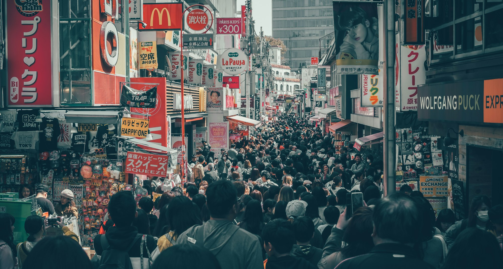
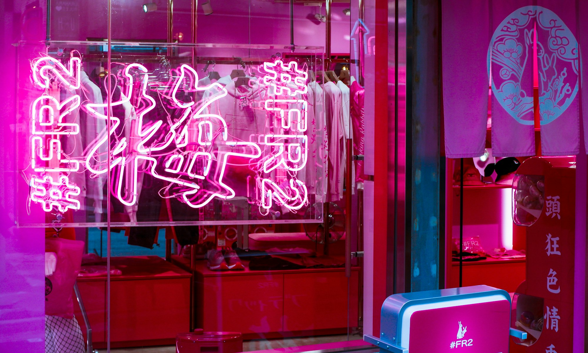

Harajuku is a global symbol of youth culture and creative self-expression. On and around Takeshita Street and Cat Street, you’ll find looks that range from sugary-sweet kawaii to underground Ura‑Hara streetwear, from DIY customization to couture-level craftsmanship. This photo-forward post highlights the eclectic spirit that makes Harajuku fashion endlessly inspiring.

_Kawaii color play on Takeshita Street — Placeholder_

## Kawaii, Decora, and Beyond

Think vibrant palettes, oversized bows, layered accessories, and character motifs. Decora-inspired looks pile on playful elements, while modern kawaii often mixes pastels with streetwear silhouettes and platform footwear for a sharper edge.

_Layered accessories and bows — Placeholder_

_Pastel meets streetwear — Placeholder_

## Ura‑Hara Heritage Meets Now

The Ura‑Harajuku lineage—graphic tees, workwear, military surplus, and innovative cuts—still informs the scene. Contemporary labels remix those codes with technical fabrics, generous proportions, and bold art direction.

_Graphic-driven streetwear — Placeholder_

_Workwear with a twist — Placeholder_

## Silhouette: Layer, Stack, Play

Layering is a design language here—stacked hems, visible underlayers, mixed textures, and unexpected lengths create dynamic proportions. The result is movement and personality in every step.

_Proportional play through layering — Placeholder_

_Textures and lengths in motion — Placeholder_

## Statement Footwear

Platforms, creepers, tech sneakers, and chunky boots all have a home in Harajuku. Shoes punctuate the look—adding height, attitude, and sometimes a pop of neon.

_Chunky platforms — Placeholder_

## Hair, Makeup, and Accessories as Art

Colorful hair, graphic liner, nail art, stickers, and layered jewelry complete the story. Beauty and accessories are treated as equally important design surfaces.

_Playful hair color and details — Placeholder_

## Where to Spot the Best Style

- **Takeshita Street:** The heart of kawaii culture and youth trends.
- **Cat Street:** Boutique-lined and relaxed; streetwear and vintage mixes.
- **Omotesando:** Elevated, architectural looks and luxury high-low combos.
- **Backstreets of Jingumae:** Independent shops and experimental outfits.

_Strolling Cat Street — Placeholder_

## Harajuku Style Tips

- **Express yourself:** Wear what makes you smile.
- **Mix high and low:** Pair vintage with new, DIY with designer.
- **Layer creatively:** Play with volume, texture, and length.
- **Finish the story:** Hair, makeup, and accessories matter.
- **Have fun:** Harajuku celebrates joy and originality.

Harajuku’s influence reaches far beyond Tokyo because it champions individuality without apology. It’s a living canvas—ever-changing, always surprising.

—

Credits are embedded in each caption (Placeholder). After selecting specific images, replace with photographer names/links as needed.

