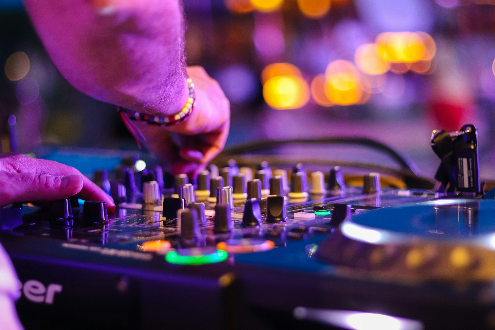
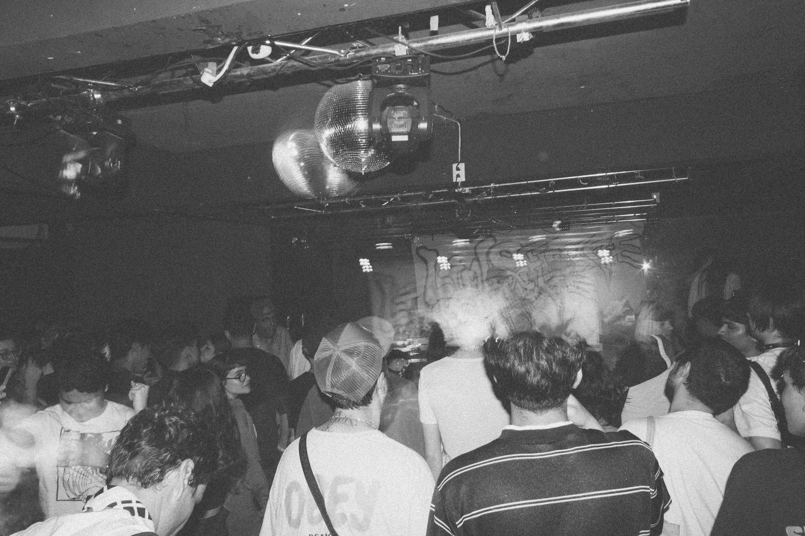
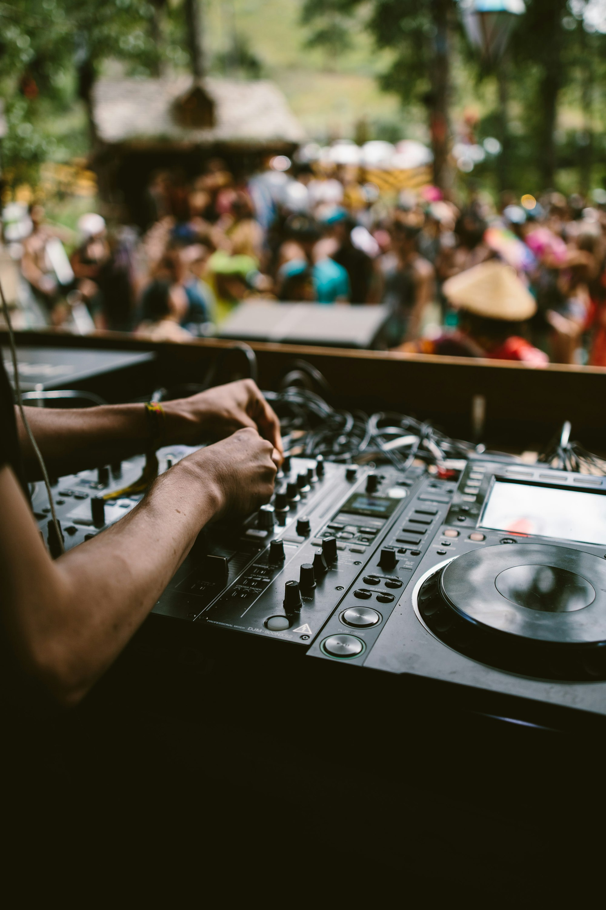
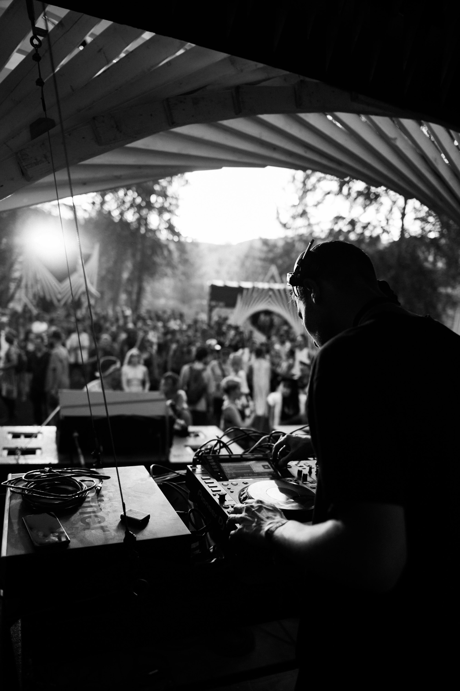
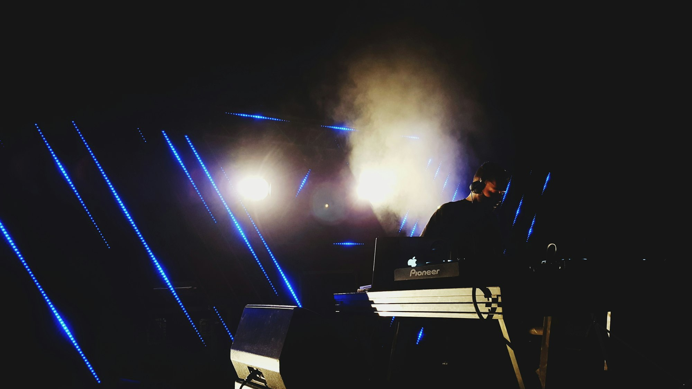
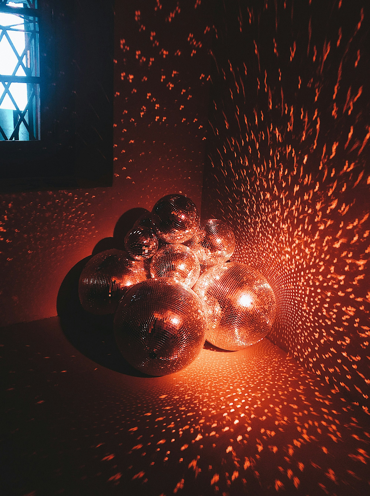
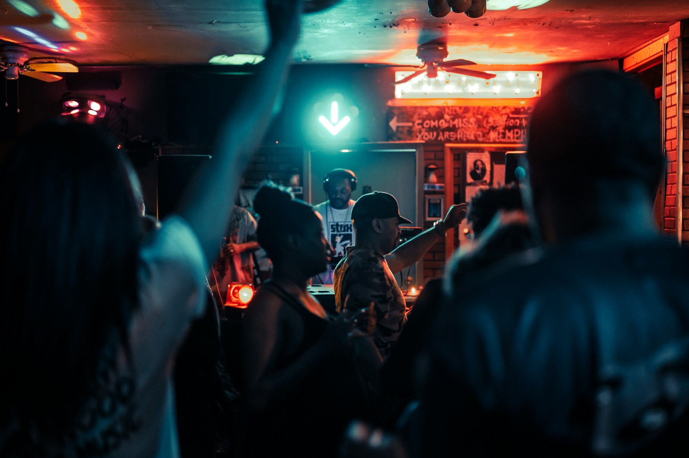
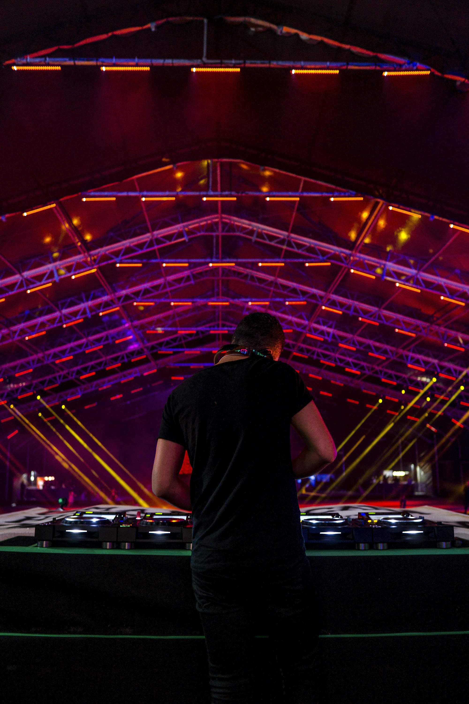
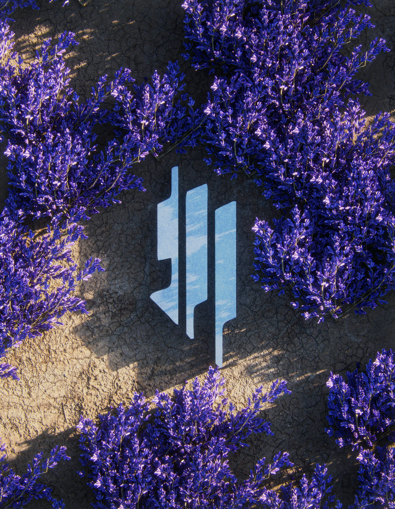
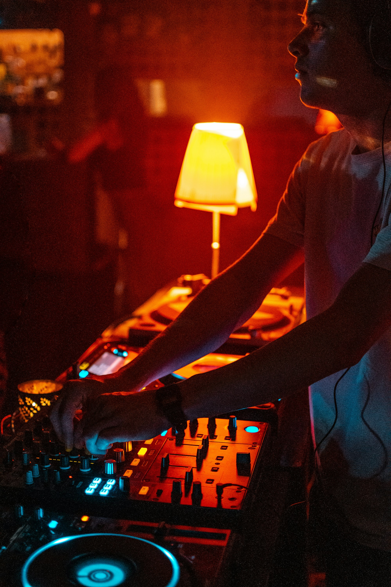

House music is a feeling — a communal pulse born from Chicago’s warehouses and carried worldwide through DJs, dancers, and late-night rooms. This photo-driven primer touches on where it comes from, how it’s built, and how to show up — on decks, in the booth, and on the floor.

_Room warming up — Placeholder_

## Roots and Culture

From Chicago and NYC to the world, house is built on inclusivity, joy, and movement. The DJ curates energy; the crowd completes the mix.

_Community on the floor — Placeholder_

_Booth and floor connection — Placeholder_

## Structure and Groove

Four-on-the-floor kicks, syncopated hats, rolling bass, and soulful textures. Typical tempo sits ~118–130 BPM; phrasing often in 4, 8, 16-bar blocks.

_Kick, hat, clap in balance — Placeholder_

_Bassline movement — Placeholder_

## DJ Basics: Blend, Phrase, Read

Match tempos, align phrases, and EQ with intention. Read the room — energy arcs > single drops. Record your sets and refine transitions.

_On the mixers — Placeholder_

_Cueing the next track — Placeholder_

## Production: From Loop to Track

Start with a drum loop, add a hook (chords, vocal, stab), then arrange with tension/release. Sidechain for space; leave headroom on the master.

_In the DAW — Placeholder_

## Subgenres to Explore

- **Deep House:** Warm chords, soulful vocals.
- **Tech House:** Minimal textures, percussive drive.
- **Soulful/Classic:** Disco lineage, uplifting energy.
- **Acid House:** 303 squelch and hypnotic lines.

_Lights and motion — Placeholder_

## Dancefloor Etiquette

Respect space, hydrate, and be kind. The best sets are a conversation — cheer the blends and give room to move.

_Peak-time release — Placeholder_

## Quick Tips

- **Count bars:** Mix on 16s for clean phrasing.
- **Gain staging:** Avoid red; trust the system.
- **Build arcs:** Warm-up, lift, breathe, land.
- **Tag tracks:** Notes on key/energy help flow.

_Closing track glow — Placeholder_

House thrives on community and care. Keep showing up — track by track, night by night, the groove brings everyone together.

—

Credits are embedded in each caption (Placeholder). After selecting specific images, replace with photographer names/links as needed.

