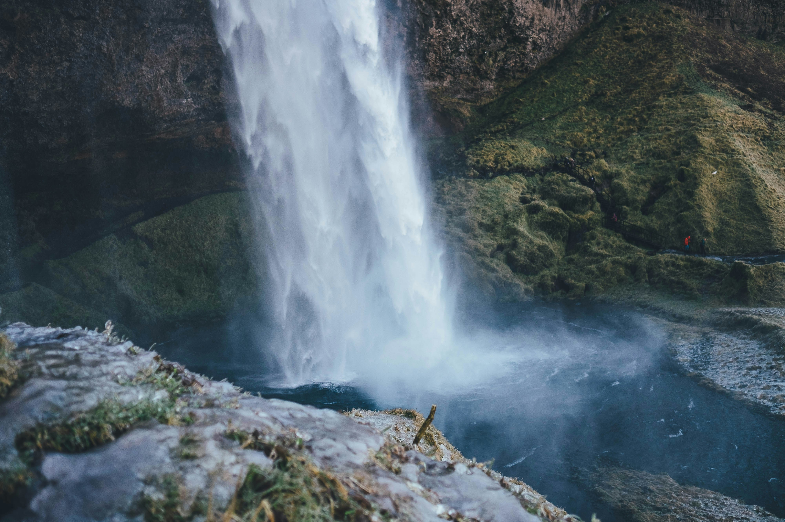
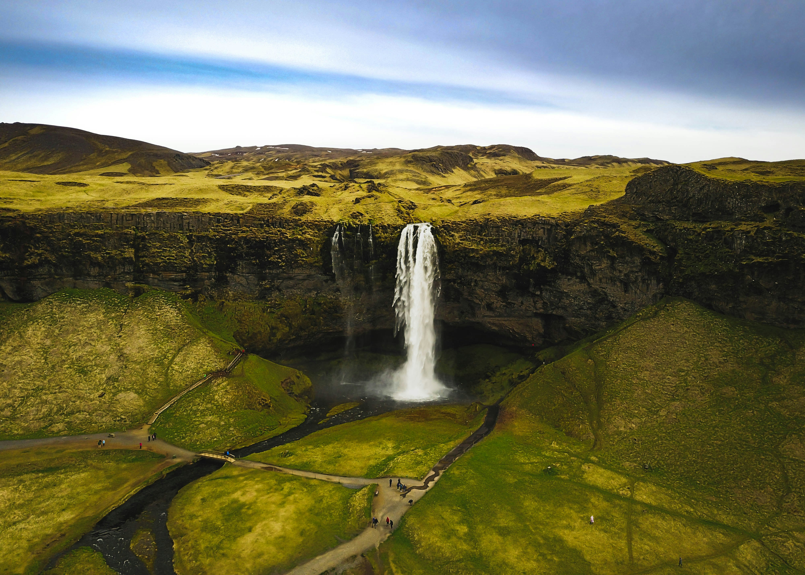

Small island, big drama — Iceland’s Ring Road ties glaciers, volcanoes, and waterfalls into a loop of constant wow. This photo guide hits the essentials.

_Falls and spray — Placeholder_

## Highlights

Seljalandsfoss, Skógafoss, Reynisfjara, Jökulsárlón, Kirkjufell, Blue Lagoon or local pools.

_Black sand lines — Placeholder_

_Glacier glow — Placeholder_

## Seasons and Safety

Weather turns fast. Check roads, wind, and surf warnings; pack layers and spikes in winter.

_Aurora watch — Placeholder_

—

Credits are embedded in each caption (Placeholder).

