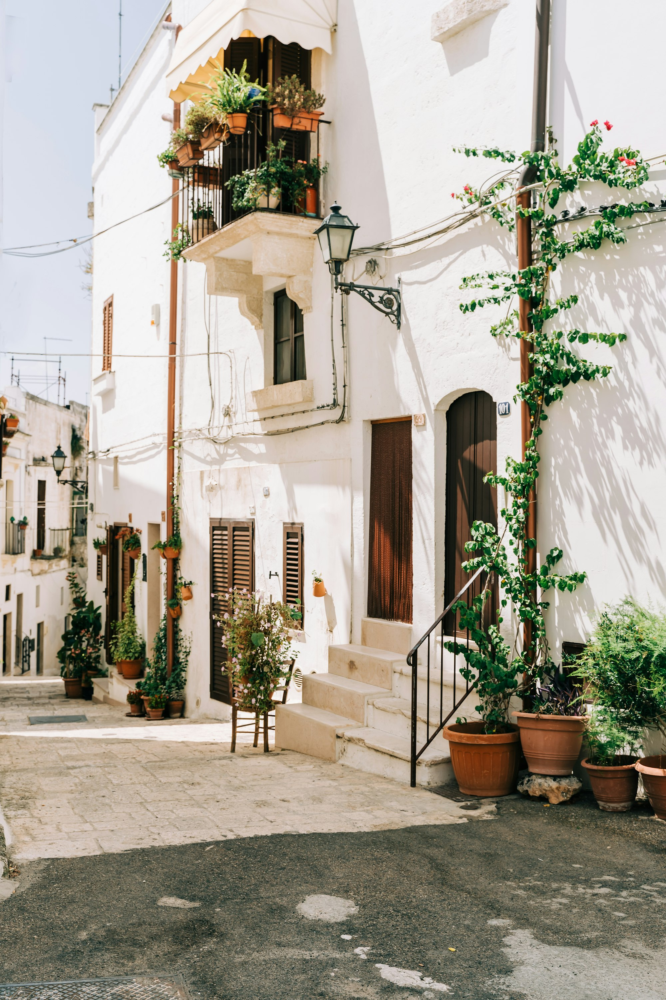

Italy's streets are a living testament to the art of "la bella figura"—the beautiful figure. From Milan's fashion-forward avenues to Florence's historic alleys, style is an innate form of expression. This photo-forward journey captures the essence of that effortless elegance.

_A tailored look in Milan — Placeholder_

## City-Specific Flair

Italian style varies by region. Milan champions sharp, modern tailoring; Florence embraces a more classic, artisanal aesthetic; Rome blends high fashion with a relaxed, confident energy. The result is a rich tapestry of personal style.

_Florentine elegance near the Duomo — Placeholder_

_Roman holiday, modern twist — Placeholder_

## The Art of Sprezzatura

Sprezzatura is the art of studied carelessness, making a meticulously crafted look appear effortless. It's in the drape of a scarf, the roll of a sleeve, or the perfect pair of sunglasses.

_Effortless drape of a jacket — Placeholder_

_Perfectly chosen accessories — Placeholder_

## Statement Tailoring

Impeccable tailoring is the backbone of Italian style. Jackets are sharp, trousers are perfectly cut, and silhouettes are clean. The focus is on quality fabrics and a flawless fit.

_Sharp suit, casual setting — Placeholder_

_The perfect summer blazer — Placeholder_

## Quality Leather Goods

From shoes to bags to jackets, high-quality leather is a staple. It's a nod to Italy's rich tradition of craftsmanship and adds a touch of luxury to any outfit.

_A classic leather bag — Placeholder_

## Effortless Monochrome

Head-to-toe monochrome looks are common, often in neutral tones like beige, white, or navy. It's a sophisticated and timeless approach to dressing.

_Chic all-white ensemble — Placeholder_

## Sunglasses are Non-Negotiable

Sunglasses aren't just for sun protection; they're a key accessory. Classic, bold, and always stylish, they complete the look.

_Bold sunglasses making a statement — Placeholder_

## Where to See It

- **Milan:** Via Montenapoleone for high fashion, Brera for artistic flair.
- **Florence:** Via de' Tornabuoni for luxury, Oltrarno for artisan workshops.
- **Rome:** Via Condotti for designer brands, Trastevere for bohemian vibes.

_Aperitivo hour style — Placeholder_

## Seasonal Notes

- **Winter:** Luxurious wool coats, cashmere scarves, and leather boots.
- **Spring:** Light jackets, loafers, and vibrant colors.
- **Summer:** Linen shirts, tailored shorts, and open-toed sandals.
- **Fall:** Trench coats, fine-knit sweaters, and rich, earthy tones.

_Autumn layers in the city — Placeholder_

## Key Style Elements

- **Focus on fit:** Tailoring is paramount.
- **Quality over quantity:** Invest in timeless, well-made pieces.
- **Effortless elegance:** Don't overthink it.
- **Accessorize wisely:** A great bag, shoes, or sunglasses can elevate any look.

Italian street style is a masterclass in dressing with confidence and flair. It's about personal expression, quality craftsmanship, and a deep appreciation for the art of looking good.

—

Credits are embedded in each caption (Placeholder). After selecting specific images, replace with photographer names/links as needed.
