London street style is a vibrant, eclectic mix of high fashion, vintage finds, and subcultural influences. It’s a city where individuality reigns supreme, and personal expression is celebrated. From the polished streets of Chelsea to the creative energy of Shoreditch, London's fashion scene is as diverse as the city itself. This photo-forward post captures that unique spirit.

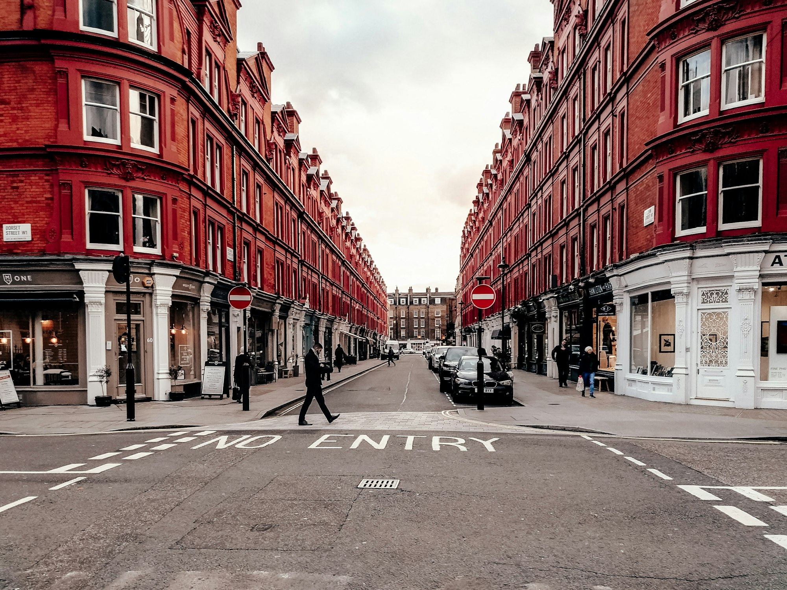
_A bold look in Shoreditch — Placeholder_

## The Art of the Mix

Londoners are masters of the high-low mix, effortlessly pairing designer pieces with high-street finds and vintage treasures. There are no rules—only creativity. A tailored coat might be thrown over a band t-shirt, or a couture bag paired with battered trainers.

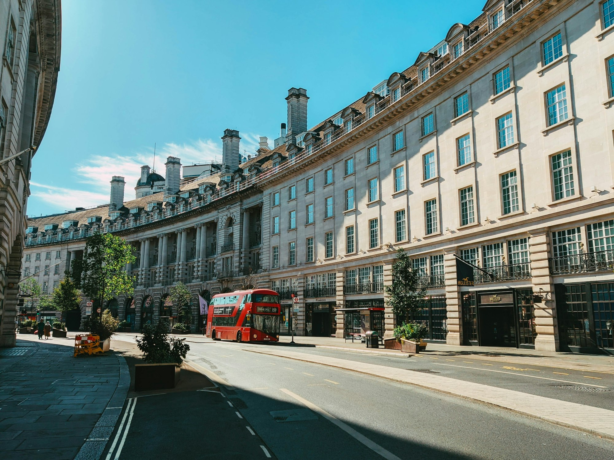
_High-low dressing in Notting Hill — Placeholder_

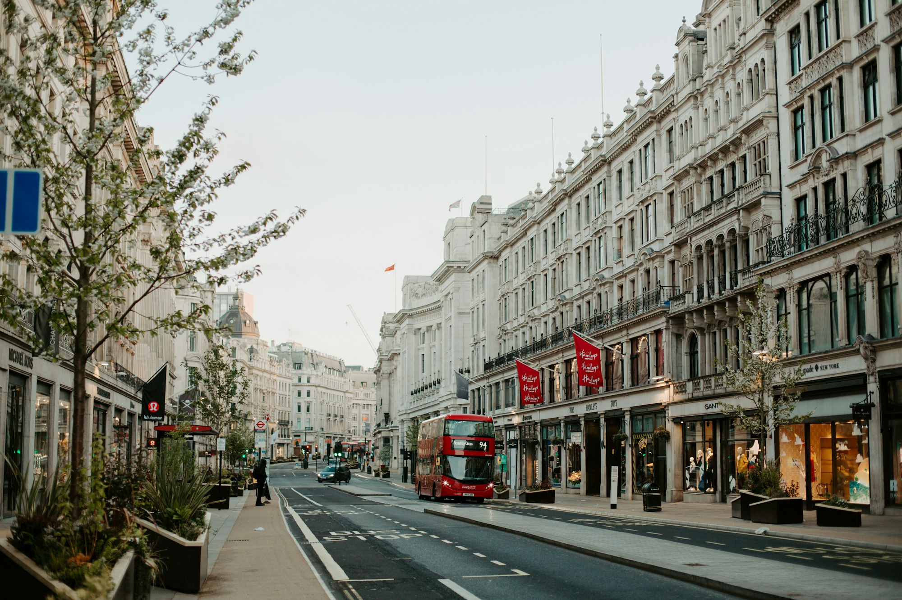
_Vintage finds in Camden — Placeholder_

## A Nod to Heritage

British heritage fabrics and patterns are a constant source of inspiration. Think classic trench coats, tailored tweed, and punk-inspired tartan. These timeless elements are constantly being reinterpreted in new and exciting ways.

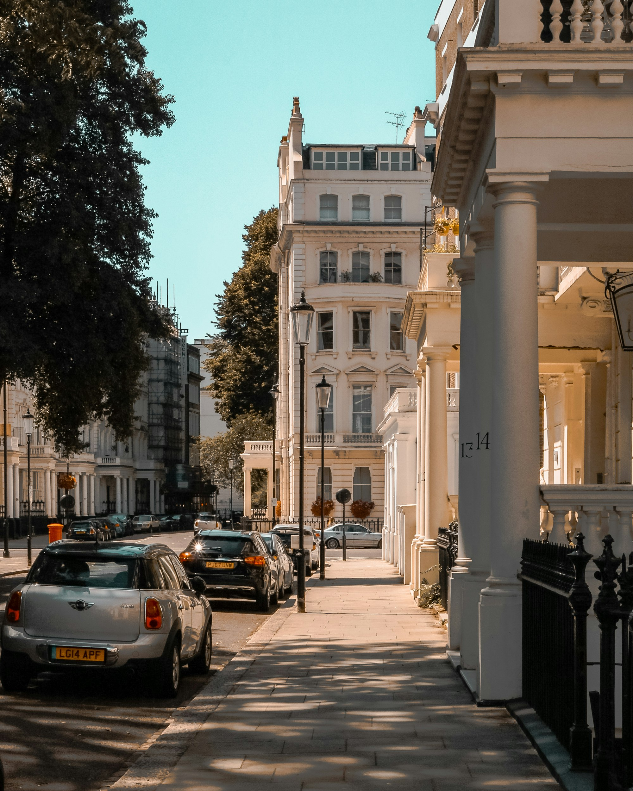
_The classic trench, reimagined — Placeholder_

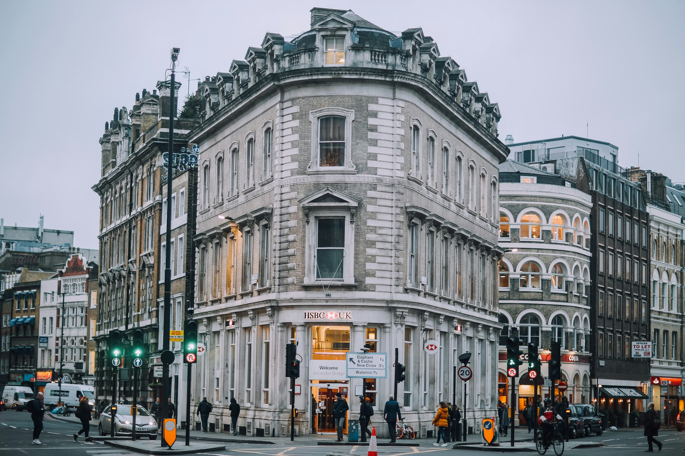
_Modern tartan — Placeholder_

## Statement Outerwear

Given the city's unpredictable weather, it's no surprise that outerwear is a key focus. From classic camel coats to bold, oversized puffers, a great coat is a London essential. It's the piece that pulls the whole look together.

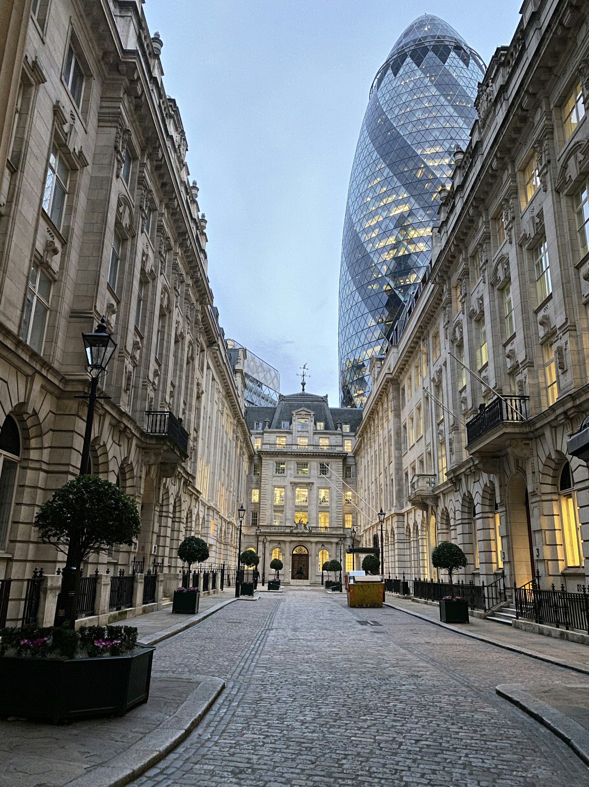
_A standout coat — Placeholder_

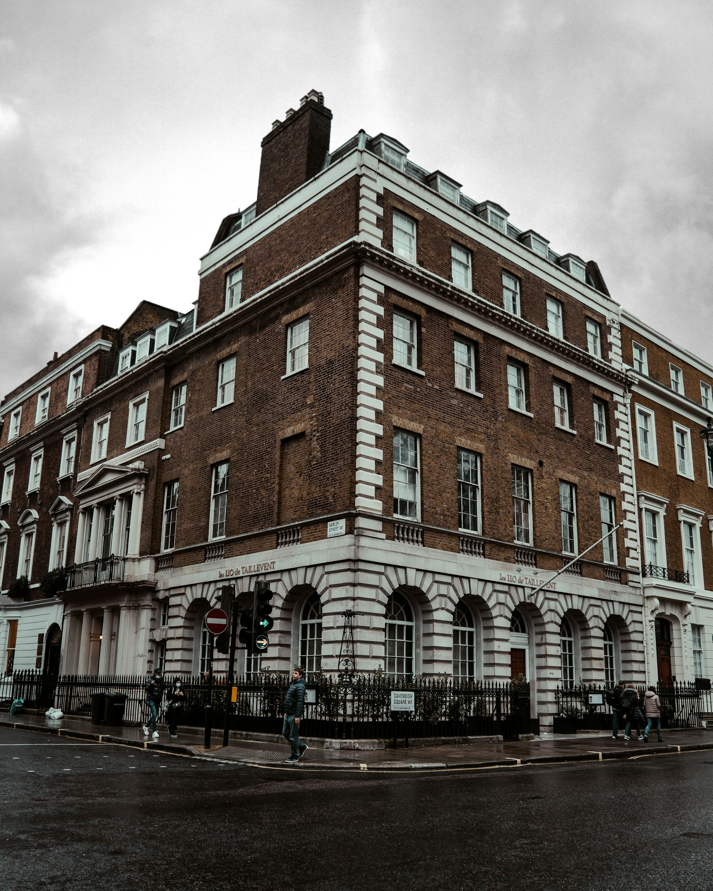
_Leather jacket cool — Placeholder_

## The Trainer Is King

Comfort is key in a city that's always on the move. Trainers are ubiquitous, worn with everything from tailored trousers to floaty dresses. They add a touch of urban cool to any outfit.

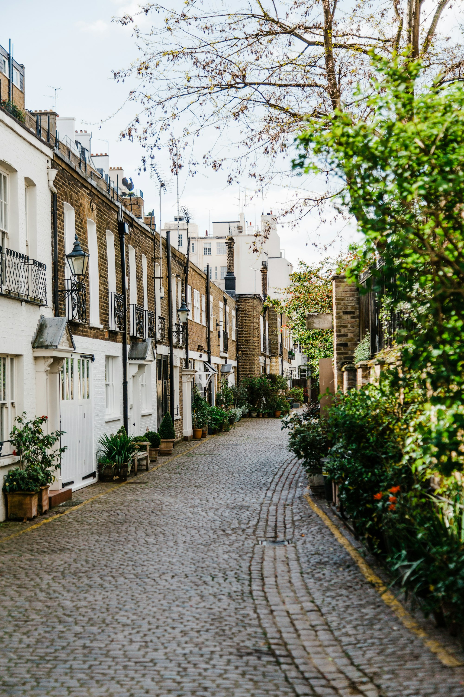
_Box-fresh trainers — Placeholder_

## A Love of Tailoring

Whether it's a sharp suit from Savile Row or a perfectly cut blazer from the high street, Londoners appreciate good tailoring. The look is often relaxed and slightly undone, rather than stuffy or formal.

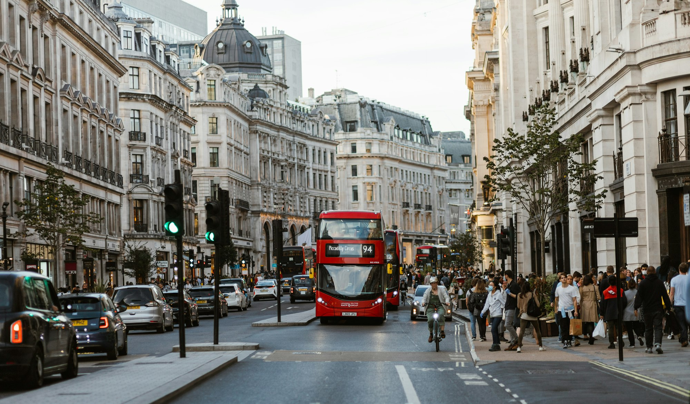
_Relaxed tailoring — Placeholder_

## Individuality and Attitude

More than any specific item of clothing, London street style is about attitude. It's about having the confidence to wear what you want, how you want. It's a celebration of personal style in all its forms.

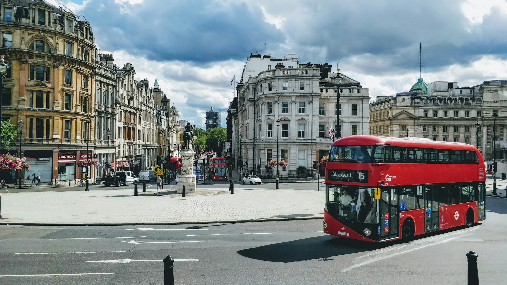
_Confidence is the best accessory — Placeholder_

## Where to Spot the Best Style

- **East London (Shoreditch, Hackney):** For creative, trend-led looks.
- **West London (Notting Hill, Chelsea):** For polished, high-end style.
- **Soho and Covent Garden:** For a mix of high-street and designer.

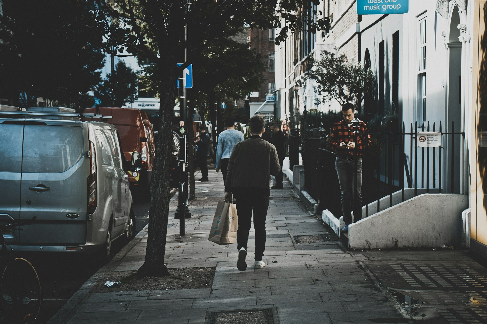
_A stylish moment in Soho — Placeholder_

## Key London Style Tips

- **Don't be afraid to experiment:** Mix prints, textures, and eras.
- **Invest in a great coat:** It's the most important item in your wardrobe.
- **Embrace flat shoes:** You'll be doing a lot of walking.
- **Shop vintage:** London has some of the best vintage shopping in the world.
- **Be yourself:** The most stylish thing you can do is be confident in your own skin.

London street style is a constant source of inspiration because it's so dynamic and unpredictable. It's a reflection of the city's creative energy and a testament to the power of individual style.

—

Credits are embedded in each caption (Placeholder). After selecting specific images, replace with photographer names/links as needed.
