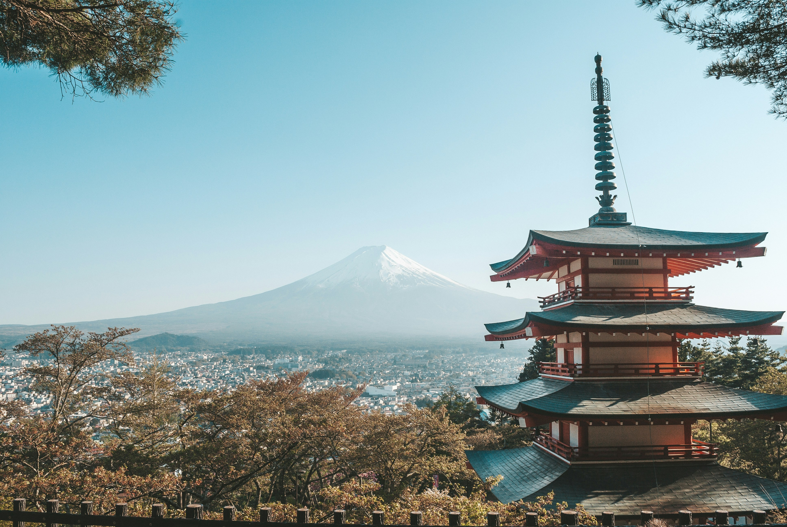
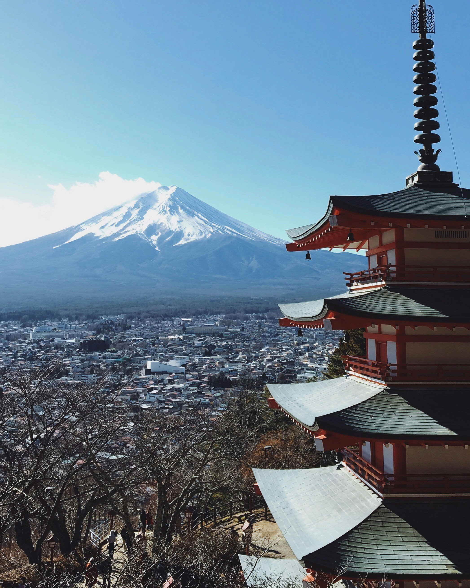
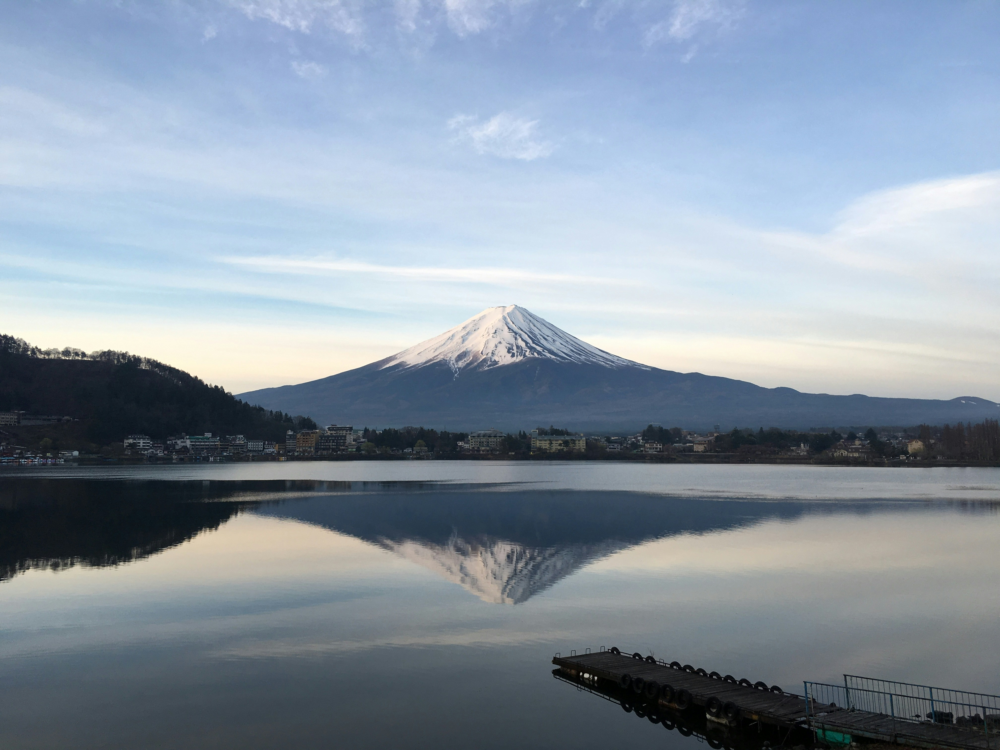
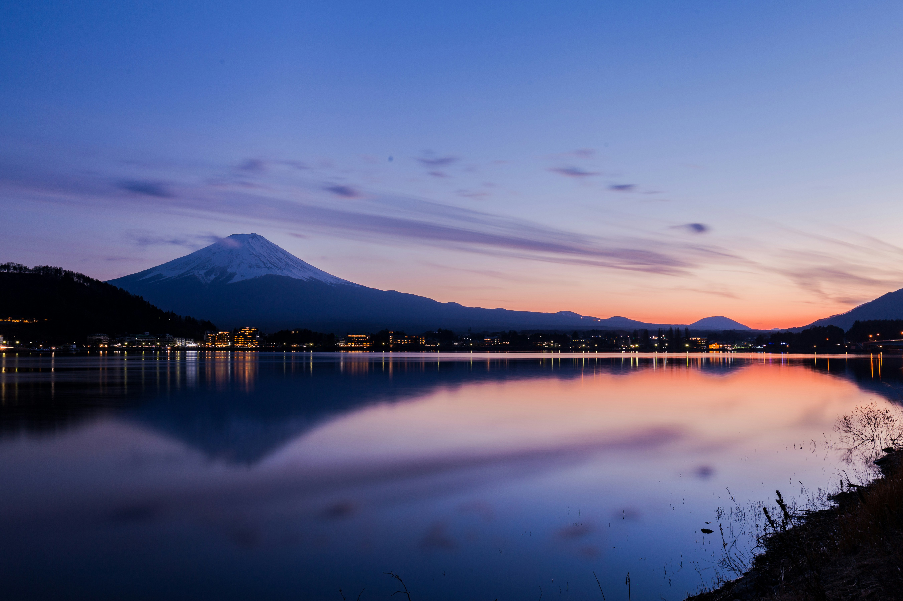
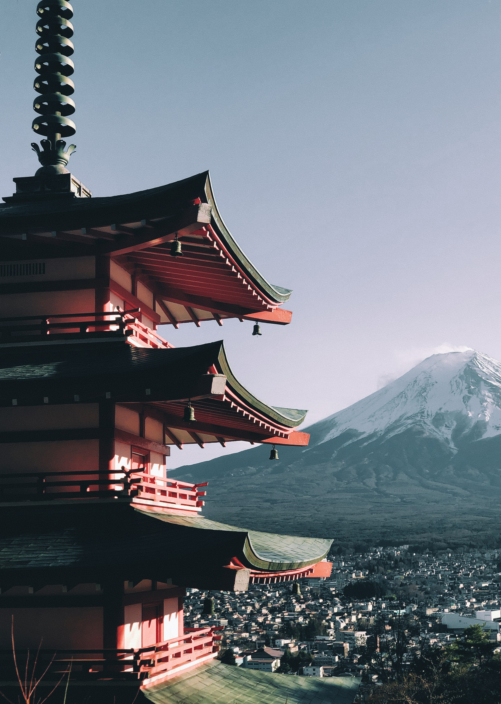
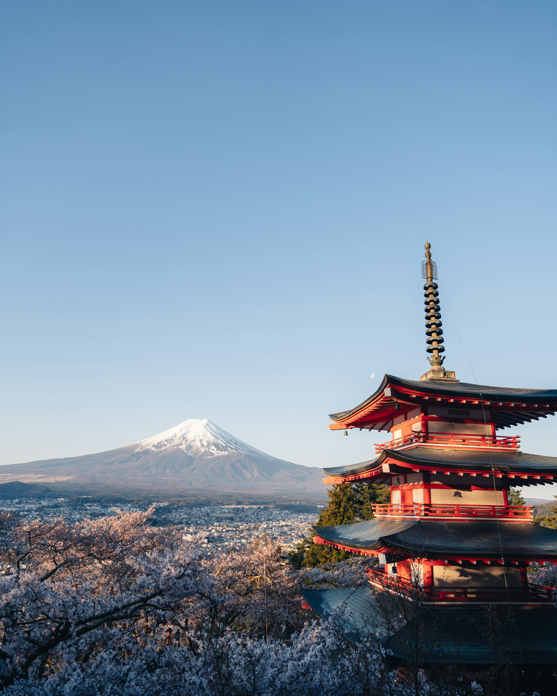

Fuji is a shape and a mood — changing with clouds, wind, and light. From lakeside reflections to tea fields and city rooftops, this photo-driven guide highlights easy viewpoints, seasonal timing, and small tricks that make the day smoother.

_First glimpse over fields — Placeholder_

## Classic Viewpoints

- **Lake Kawaguchi (Kawaguchiko):** Easy access, sunrise reflections, and seasonal frames.
- **Chureito Pagoda (Arakura Sengen):** Iconic pagoda + Fuji alignment; best at early/late hours.
- **Oshino Hakkai:** Springs and village textures with Fuji beyond.
- **Lake Yamanaka / Motosu:** Wide water and calm mornings.

_Kawaguchiko reflection — Placeholder_

_Chureito lines — Placeholder_

## Seasons and Light

- **Winter:** Crisp air, snowy crown, clear horizons.
- **Spring:** Blossoms + Fuji; crowds grow — go early.
- **Summer:** Green frames; summit climbing season (check conditions).
- **Autumn:** Maples and clear mornings after fronts.

_Winter crown — Placeholder_

_Autumn frame — Placeholder_

## Small Itineraries

- **Half-day:** Chureito at dawn → Kawaguchiko shore walk.
- **Full day:** Oshino Hakkai → Kawaguchiko loop → sunset pier.
- **Weekend:** Day 1 lakes + ropeway; Day 2 tea fields or Fuji Five Lakes hop.

_Oshino paths — Placeholder_

_Pier at dusk — Placeholder_

## Photo Tips

- **Watch wind:** Still water after cold, calm nights.
- **Use foregrounds:** Reeds, rails, pagodas, and piers for depth.
- **Travel early:** Beat haze and buses; blue hour rewards.

_Reeds and reflections — Placeholder_

## Summit Season Notes

If you plan to climb: check trail openings, bring layers and headlamp, hydrate, and respect altitude — turn back if needed.

_Trail to the sky — Placeholder_

## Getting There

From Tokyo: express bus to Kawaguchiko, or train (Chuo Line → Fujikyu). Local buses serve pagoda, ropeway, and lake stops.

_Local bus, easy hops — Placeholder_

## Quick Tips

- **Plan A/B:** Clouds happen; keep alternate spots.
- **Snacks and cash:** Convenience stores help, but hours vary.
- **Respect spaces:** Shrines/paths have local rules.

_Last light on Fuji — Placeholder_

Fuji rewards patience and small adjustments — watch the wind, move a few steps, and the mountain will give you a frame.

—

Credits are embedded in each caption (Placeholder). After selecting specific images, replace with photographer names/links as needed.

