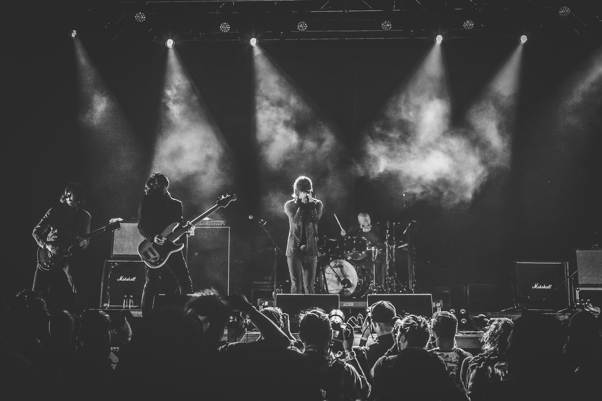
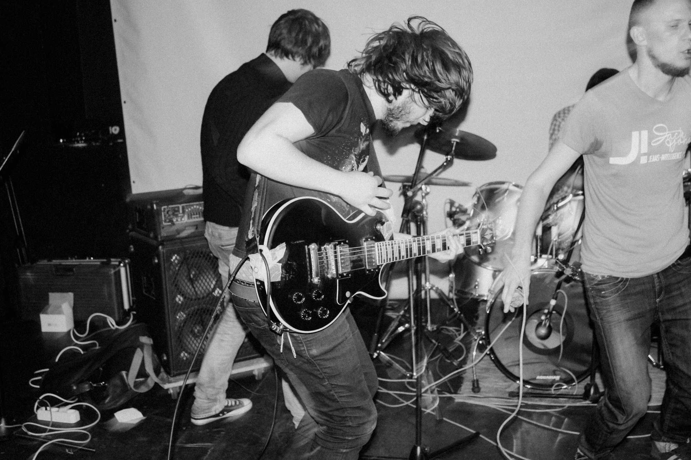
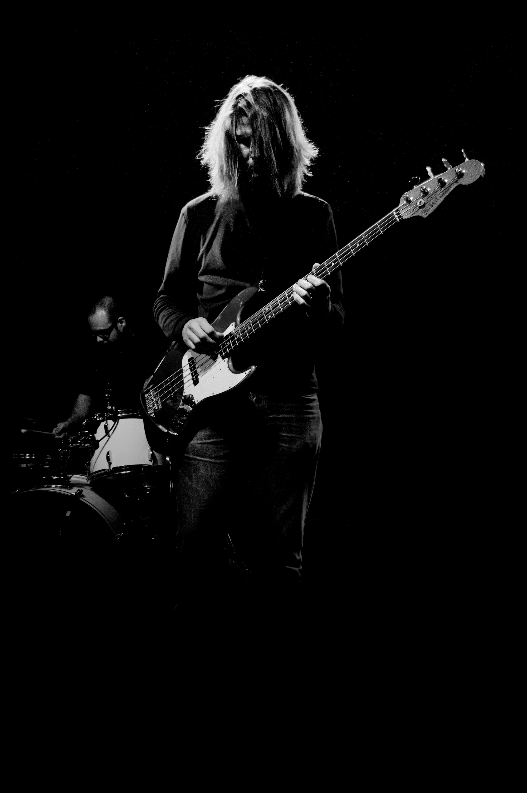
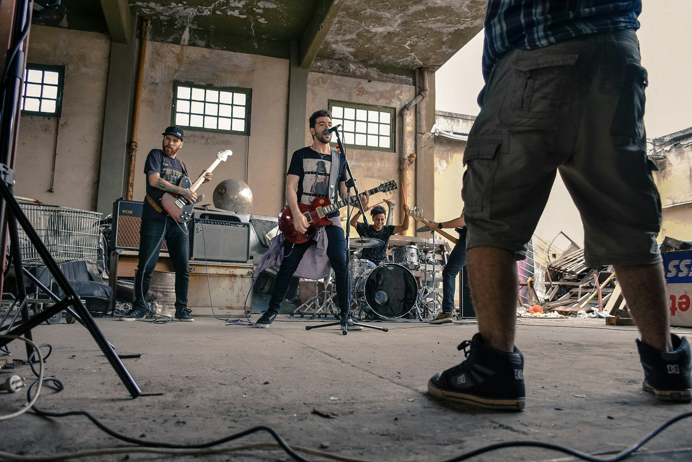
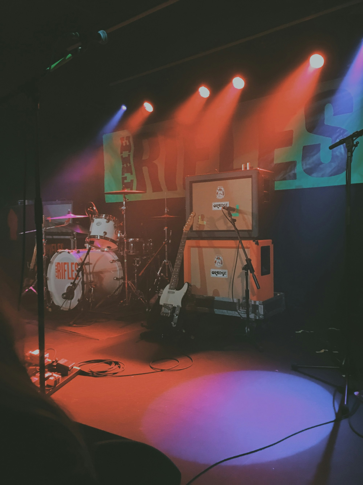
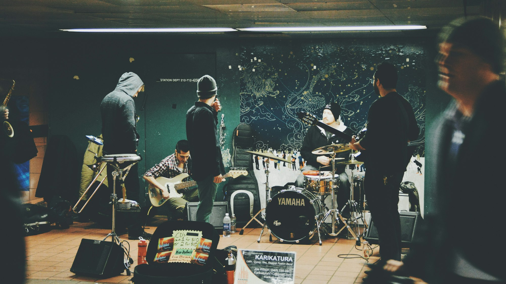
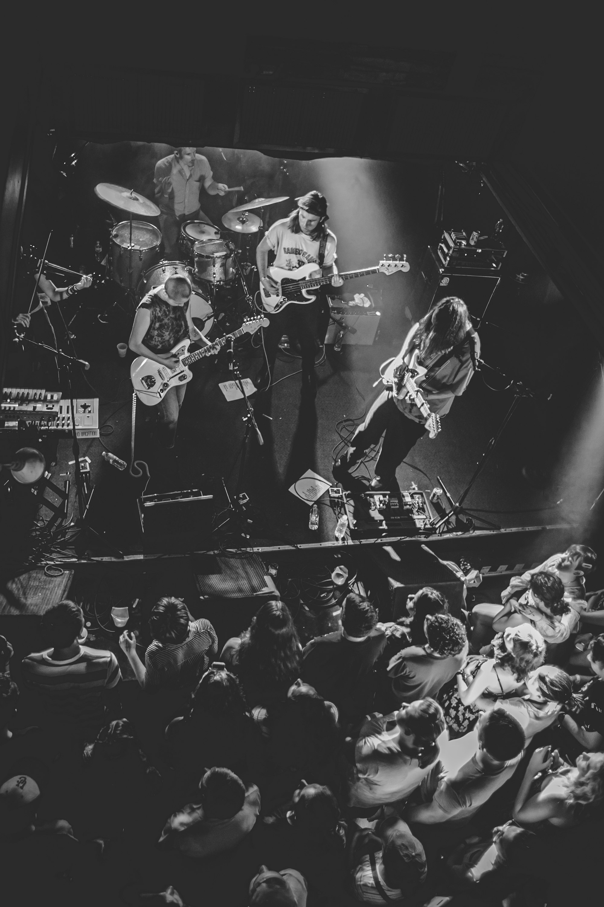
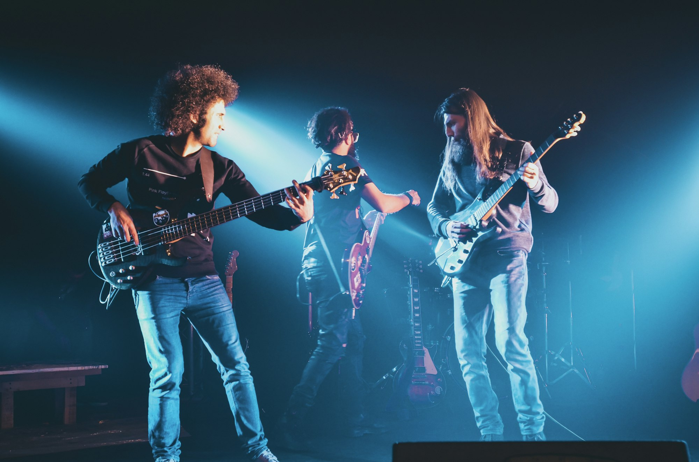
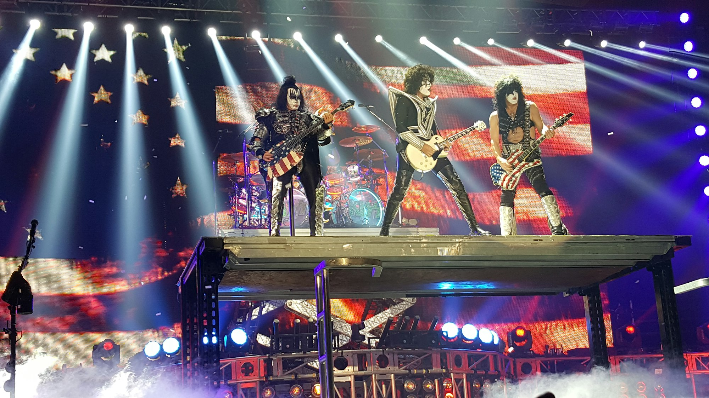
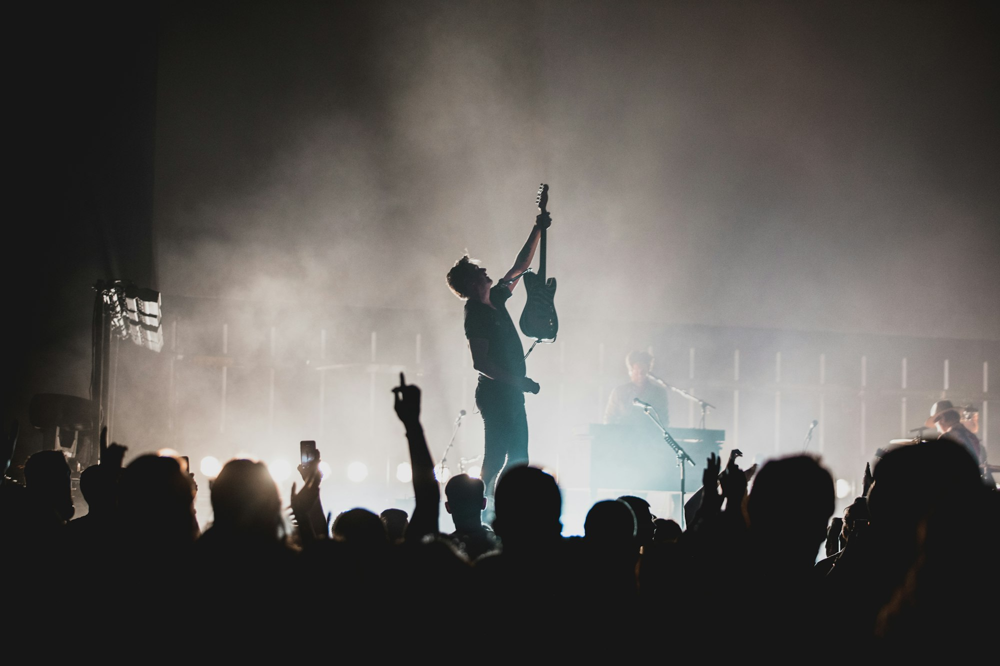

Festival rock sets are about impact and connection — tight arrangements, big choruses, clear stage roles, and a mix that carries to the back rail. This photo-driven guide covers stagecraft, sound, set pacing, and the small habits that make big shows land.

_Gates open, guitar checks — Placeholder_

## Stagecraft: Roles and Space

Divide the stage with purpose: vocals center, guitars wide, bass near drums, keys for sightlines. Use movement to mark sections — step to the front for solos and pre-choruses.

_Owning stage left/right — Placeholder_

_Chorus formation — Placeholder_

## Sound: Gain, Headroom, Clarity

Line check before soundcheck; keep stage volume reasonable so FOH can build power out front. High-pass where possible, carve mids for guitars, leave room for vocals.

_Soundcheck focus — Placeholder_

_FOH perspective — Placeholder_

## Setlists: Arc and Momentum

Open strong, earn the longer builds mid-set, and stack finales. Anchor sing-alongs near the end; keep transitions tight (count-ins, samples, or drum pickups).

_Golden-hour lift — Placeholder_

_Tight transitions — Placeholder_

## Gear: Guitars, Drums, Monitoring

Bring backups and spares (strings, picks, cables, fuses). Tune often, dampen what rings, and set monitor cues (IEMs or wedges) for vocals first.

_Backline ready — Placeholder_

## Crowd Connection

Short, clear talk breaks; teach a chorus line if the crowd is with you. Use the stage run for the peak; thank the crew and festival by name.

_Call and response — Placeholder_

## Safety and Stamina

Hydrate, ear protection, and sun strategy for day sets. Pace jumps and runs; save legs for the closer.

_Final push — Placeholder_

## Quick Tips

- **Mark cues:** Everyone knows the count and ending.
- **Tidy stage:** Tape runs, label lines, no trip hazards.
- **Check backup paths:** Spare DI, alt tuner, second cable.
- **Smile and breathe:** Anxiety reads; joy spreads.

_Confetti and smiles — Placeholder_

Rock festival sets are sprints with a marathon’s prep. Nail the details, trust the mix, and let the songs do the heavy lifting.

—

Credits are embedded in each caption (Placeholder). After selecting specific images, replace with photographer names/links as needed.

