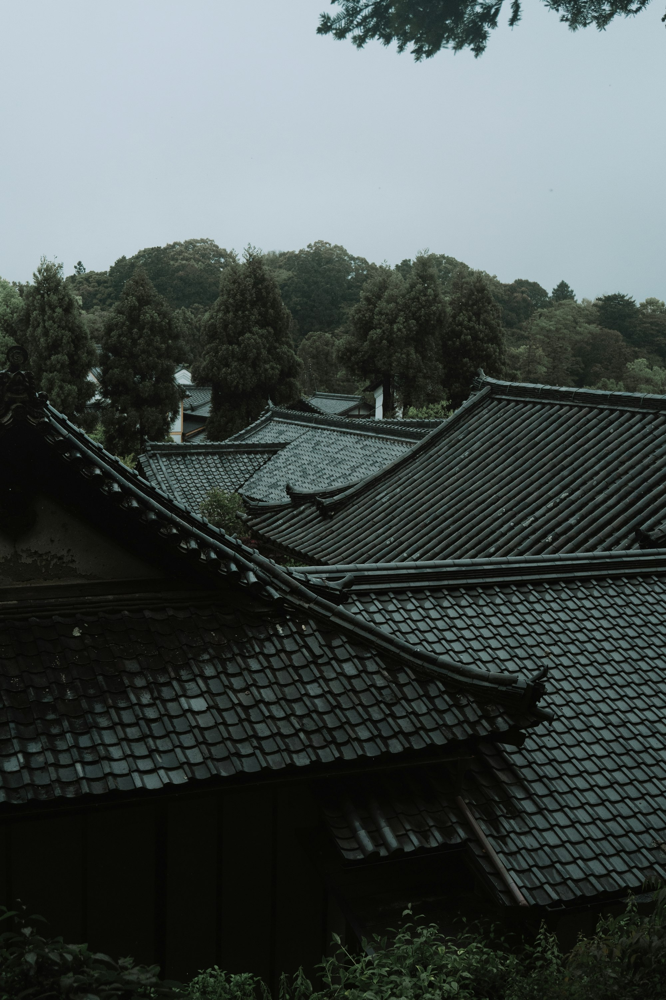

Ninja (shinobi) occupy a blurred line between history and legend. Beyond pop culture silhouettes lie networks, intel, and survival skills shaped by geography, politics, and necessity. This photo-forward guide touches on context, tools, training, and the mythos that persists.

_Night approach — Placeholder_

## Context and Roles

Shinobi supported warlords with reconnaissance, infiltration, counter‑intel, and sabotage. Regions like Iga and Kōga are central in records and folklore.

_Hidden paths — Placeholder_

_Signals and codes — Placeholder_

## Tools and Techniques

- **Ropes/Climbing:** Access and escape across walls and terrain.
- **Disguise/Deception:** Dress the part; blend into crowds and trades.
- **Implements:** Kunai, shuriken, smoke, and firecraft — context over duel fantasy.

_Implements and ropework — Placeholder_

_Trail and terrain — Placeholder_

## Training and Discipline

Conditioning, balance, navigation, and observation were as critical as combat. Reading wind, water, and footsteps often outweighed force.

_Balance and footing — Placeholder_

_Silent movement — Placeholder_

## Myth vs Reality

Sources mix manuals, anecdotes, and later fiction. Separate stage costume from practical dress; weigh claims against era and need.

_Between lanterns and shadow — Placeholder_

## Landscapes and Hideaways

Mountain passes, forests, rivers, and castle towns shaped tactics — movement follows terrain and schedule.

_Forest edge — Placeholder_

## Explore with Care

- **Museums/Local history:** Regional archives and exhibits.
- **Sites/Trails:** Castles, post towns, and mountain routes.
- **Read critically:** Manuals, scholars, and folklore together.

_Footsteps fade — Placeholder_

Ninja stories persist because they mix craft with imagination. Study patiently, travel thoughtfully, and enjoy how history and art inform each other.

—

Credits are embedded in each caption (Placeholder). After selecting specific images, replace with photographer names/links as needed.

