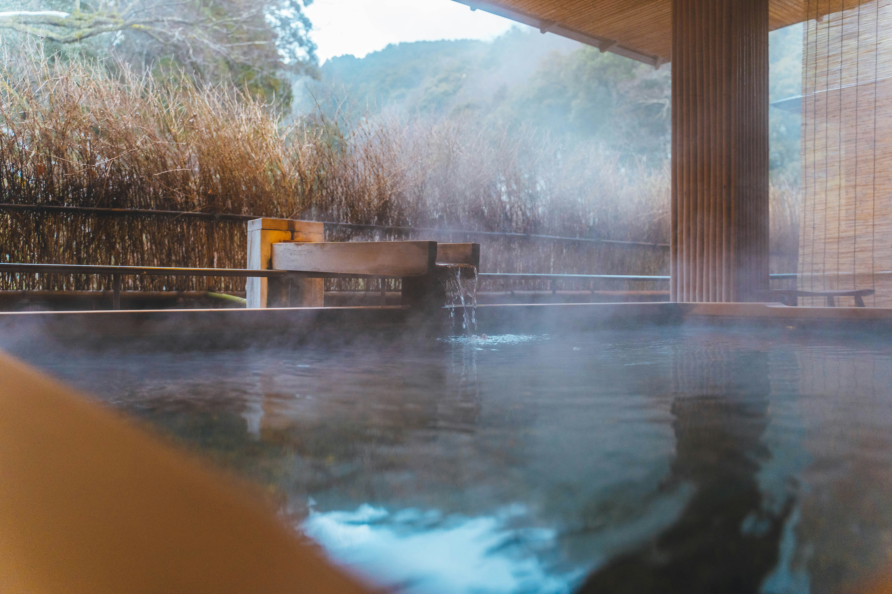
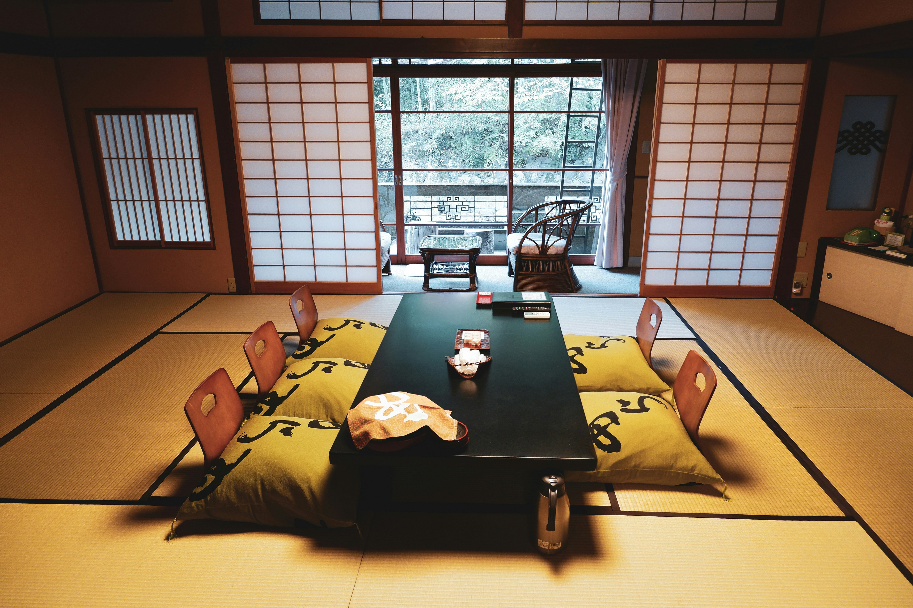
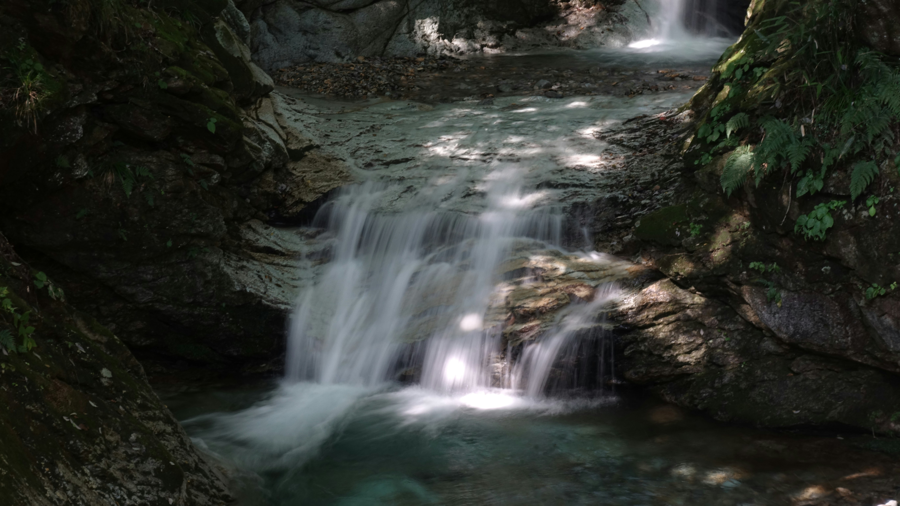

Onsen is seasonal poetry — snow steam, spring blossoms, summer cicadas, autumn leaves. Learn bathing steps, towel etiquette, and local styles.

_Ryokan approach — Placeholder_

## How to Bathe

Rinse, soak, rest, hydrate; repeat gently. Respect quiet and photography rules.

_Steam and cedar — Placeholder_

_Winter soak — Placeholder_

—

Credits are embedded in each caption (Placeholder).

