Bridging oceans and continents, Panama blends glassy skylines with colonial alleys, cloud forests, and island reefs. This photo-driven primer covers highlights, neighborhoods, nature escapes, and essentials for easy planning.

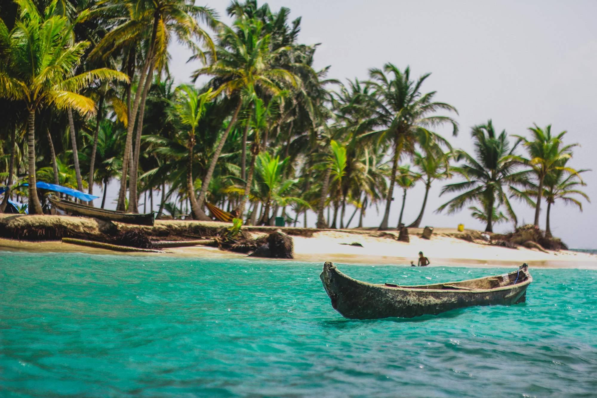
_First look at the skyline — Placeholder_

## Panama City at a Glance

- **Cinta Costera:** Waterfront path with city views.
- **Casco Viejo:** UNESCO-listed old quarter of plazas, cafés, and churches.
- **Amador Causeway:** Views of the Pacific entrance to the Canal.

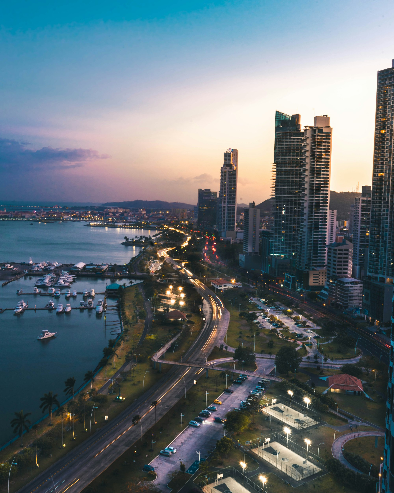
_Casco Viejo textures — Placeholder_

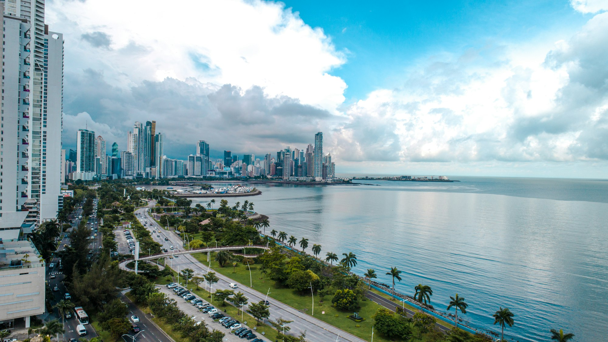
_Amador sunset — Placeholder_

## The Panama Canal

Engineering and ecology meet at Miraflores, Agua Clara, and the expanded locks. Time your visit to watch ships rise and the rainforest frame the lanes.

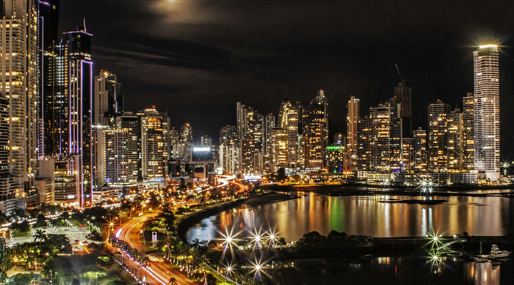
_Miraflores locks in motion — Placeholder_

## Nature: From Cloud Forests to Coral

- **Boquete (Chiriquí):** Coffee fincas, cloud-forest trails, and cool mornings.
- **Bocas del Toro:** Wooden towns, reefs, and laid-back Caribbean pace.
- **San Blas (Guna Yala):** Postcard islets and turquoise shallows.

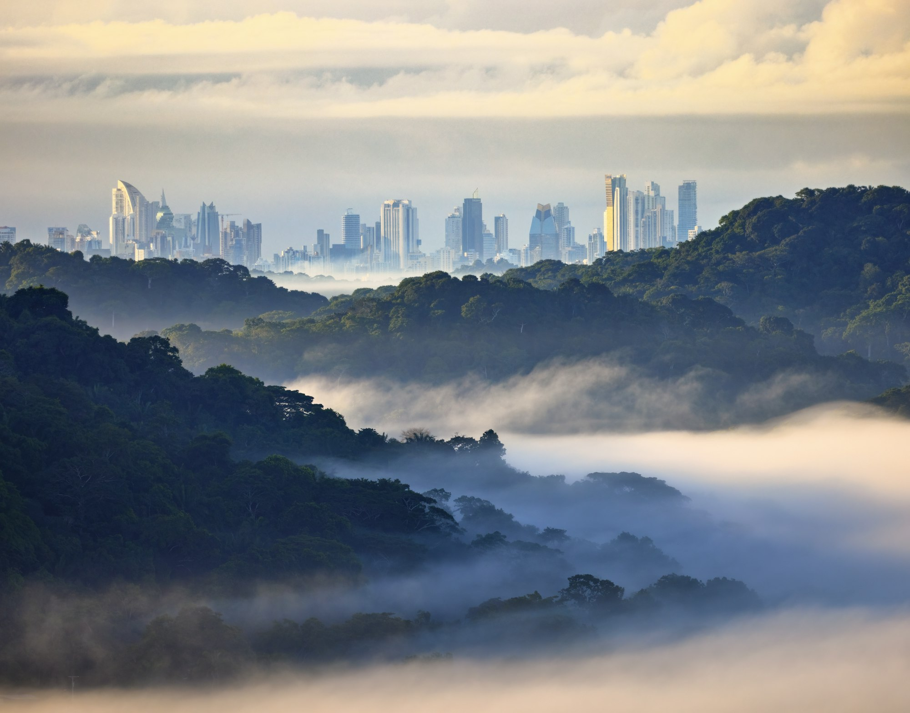
_Coffee highlands — Placeholder_

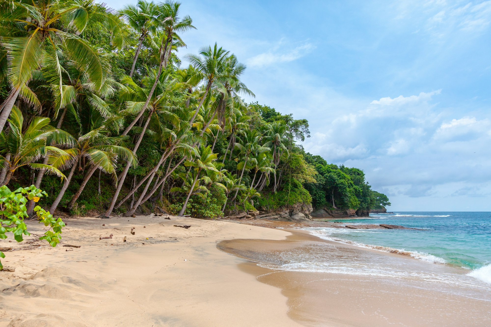
_Caribbean palette — Placeholder_

## Wildlife and Rainforest

Soberanía National Park and Pipeline Road are famed for birding (toucans, motmots). Closer to the city, Metropolitan Natural Park brings sloths and skyline in one frame.

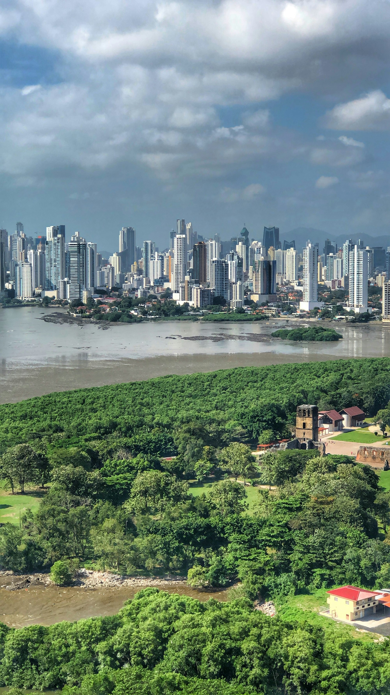
_Rainforest canopy — Placeholder_

## Food and Coffee

Sea-to-table ceviche, Afro-Panamanian stews, and world-class coffee (including Geisha). Casco offers bakeries and rooftops; Boquete roasteries pour farm-to-cup.

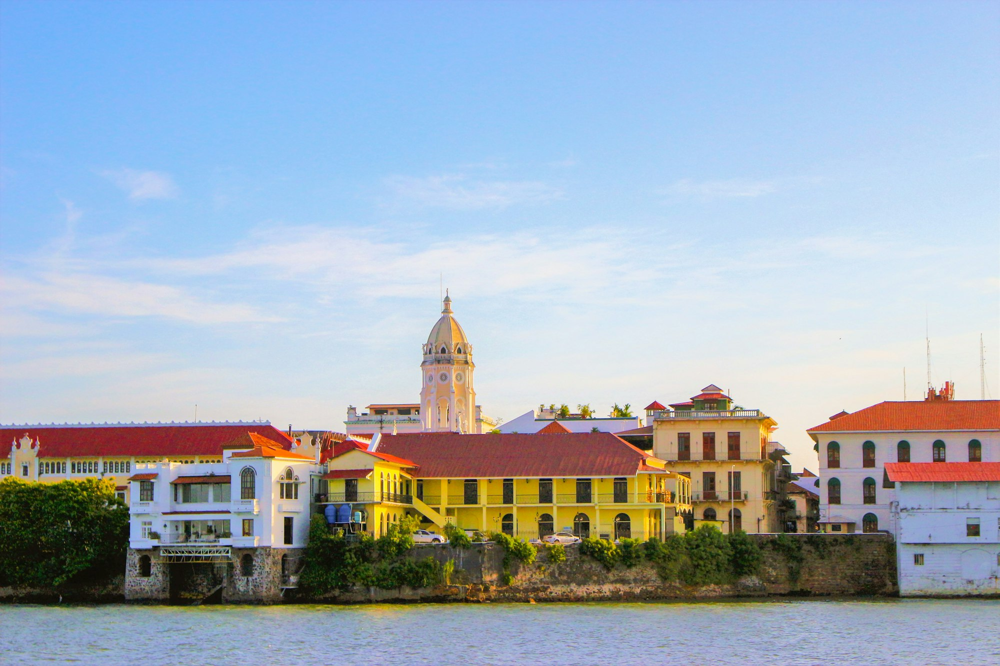
_Fresh ceviche stop — Placeholder_

## Getting Around and Safety

Use the metro and rideshares in the city; for highlands/islands, book transfers or fly regional. Mind sun and hydration; carry light rain gear year-round.

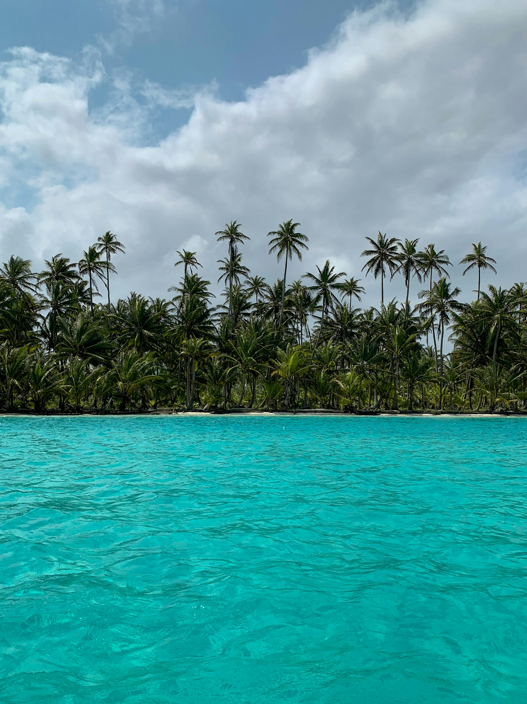
_On the move — Placeholder_

## Sample Itineraries

- **48 hours:** Casco + Canal + Causeway.
- **5–6 days:** Add Boquete (coffee, hikes) or Bocas (islands).
- **8–10 days:** City + Boquete + San Blas or Bocas.

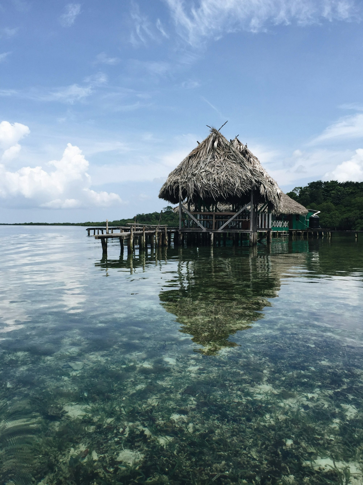
_Island day trip — Placeholder_

## Quick Tips

- **Time the Canal:** Check transit times for action.
- **Pack light layers:** Tropics + highland mornings.
- **Cash + card:** Some islands are cash-only.
- **Respect communities:** Especially in Guna Yala.

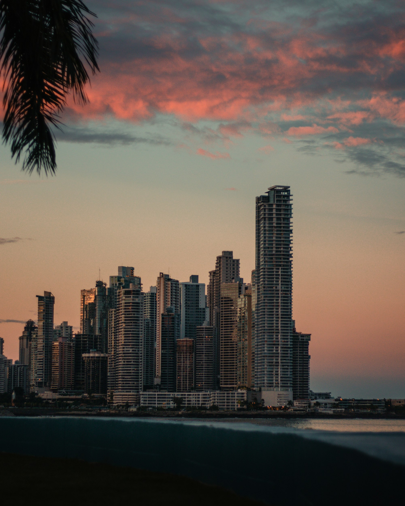
_Golden hour in Casco — Placeholder_

Panama rewards curiosity and pacing — split days between city and nature, sip the coffee slowly, and let the views do the rest.

—

Credits are embedded in each caption (Placeholder). After selecting specific images, replace with photographer names/links as needed.

