Parisian style is less about trends and more about an attitude—a confident, understated elegance that feels both timeless and modern. The streets of Paris, from Le Marais to Saint-Germain-des-Prés, are a masterclass in the art of dressing well without looking like you've tried too hard. This photo-forward post explores that quintessential French cool.

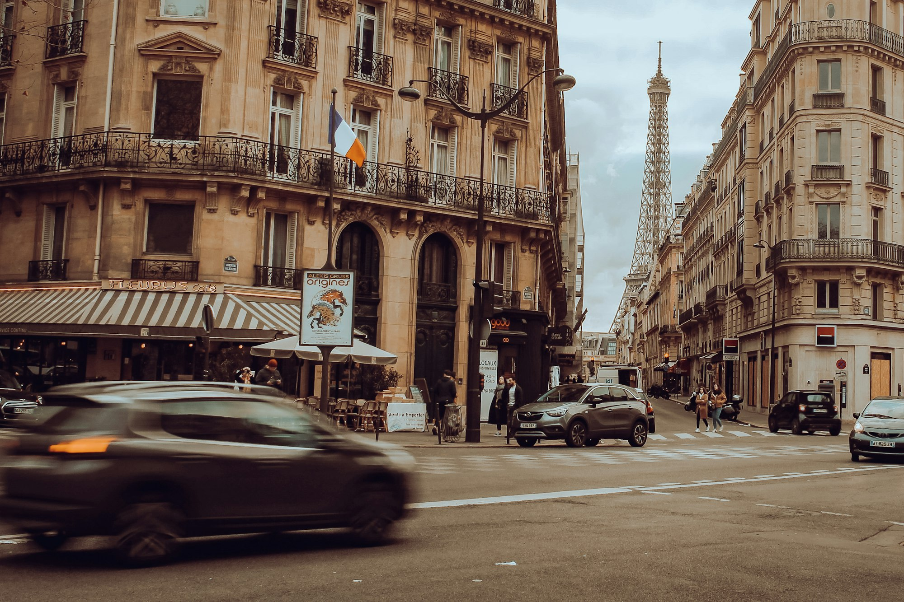
_Effortless chic in Le Marais — Placeholder_

## The Foundation: Classic Pieces

The Parisian wardrobe is built on a foundation of high-quality, versatile classics: the perfect trench coat, a well-cut pair of jeans, a simple silk blouse, and a timeless blazer. These pieces are the canvas for personal style.

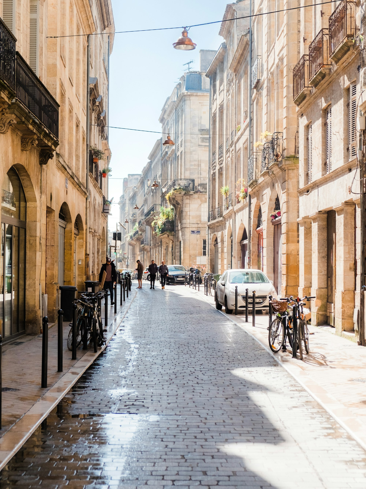
_The iconic trench coat — Placeholder_

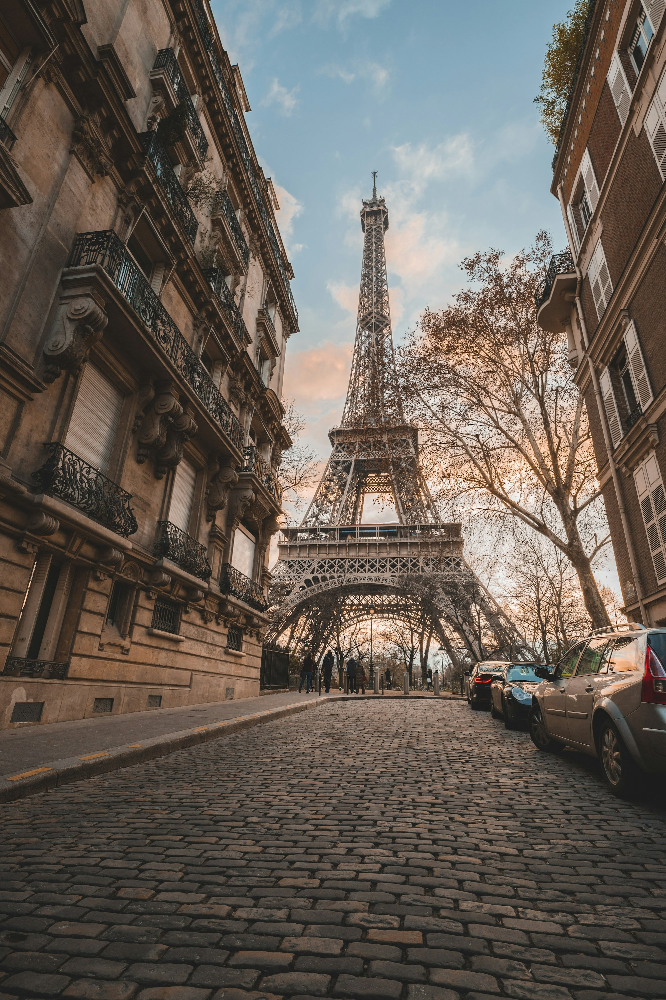
_Perfectly fitted denim — Placeholder_

## A Neutral Palette

Color is used sparingly. The Parisian palette is dominated by neutrals—black, white, navy, beige, and grey. This creates a cohesive, sophisticated look that allows the focus to be on silhouette and texture.

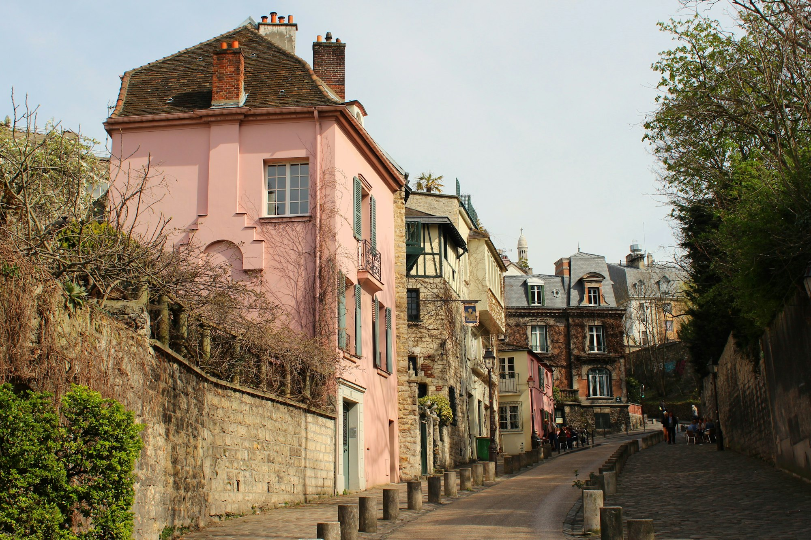
_A study in monochrome — Placeholder_

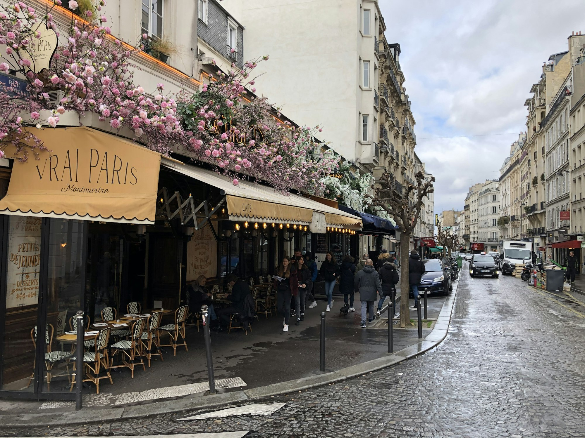
_Subtle pops of color — Placeholder_

## The Art of the Silhouette

Fit is everything. Parisians understand the power of a strong silhouette, whether it's the sharp shoulder of a blazer or the gentle drape of a silk dress. The clothes don't wear the person; the person wears the clothes.

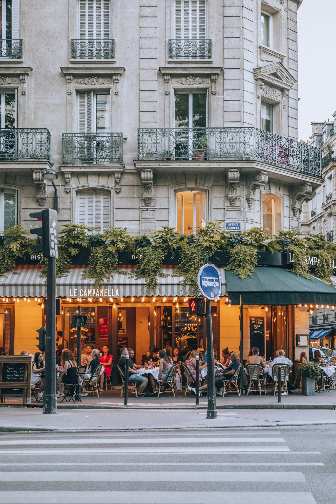
_A sharp, tailored blazer — Placeholder_

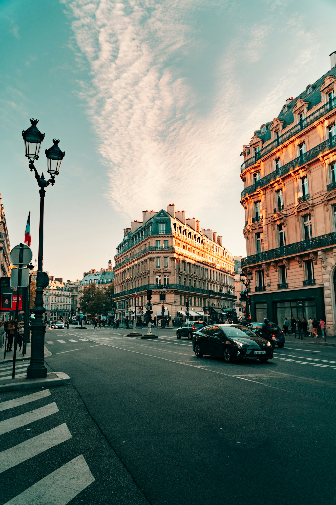
_Flowing, feminine dress — Placeholder_

## Minimal, Meaningful Accessories

Accessories are chosen with care. A single, beautiful handbag, a delicate piece of jewelry, or a classic silk scarf is often all that's needed. The goal is to complement, not overwhelm, the outfit.

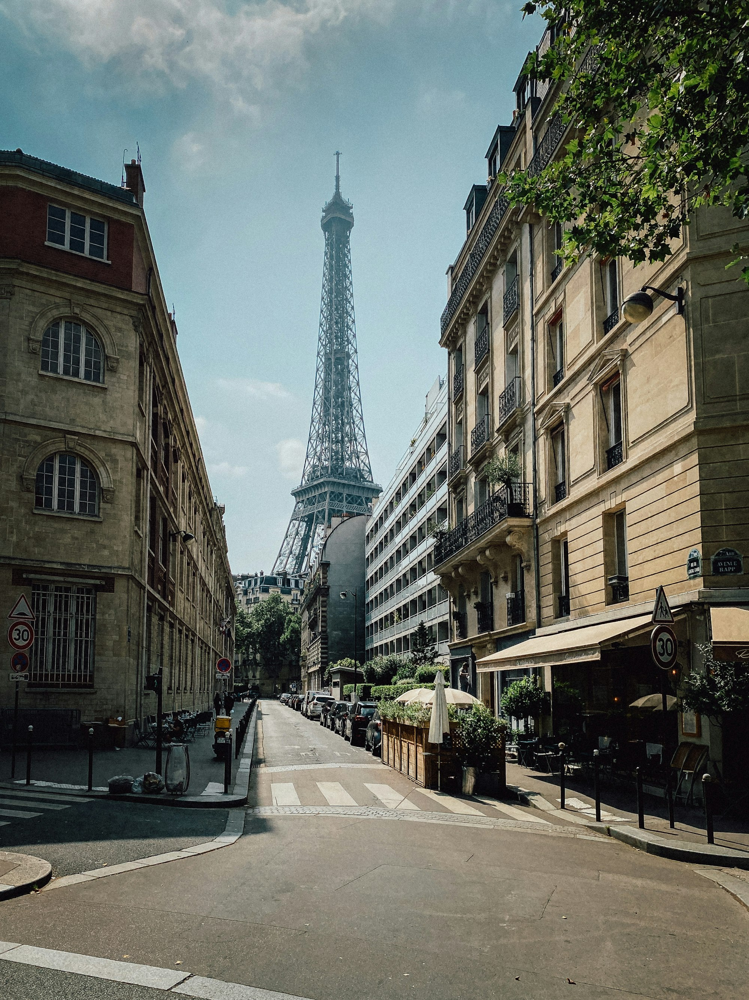
_The perfect leather handbag — Placeholder_

## The "I Woke Up Like This" Aesthetic

Hair is often slightly undone, and makeup is minimal. This sense of ease and natural beauty is central to the Parisian aesthetic. It's about looking like the best version of yourself, not someone else.

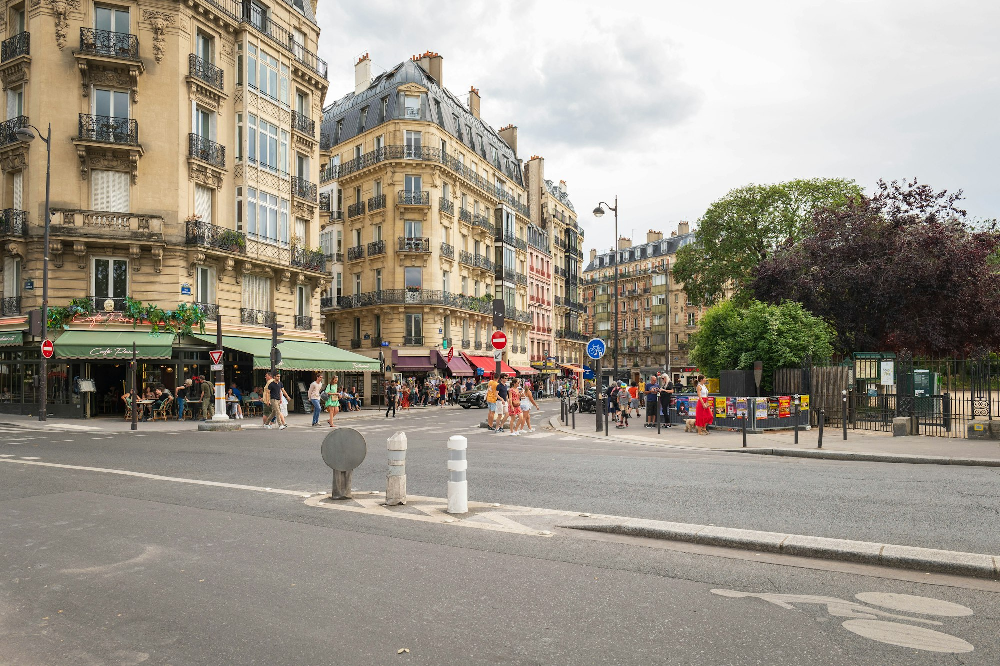
_Natural, unfussy hair — Placeholder_

## Footwear: Chic and Walkable

Shoes must be stylish, but they must also be practical for navigating the city's cobblestone streets. Classic choices include ballet flats, loafers, and low block heels.

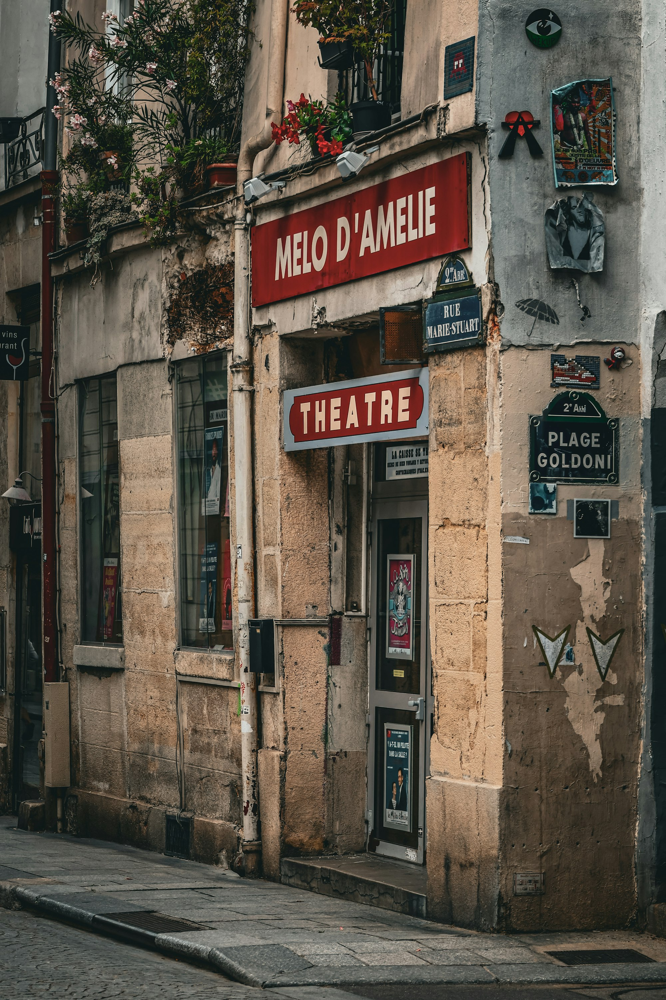
_Classic ballet flats — Placeholder_

## Where to People-Watch

- **Le Marais:** For trendy, fashion-forward looks.
- **Saint-Germain-des-Prés:** For classic, intellectual style.
- **Canal Saint-Martin:** For a more bohemian, relaxed vibe.

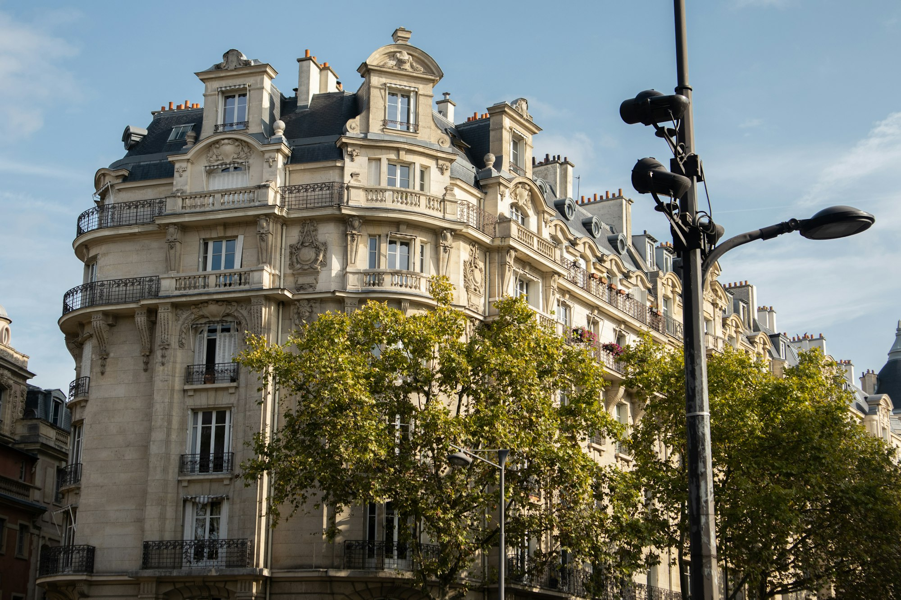
_A moment by the Seine — Placeholder_

## Key Style Principles

- **Invest in quality basics:** These are the building blocks of your wardrobe.
- **Prioritize fit:** Tailoring can make even the simplest outfit look expensive.
- **Embrace neutrals:** A neutral palette is endlessly versatile.
- **Less is more:** Avoid over-accessorizing.
- **Be confident:** The most important element of Parisian style is the attitude.

Parisian street style is an enduring source of inspiration because it's rooted in timeless principles of elegance, quality, and confidence. It's a reminder that true style is not about chasing trends, but about knowing yourself.

—

Credits are embedded in each caption (Placeholder). After selecting specific images, replace with photographer names/links as needed.
