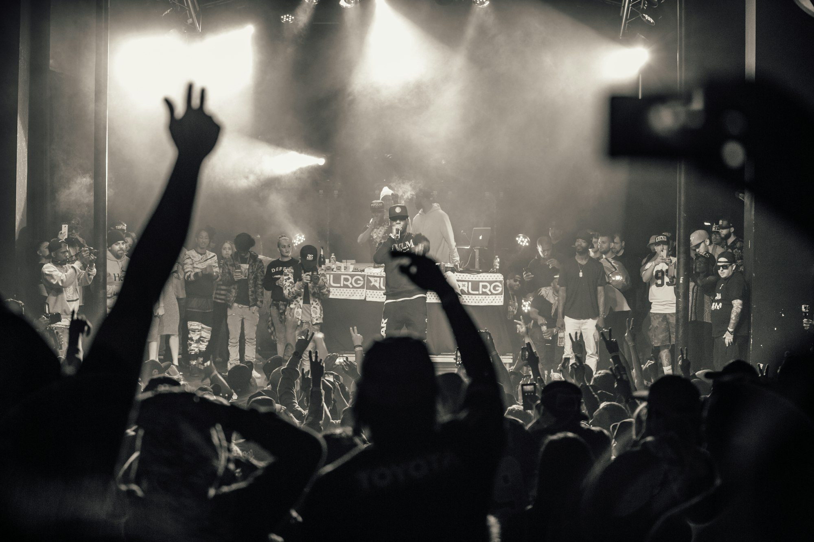

Rap is voice, rhythm, and story — a craft built on breath control, timing, and wordplay. From writing in notebooks to recording in the studio and rocking live shows, this photo-forward piece breaks down fundamentals for steady progression.

_Cypher energy — Placeholder_

## Flow and Delivery

Flow lives in rhythm and breath. Map bar lines, mark breaths, and vary cadence (double-time, halftime) to shape momentum and impact.

_Mic technique — Placeholder_

_Stage presence — Placeholder_

## Writing: Content and Wordplay

Start with a concept, build images and point of view, then layer multis, internals, and setups. Punchlines land harder when the story earns them.

_Notebook and drafts — Placeholder_

_In the pocket — Placeholder_

## Beats and Structure

Pick beats that fit your voice. Learn 4/4 bar math, hooks every 8 or 16, and use pre-chorus lifts or ad-libs to guide listeners.

_Producer and pads — Placeholder_

_Hook moment — Placeholder_

## Recording: Clean Takes and Layers

Warm up, track leads first, then doubles and ad-libs with intention. Gain-stage properly, cut breaths tastefully, and leave space for dynamics.

_Tracking in the booth — Placeholder_

## Live: Presence, Breath, and Crowd Work

Own the stage: eye lines, posture, and pacing. Train diaphragmatic breath, rehearse cut-down verses, and give the crowd clear cues.

_Own the stage — Placeholder_

## Freestyle and Cyphers

Drill alphabets, rhyme families, and topic switches. In the cypher, listen first, build on ideas, and keep it respectful.

_Circle up — Placeholder_

## Quick Tips

- **Write daily:** Small reps compound into catalog.
- **Count bars:** Flow clarity starts with structure.
- **Record often:** Mic awareness grows in the booth.
- **Perform early:** Live feedback sharpens delivery.

_Encore glow — Placeholder_

Rap rewards honesty and craft. Keep showing up — verse by verse, show by show, your voice finds its weight.

—

Credits are embedded in each caption (Placeholder). After selecting specific images, replace with photographer names/links as needed.

