Samurai were warrior-aristocrats whose roles evolved across centuries — from mounted archers to disciplined retainers balancing arms, administration, and arts. Their legacy survives in craft, ceremony, and the modern imagination.

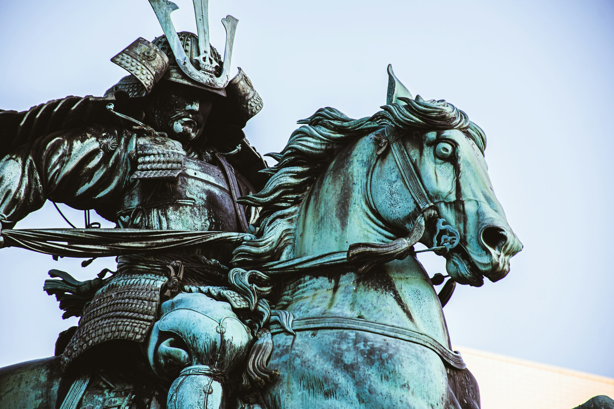
_Dawn at the gate — Placeholder_

## A Brief Timeline

From Heian roots to the Kamakura shogunate, through Sengoku turmoil and Edo peace, the samurai’s duties adapted to state and society — warfare, governance, and cultural patronage.

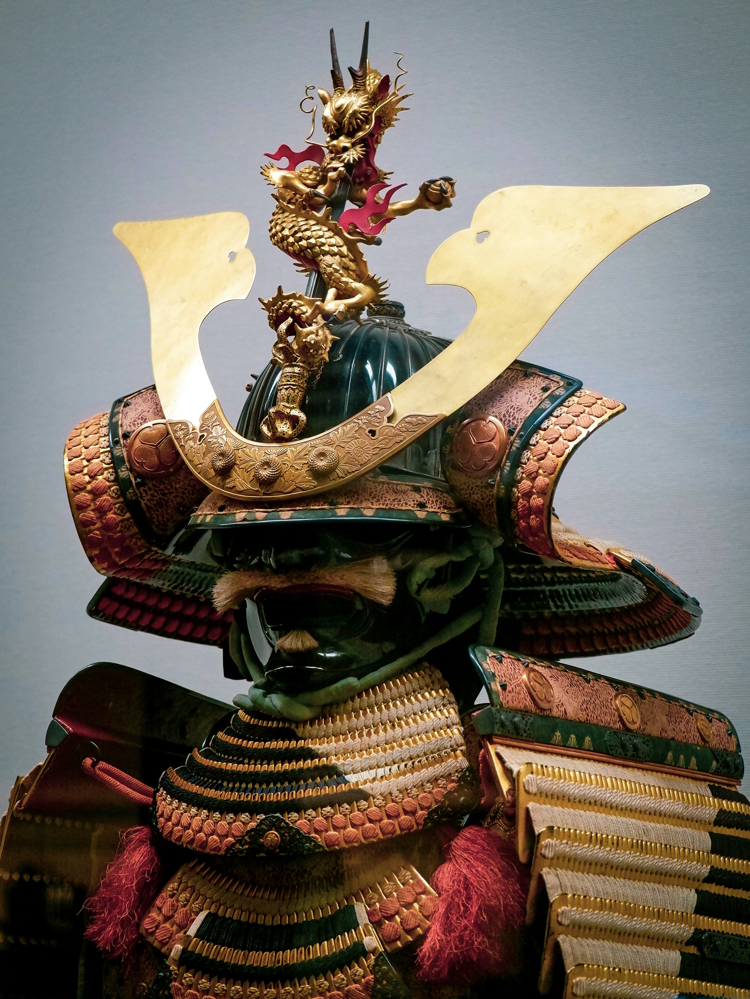
_Castle approach — Placeholder_

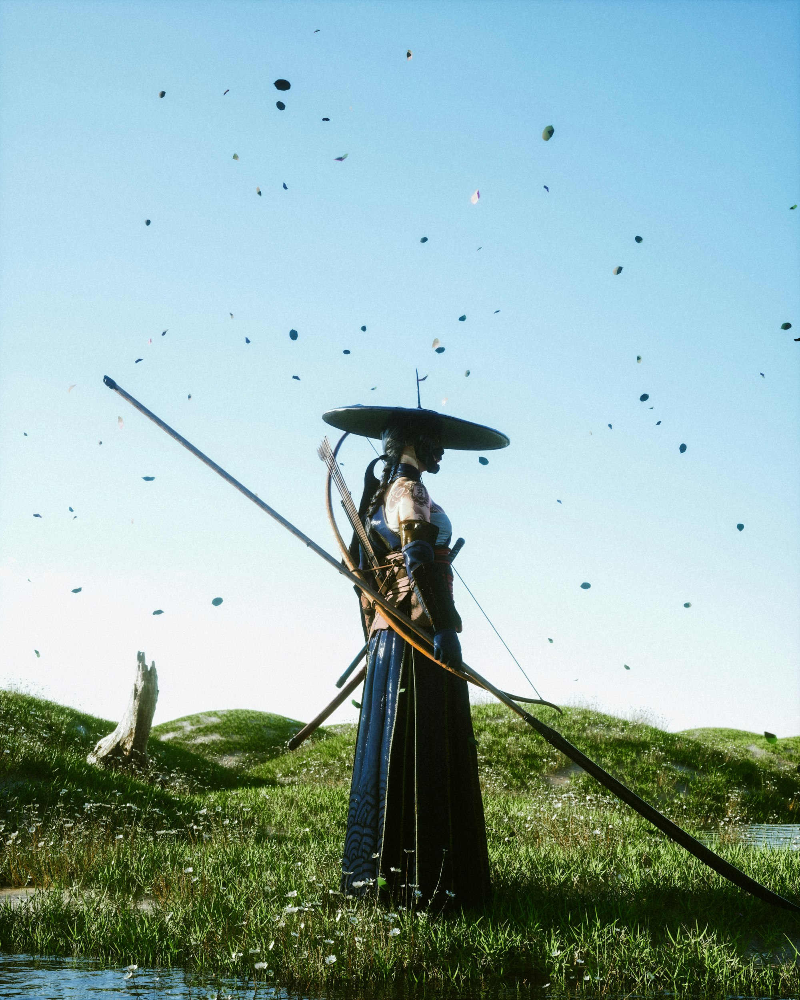
_Quiet courtyard — Placeholder_

## Arms and Armor

- **Katana/Wakizashi:** Curved blades optimized for draw and cut.
- **Yoroi/Do‑maru:** Lamellar armor balancing mobility and protection.
- **Bow/Naginata:** Ranged and reach options shaping tactics.

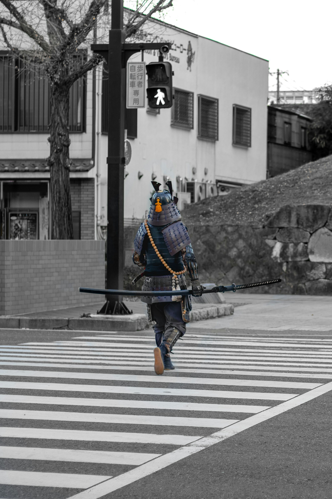
_Blade craftsmanship — Placeholder_

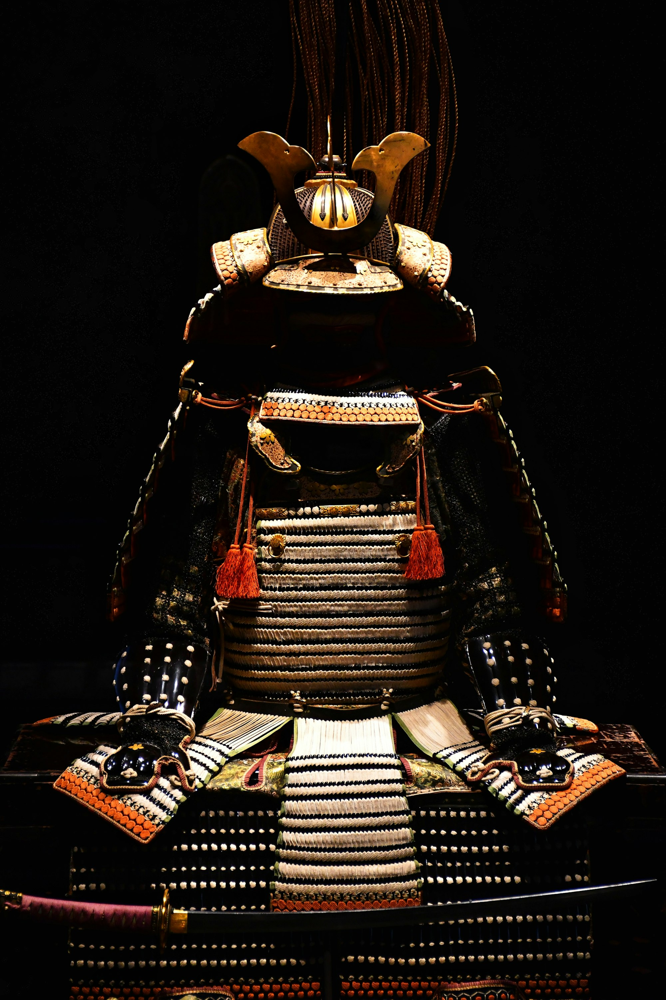
_Armor details — Placeholder_

## Practice and Discipline

Kenjutsu and kyūdō sit alongside calligraphy and poetry — training hands and mind. Etiquette and posture communicate intent before a blade is drawn.

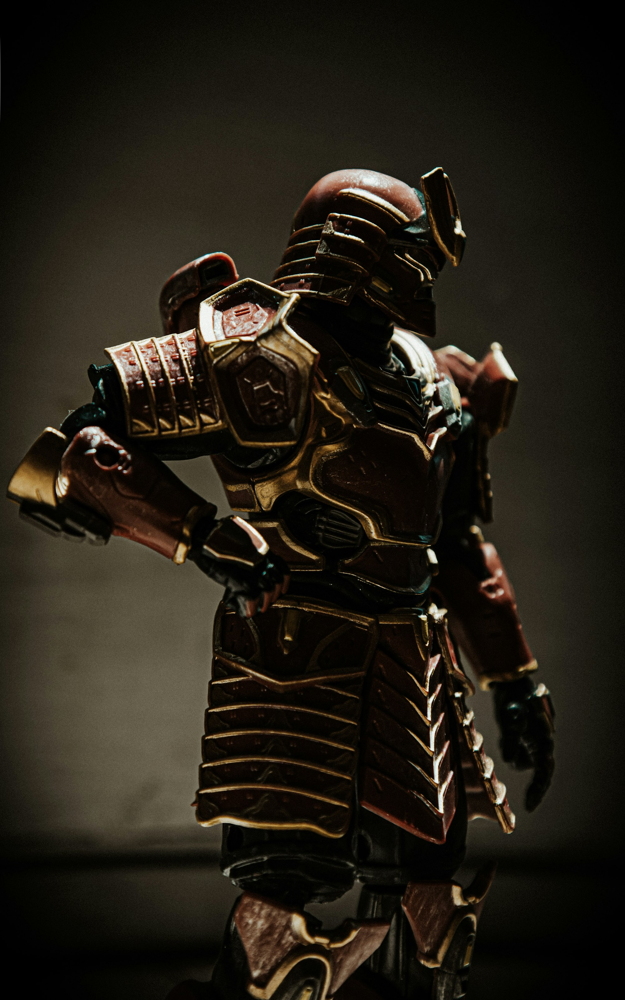
_Dojo focus — Placeholder_

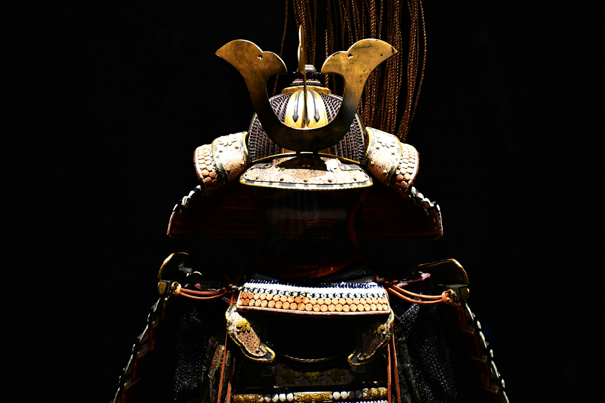
_Forms and breath — Placeholder_

## Codes and Conduct

Bushidō is a later synthesis, but virtues like rectitude, courage, and loyalty appear throughout records. Context matters: ideals met messy realities.

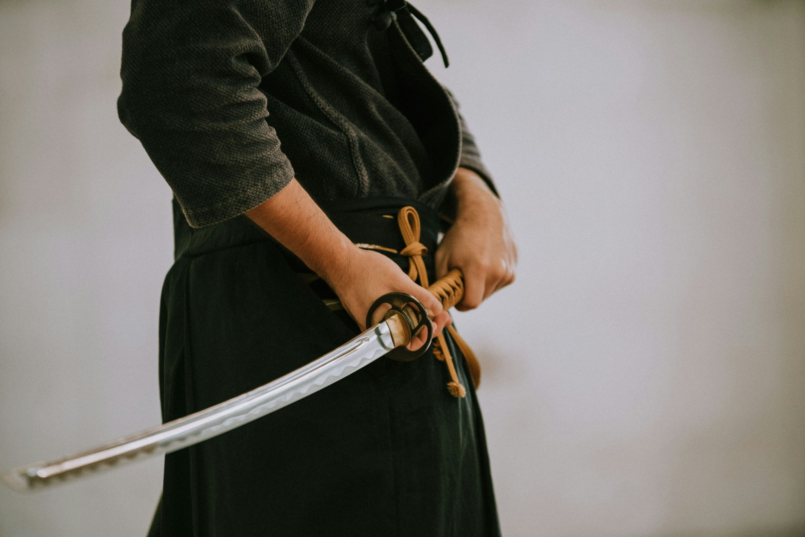
_Symbol and ritual — Placeholder_

## Craft and Aesthetics

Lacquer, silk, iron — objects embody restraint and precision. Architecture, gardens, and tea ceremony reflect control of space, light, and time.

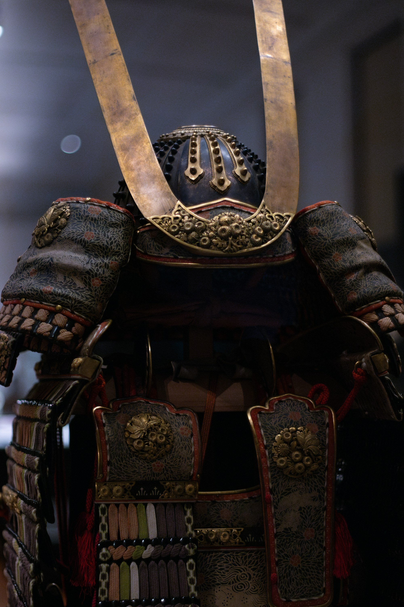
_Materials and pattern — Placeholder_

## Modern Echoes

Cinema, anime, martial arts, and tourism reinterpret samurai for new stories. Respect history, learn context, and enjoy the art it inspired.

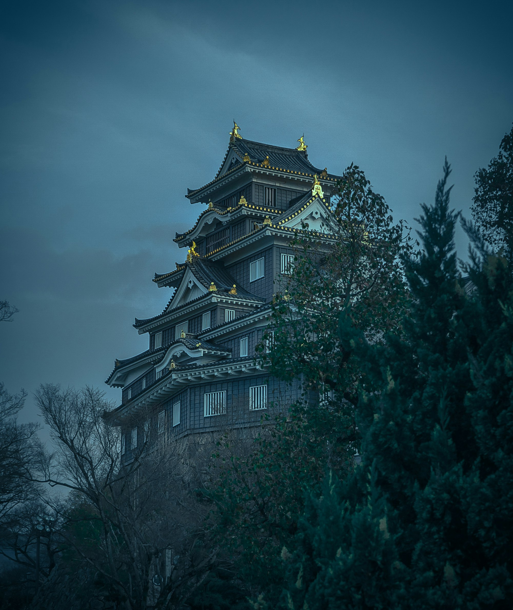
_On screen, reimagined — Placeholder_

## How to Explore

- **Museums/Exhibitions:** Arms, armor, and documents.
- **Castles/Temples:** Spaces that shaped daily rhythms.
- **Dojo visits:** Observe forms and etiquette.
- **Read widely:** History, craft, and critical perspectives.

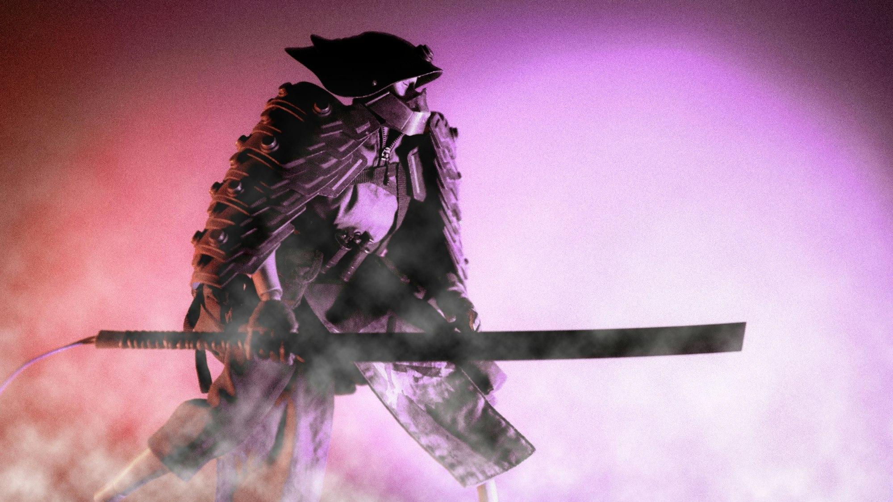
_Evening at the castle moat — Placeholder_

Samurai history is layered — study carefully, travel thoughtfully, and let the objects and spaces speak.

—

Credits are embedded in each caption (Placeholder). After selecting specific images, replace with photographer names/links as needed.

