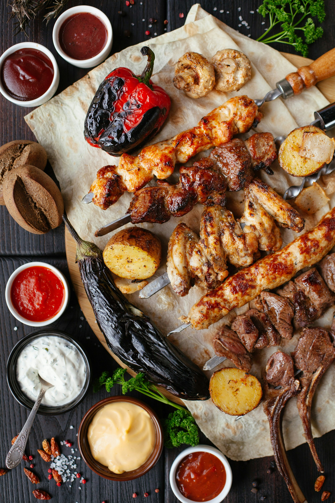

Sauna is simple and deep: warm, breathe, cool, repeat. Learn types (smoke/electric/wood), basic etiquette, and safety.

_Warm wood, soft light — Placeholder_

## The Cycle

Heat 8–15 min, cool down, hydrate, rest — 2–4 rounds. Adjust to body and day.

 
_Löyly moment — Placeholder_

_Cold plunge — Placeholder_

—

     

  

Credits are embedded in each caption (Placeholder).
