Shibuya is not just a district in Tokyo; it's a cultural phenomenon and a global epicenter for youth fashion. Its streets, particularly the famous Scramble Crossing, are a living runway where countless trends are born, evolve, and go global. Shibuya style is characterized by its boldness, its willingness to experiment, and its fearless embrace of subcultures. This photo-forward post dives into the dynamic world of Shibuya street fashion.

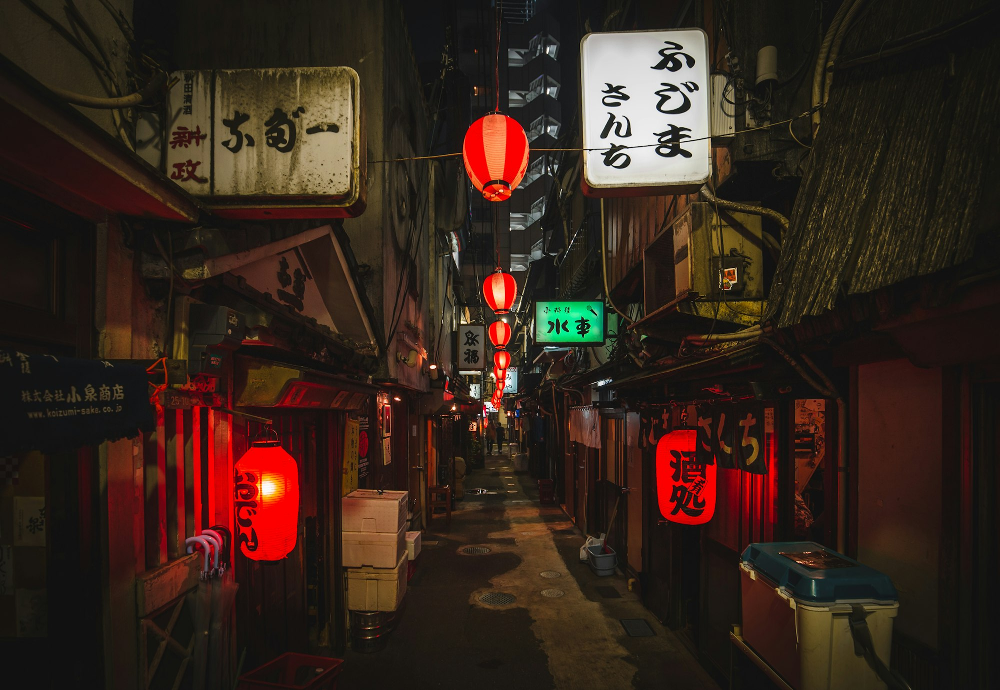
_A look from the streets of Harajuku, near Shibuya — Placeholder_

## A Melting Pot of Subcultures

Shibuya's style is not one single look, but a vibrant mix of numerous subcultures. From the dark, dramatic flair of visual kei to the cute, pastel-colored world of lolita fashion, and the oversized, layered look of modern streetwear, there's a niche for everyone. This diversity is what makes Shibuya so exciting.

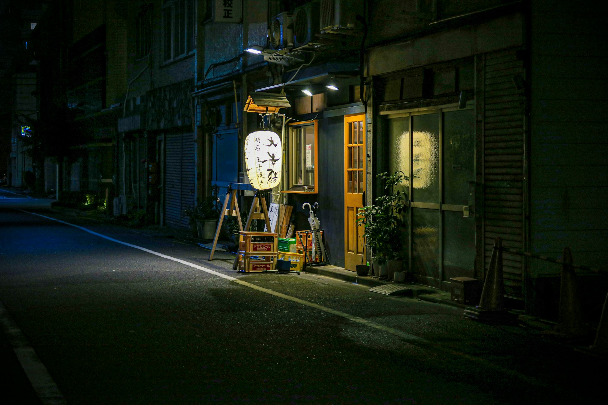
_Layered, oversized silhouettes — Placeholder_

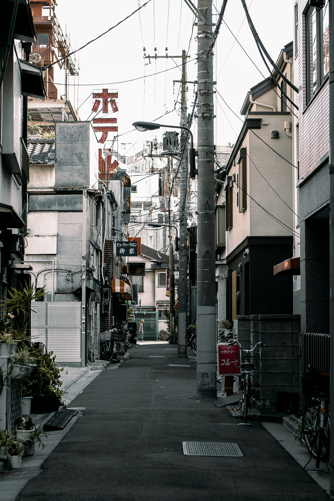
_Colorful and playful accessories — Placeholder_

## The Power of Layering

Layering is a key element of Tokyo street style. It's not just about warmth; it's a way to create complex, interesting silhouettes and to play with textures and proportions. A t-shirt might be worn over a long-sleeved shirt, under a vest, and topped with a jacket.

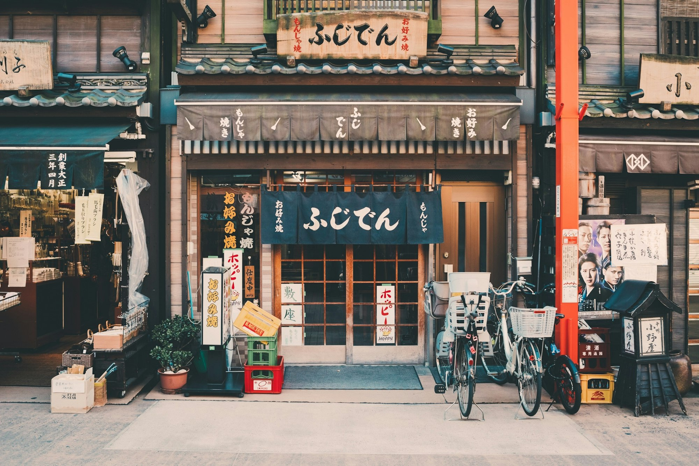
_Masterful layering — Placeholder_

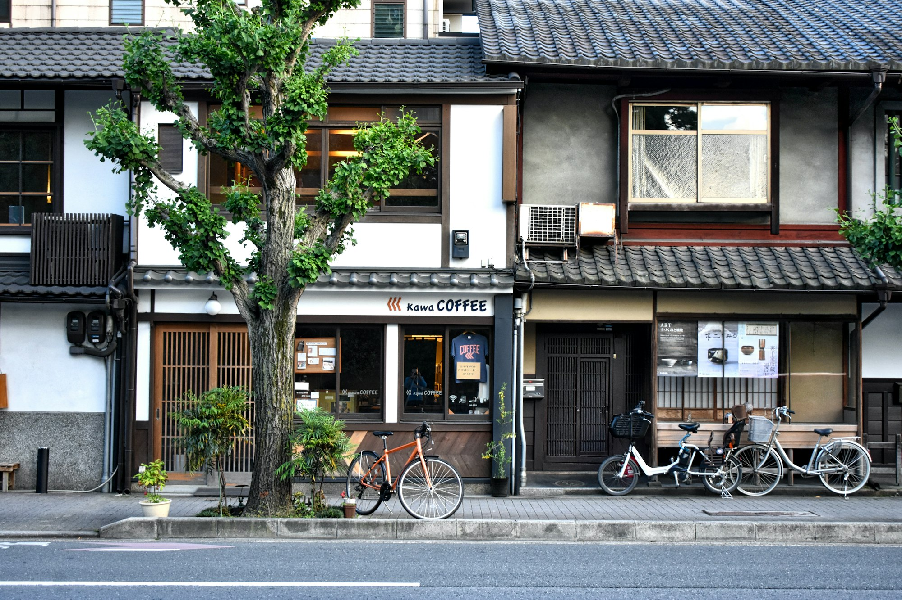
_Mixing textures and patterns — Placeholder_

## Bold Graphics and Logos

Graphic t-shirts, hoodies, and jackets are a staple. Logos are worn proudly, and bold, eye-catching graphics are a way to make a statement and show allegiance to a particular brand or subculture.

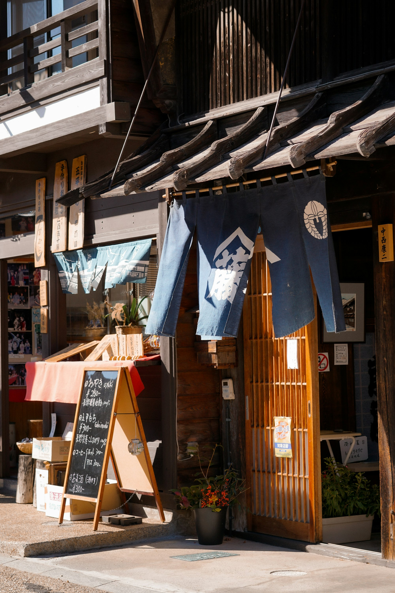
_Statement graphic tee — Placeholder_

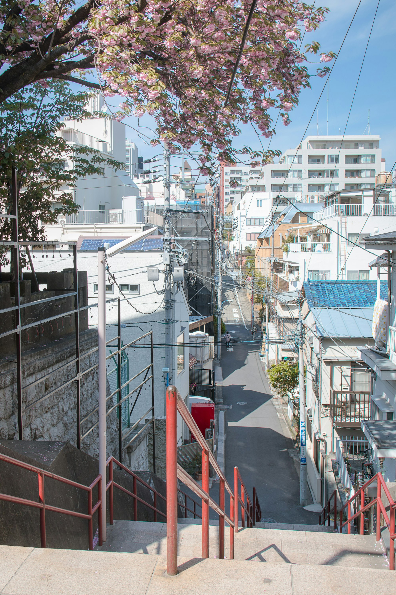
_Logos as a design element — Placeholder_

## Sneakers and Statement Footwear

Sneakers are a huge part of Shibuya style, from the latest limited-edition drops to classic, retro models. But it's not just about sneakers; chunky platform shoes, boots, and other statement footwear are also common, adding height and drama to any outfit.

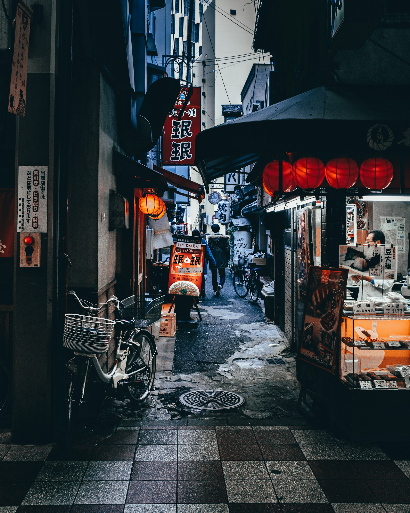
_Limited-edition sneakers — Placeholder_

## Accessorizing to the Max

More is more when it comes to accessories in Shibuya. It's common to see people wearing multiple bags, layers of jewelry, hats, and elaborate hair accessories. Every detail is considered and contributes to the overall look.

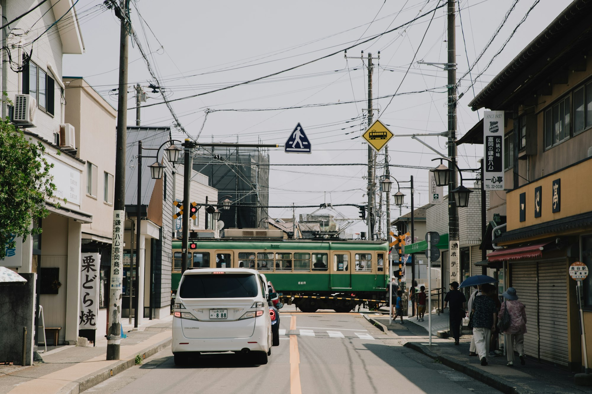
_An array of accessories — Placeholder_

## Hair and Makeup as Fashion

Hair and makeup are just as important as the clothes. Bold, colorful hair, dramatic eye makeup, and intricate nail art are all common forms of self-expression.

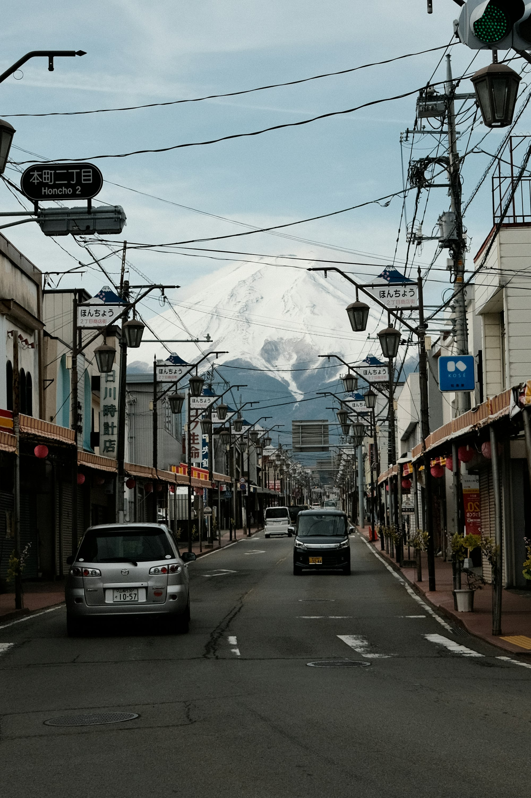
_Colorful, creative hair — Placeholder_

## Where to See the Best Style

- **Shibuya Crossing:** The world's most famous intersection is a prime spot for people-watching.
- **Center Gai:** A pedestrian street packed with shops and young people.
- **Harajuku (Takeshita Street):** Just a short walk from Shibuya, this is the heart of kawaii culture.
- **Cat Street:** A more relaxed, boutique-lined street connecting Shibuya and Harajuku.

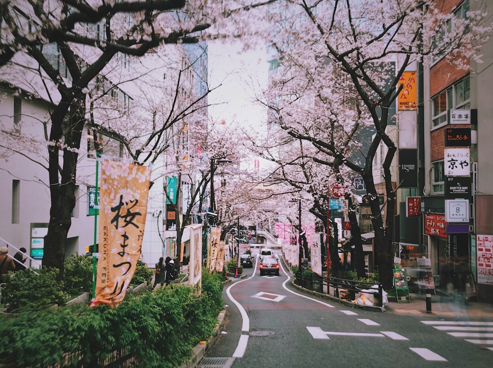
_The energy of the Scramble Crossing — Placeholder_

## Key Shibuya Style Elements

- **Be fearless:** Don't be afraid to experiment and stand out.
- **Embrace subcultures:** Find your niche and go all in.
- **Layer up:** Play with different combinations of clothes.
- **Accessorize freely:** More is more.
- **Have fun:** Fashion should be a source of joy and creativity.

Shibuya's street style is a powerful reminder that fashion is about more than just clothes; it's about community, identity, and the freedom to be yourself.

—

Credits are embedded in each caption (Placeholder). After selecting specific images, replace with photographer names/links as needed.
