Skateboarding blends creativity and athleticism with a do‑it‑yourself spirit. From crusty street spots to smooth park bowls, it’s about progression, persistence, and personal style. This photo-driven piece rolls through culture, spots, gear, and the core skills that build confidence and flow.

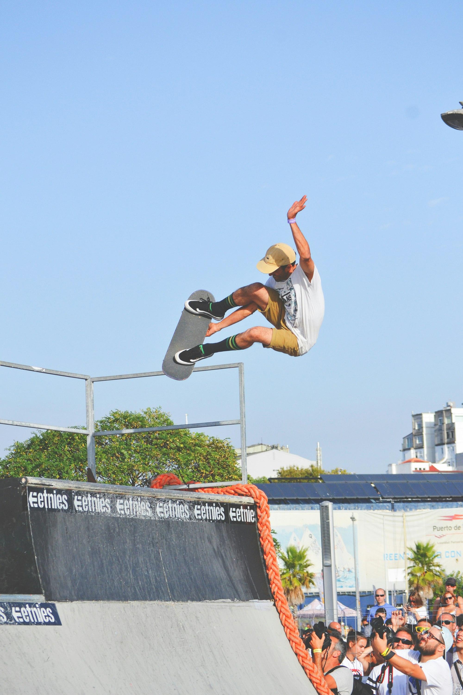
_First push, fresh pavement — Placeholder_

## Culture: DIY Roots and Respect

Skateboarding grew from garage ramps and street missions. Respect the spot, take turns, and back each other up — progression is a crew sport.

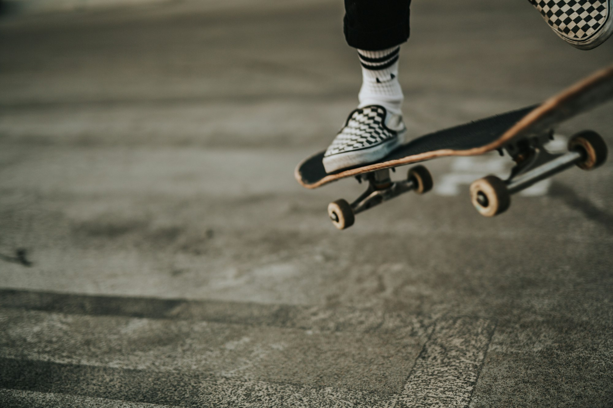
_Session energy — Placeholder_

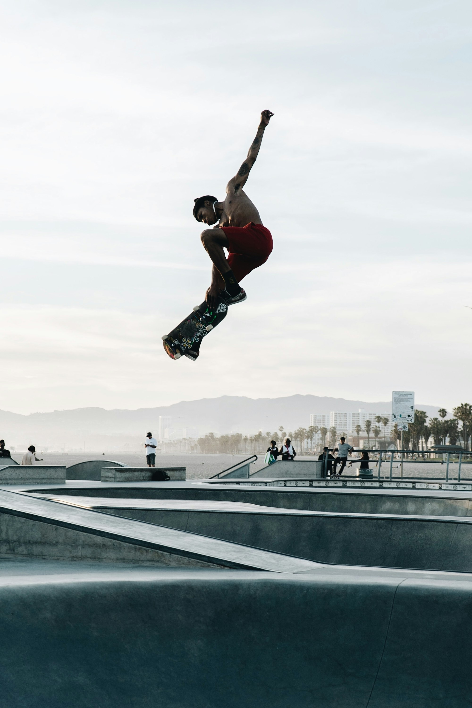
_Street mission — Placeholder_

## Spots: Street, Park, and Bowl

- **Street:** Ledges, rails, stairs, manuals — the city is your canvas.
- **Parks:** Flow lines, hips, and spines built for progression.
- **Bowls/Pools:** Carve, grind, and pump for speed without pushing.

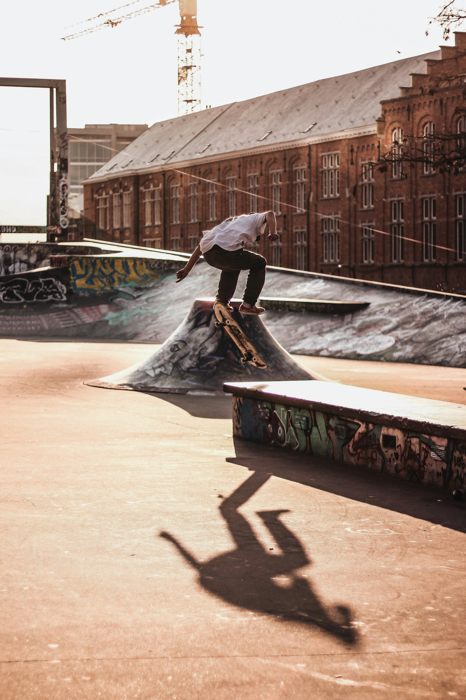
_Ledge line — Placeholder_

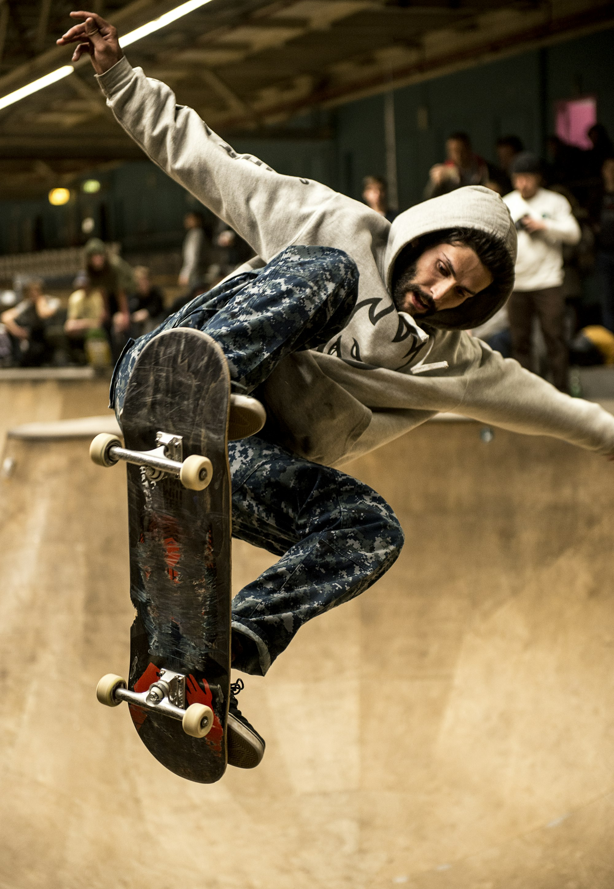
_Bowl carve — Placeholder_

## Gear: Board, Trucks, Wheels, Shoes

Deck width matches feel and shoe size; trucks should fit deck width; wheel duros trade grip for speed; skate shoes with reinforced ollie areas last longer.

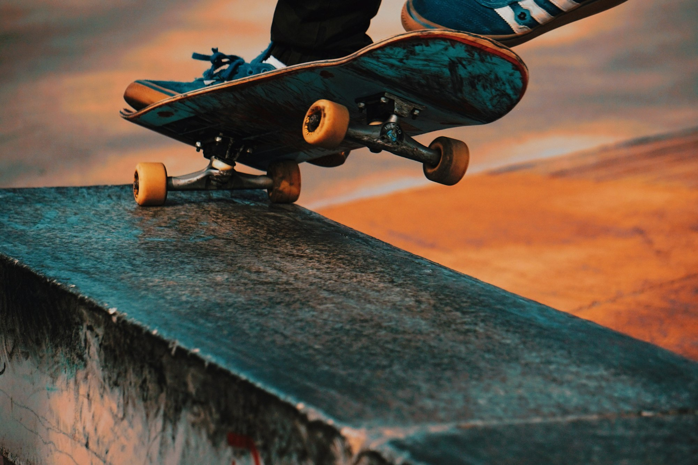
_Setup on the curb — Placeholder_

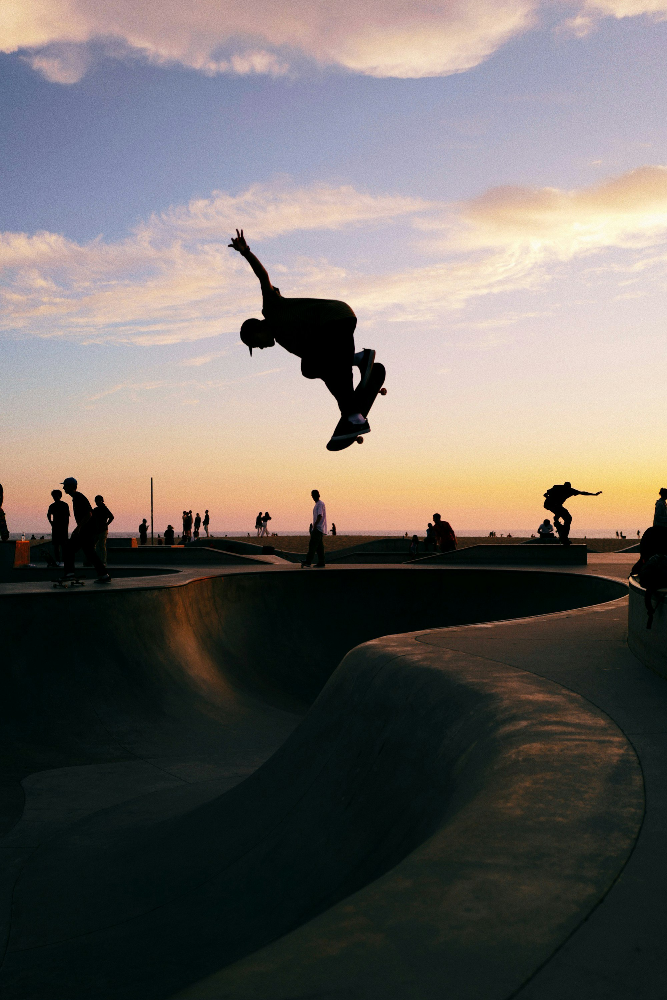
_Well-worn shoes — Placeholder_

## Foundation: Balance, Push, and Ollie

Master stance, smooth push, and stable stops. The ollie unlocks manuals, ledges, and stair sets — practice timing, pop, and slide.

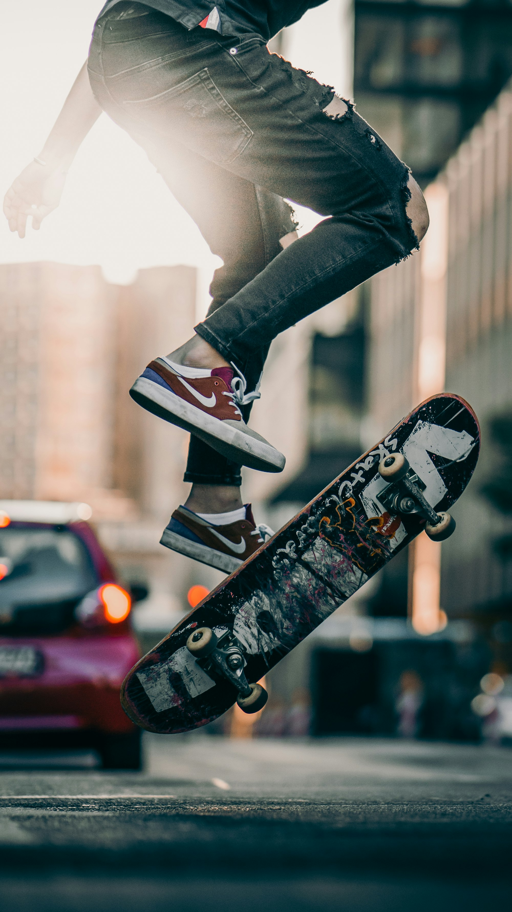
_Ollie timing — Placeholder_

## Building Lines: Flow and Consistency

Link tricks with speed control: pump transitions, keep shoulders aligned, and look through landings. Consistency beats single bangers.

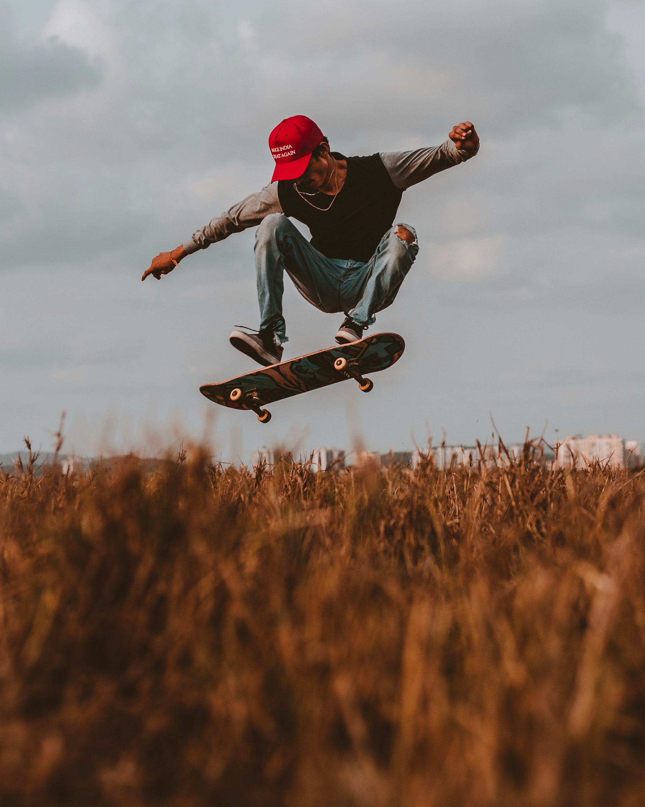
_Linking tricks — Placeholder_

## Safety and Etiquette

Warm up, fall smart, and give way. Helmets and pads help you skate longer; wax respectfully and clean up the spot.

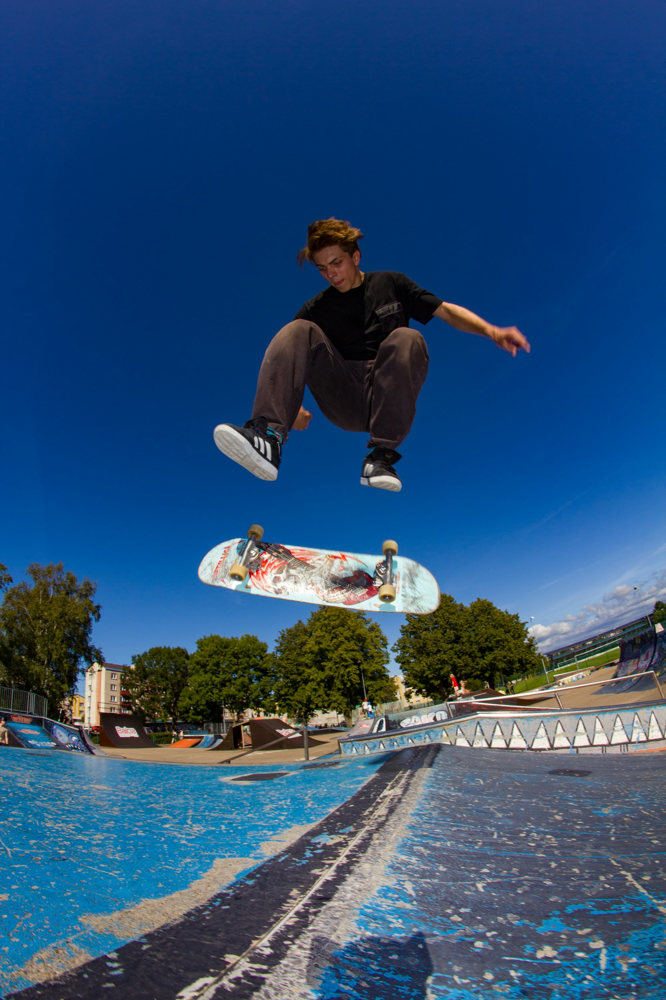
_Helmet and pads, still steezy — Placeholder_

## Quick Tips to Progress

- **Reps over perfection:** Short, focused tries build muscle memory.
- **Film yourself:** Spot posture and timing tweaks.
- **Skate with friends:** Feedback and stoke accelerate learning.
- **Maintain gear:** Fresh bearings and wheels keep speed alive.

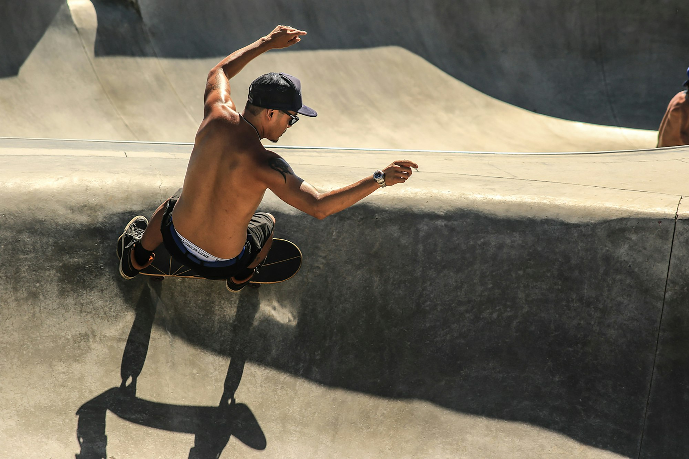
_Golden-hour cruise home — Placeholder_

Skateboarding rewards creativity and consistency. Keep pushing — every session writes a new line.

—

Credits are embedded in each caption (Placeholder). After selecting specific images, replace with photographer names/links as needed.

