Surfing is more than a sport — it’s a rhythm. A cycle of swell, wind, tide, and patience that rewards presence and humility. This photo-driven piece glides through surf culture, essential gear, common wave types, and practical tips to keep the stoke high and wipeouts low.

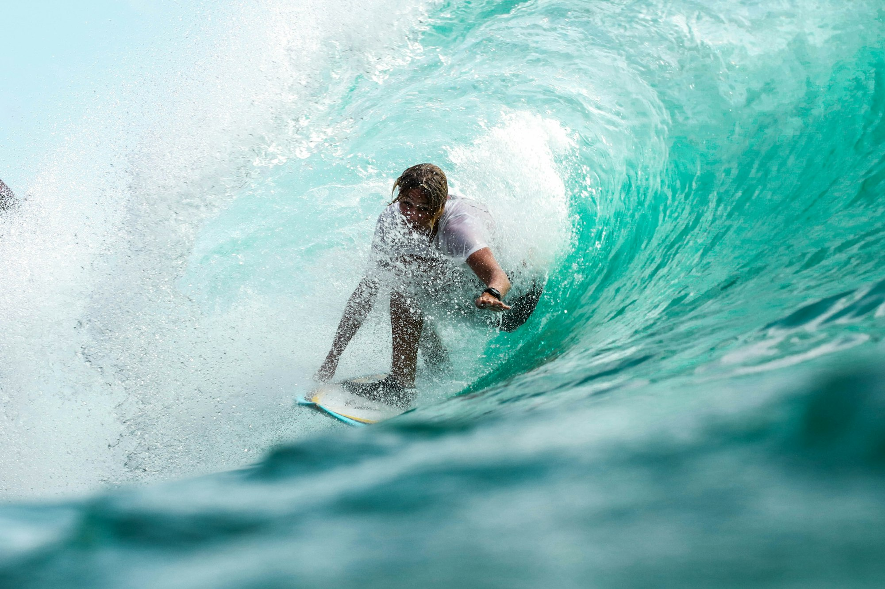
_First light, glassy lines — Placeholder_

## Culture: Lineup, Respect, and Stoke

The lineup is community. Respect the right of way, don’t drop in, and share waves. Stoke spreads: a hoot for a friend’s ride often returns as good karma for your next set.

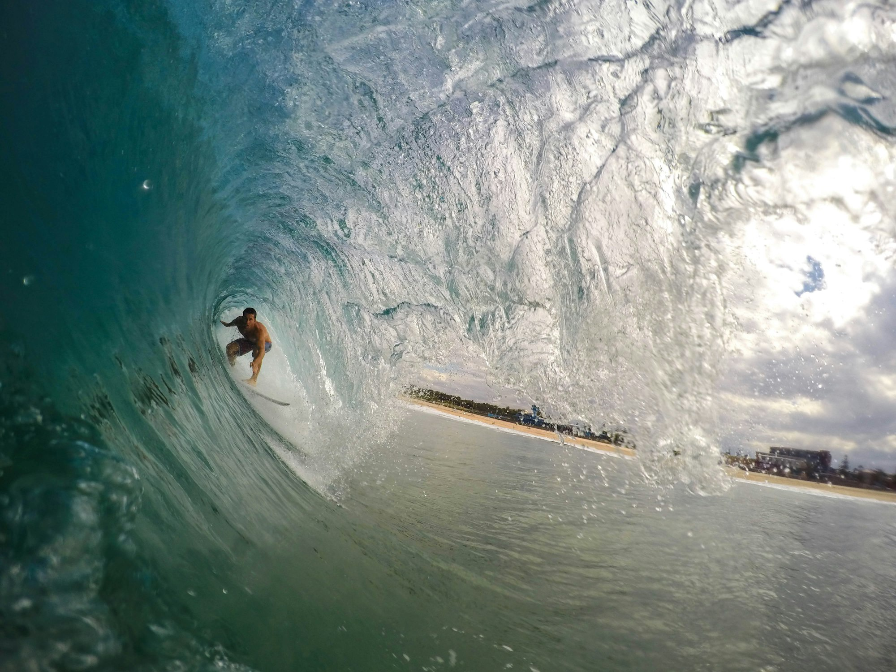
_Sharing the peak — Placeholder_

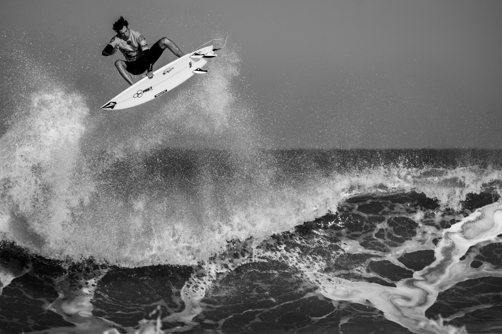
_Between sets — Placeholder_

## Gear: The Right Tool for the Wave

From foamies to performance shortboards, logs to fish, each board matches a style and condition. Wetsuit thickness follows water temp; leashes, wax, and fins round out the kit.

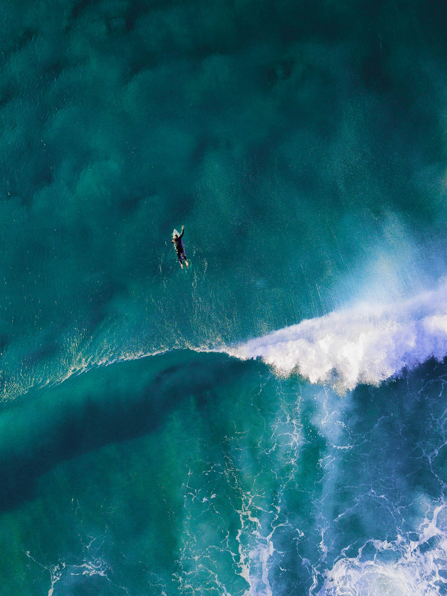
_Quiver on the sand — Placeholder_

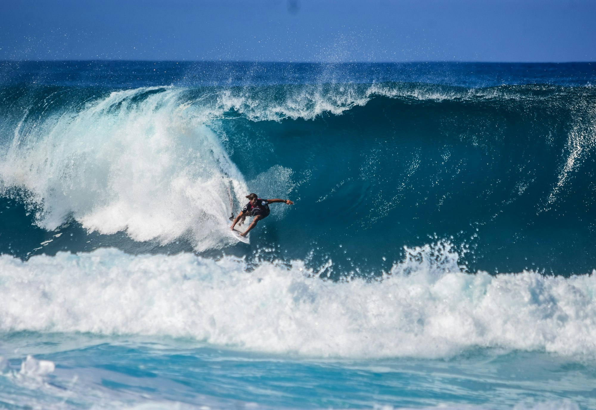
_Suiting up — Placeholder_

## Reading Waves: Peel, Pocket, and Power

Learn to spot the peak, shoulder, and closeout. Angle your takeoff, stay in the pocket for speed, then open your shoulders to carve.

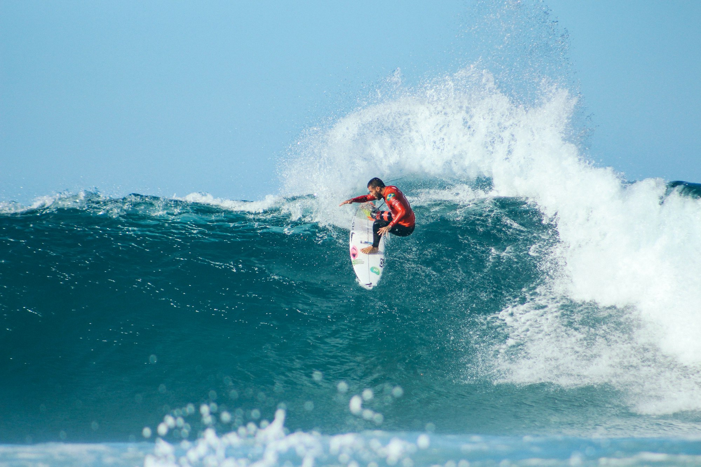
_Clean peel — Placeholder_

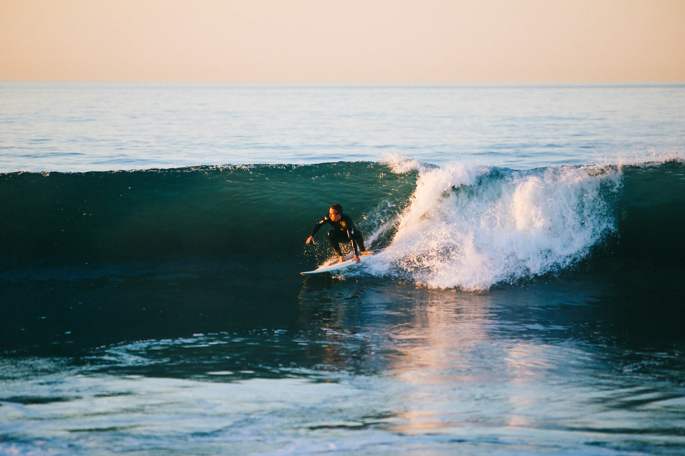
_Down the line — Placeholder_

## Sessions: Dawn Patrol to Golden Hour

Early sessions bring lighter wind and fewer crowds; sunset glass-off can be magic. Check swell period, wind direction, and tides — conditions beat forecasts.

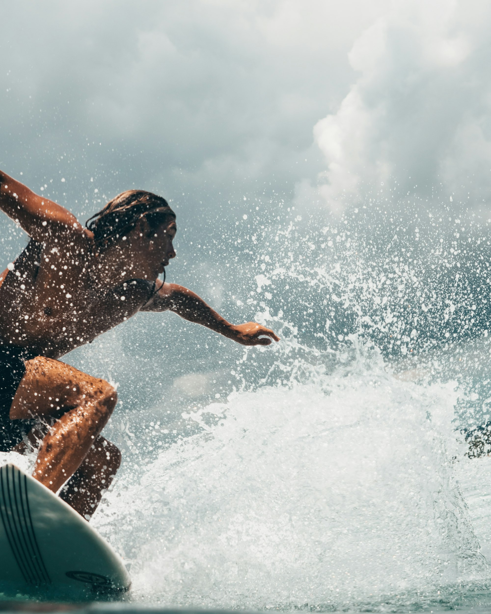
_Dawn patrol silhouettes — Placeholder_

## Safety and Etiquette

Warm up, mind your leash, and keep control of your board. Respect locals, rotate waves, and help if someone’s in trouble.

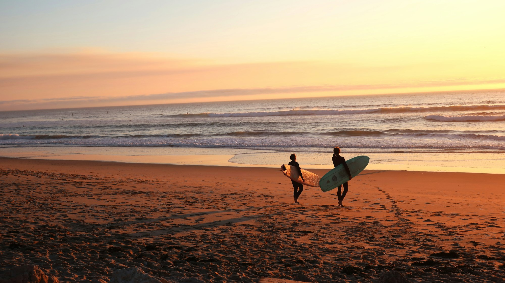
_Respect the lineup — Placeholder_

## Longboard vs Shortboard

Longboards glide, cross-step, and trim. Shortboards pivot, snap, and fit in tight pockets. Ride what keeps you smiling.

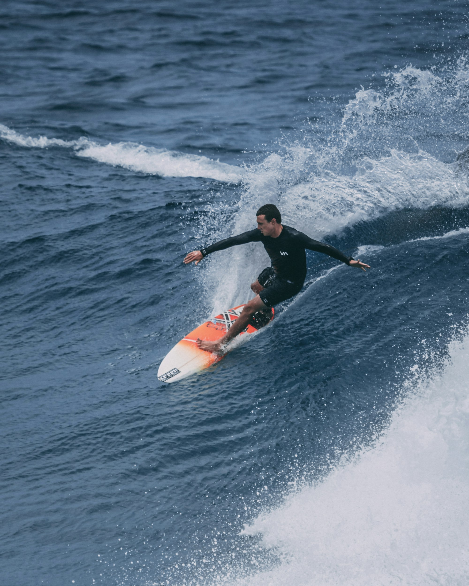
_Noseride glide — Placeholder_

## Where to Find Waves

- **Beach breaks:** Sand-bottom, forgiving, ever-changing banks.
- **Point breaks:** Long, peeling rides with defined takeoff zones.
- **Reef breaks:** Powerful, mechanical waves — for confident surfers.

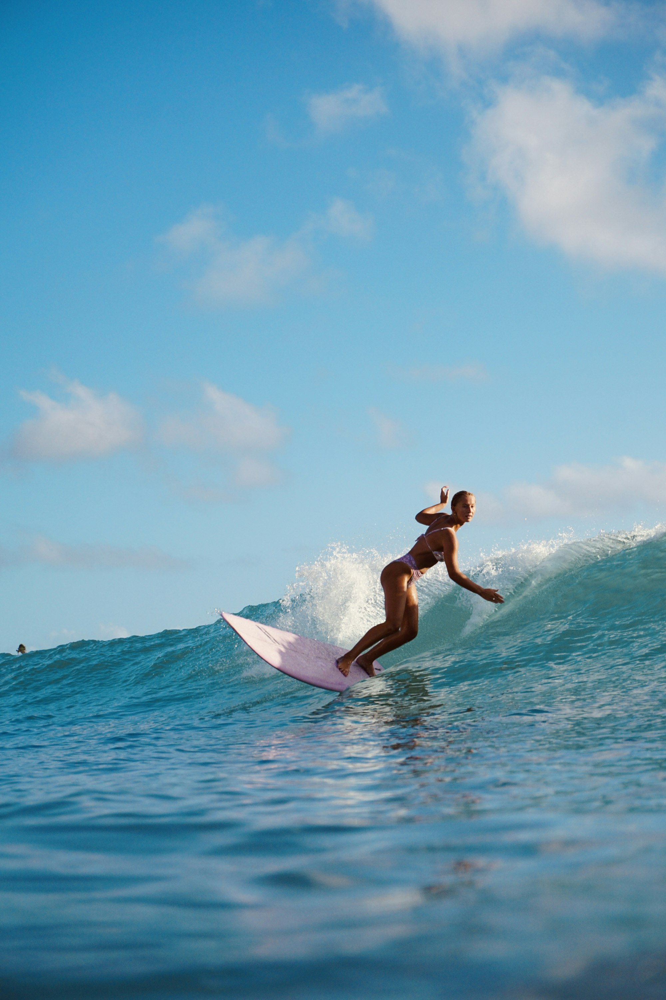
_Golden-hour lineup — Placeholder_

## Quick Tips for Progress

- **Paddle smart:** Long, steady strokes; chin low; toes together.
- **Pop-up clean:** Look where you’re going; hands by ribs; decisive movement.
- **Stay high, stay fast:** Use the pocket; don’t outrun the wave.
- **Eyes lead turns:** Hips and shoulders follow your gaze.
- **Have fun:** Stoke beats stats. Celebrate small wins.

Surfing rewards patience. Keep showing up — the ocean always has another lesson (and another wave).

—

Credits are embedded in each caption (Placeholder). After selecting specific images, replace with photographer names/links as needed.

