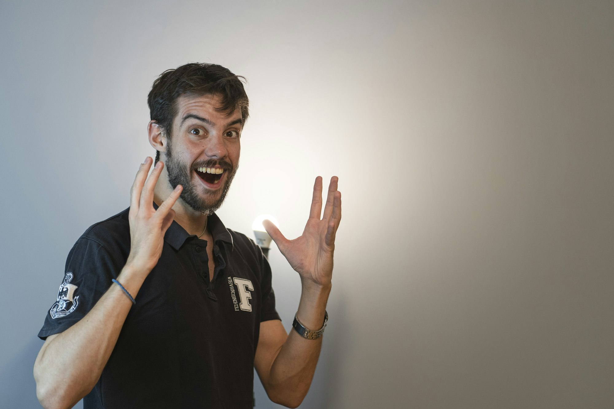

YouTube rewards clarity, consistency, and care. From shaping an idea to shipping a thumbnail, creators win by respecting viewers’ time and iterating with data. This photo-driven primer covers the workflow end-to-end.

_Idea to outline — Placeholder_

## Ideas and Scripting

Start with a clear promise (title/thumbnail). Outline beats: hook in 5–8s, context, steps or story, takeaway. Keep scenes short; write for ear, not eye.

_Hook first — Placeholder_

_Readable outline — Placeholder_

## Filming: Light, Framing, Camera

Prioritize lighting over gear: key, fill, background separation. Mind eyeline, headroom, and clean backgrounds. Lock exposure and white balance.

_Soft key light — Placeholder_

_Framing and eyeline — Placeholder_

## Audio: Mic and Space

Use a lav or shotgun close to source. Treat the room (rugs, foam), kill fans, and monitor with headphones. Record room tone for cleaner edits.

_Mic placement — Placeholder_

_Quiet room setup — Placeholder_

## Editing and Pace

Cut breaths and filler, punch in for emphasis, add b‑roll for clarity. Maintain rhythm with music under -18 to -14 LUFS; mix dialogue up front.

_Edit timeline — Placeholder_

## Thumbnails and Titles

Design for small screens: bold subject, few words, high contrast. Align title + thumb promise with first 30s of content.

_Thumbnail design — Placeholder_

## Publishing and Analytics

Ship consistently; schedule to audience time zones. Watch CTR, AVD, and retention dips; test titles/thumbs; pin comments with key links.

_Studio analytics — Placeholder_

## Community and Growth

Reply early comments, ask for examples, and collaborate. Build an email list; repurpose shorts/clips; keep improving your first minute.

_Set ready, let’s roll — Placeholder_

The loop is simple: promise clearly, deliver fast, learn honestly. Iterate one lever at a time; your library compounds.

—

Credits are embedded in each caption (Placeholder). After selecting specific images, replace with photographer names/links as needed.

