New York City doesn’t ask for style credentials—it creates them. From subway platforms to Soho cobblestones, the city’s sidewalks are an endless runway powered by attitude, utility, and improvisation. This photo-forward walkthrough captures slices of that energy.

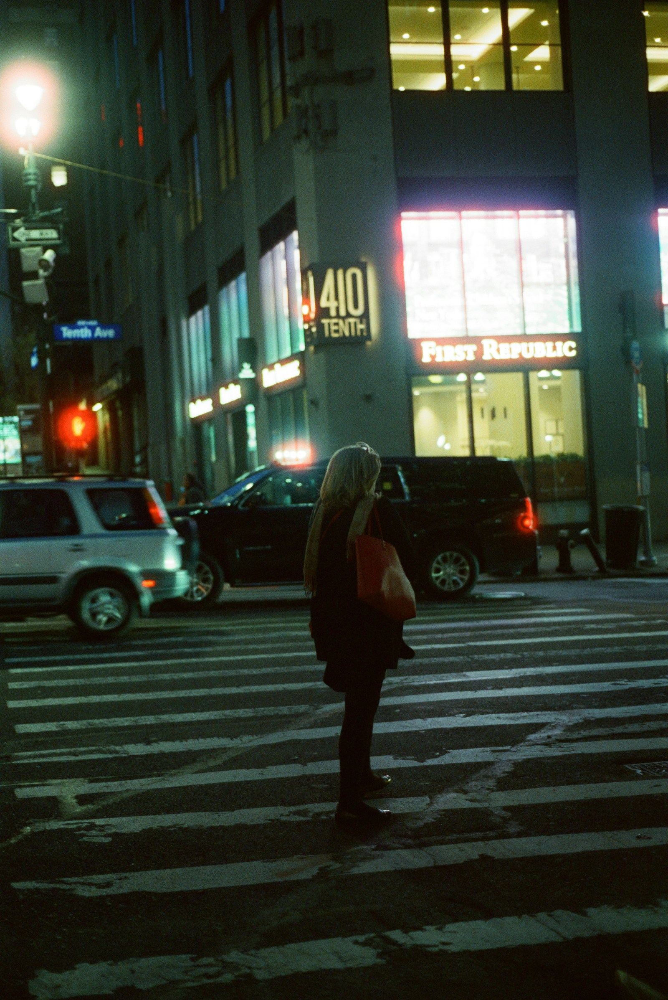
_Downtown stride in layered neutrals — Placeholder_

## Neighborhood Vibes

NYC style bends to the block you’re on. Downtown favors unexpected layers and clever tailoring; Brooklyn turns up the texture; Uptown sets the pace with luxury twists. The result is a constant remix.

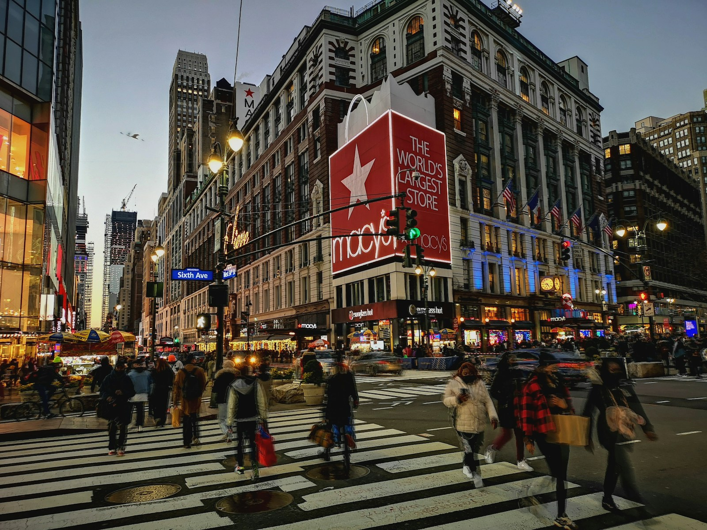
_Soho doorway, sharp silhouettes — Placeholder_

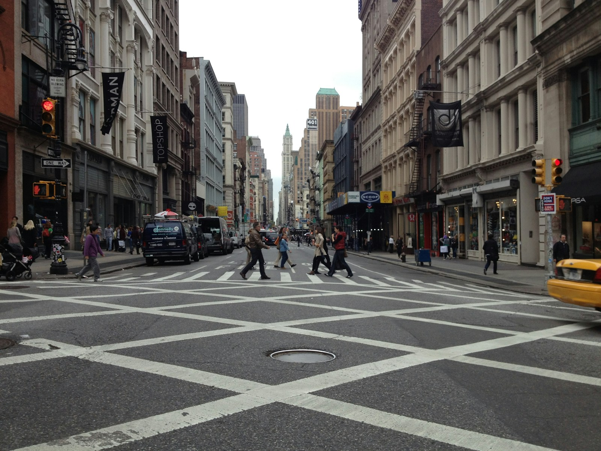
_Cobblestones and statement boots — Placeholder_

## Sneaker Culture, Everywhere

Hype pairs with practicality. You’ll see archival runners, pristine retro courts, and limited drops sharing the same train car—often styled with workwear, denim, or minimal suiting.

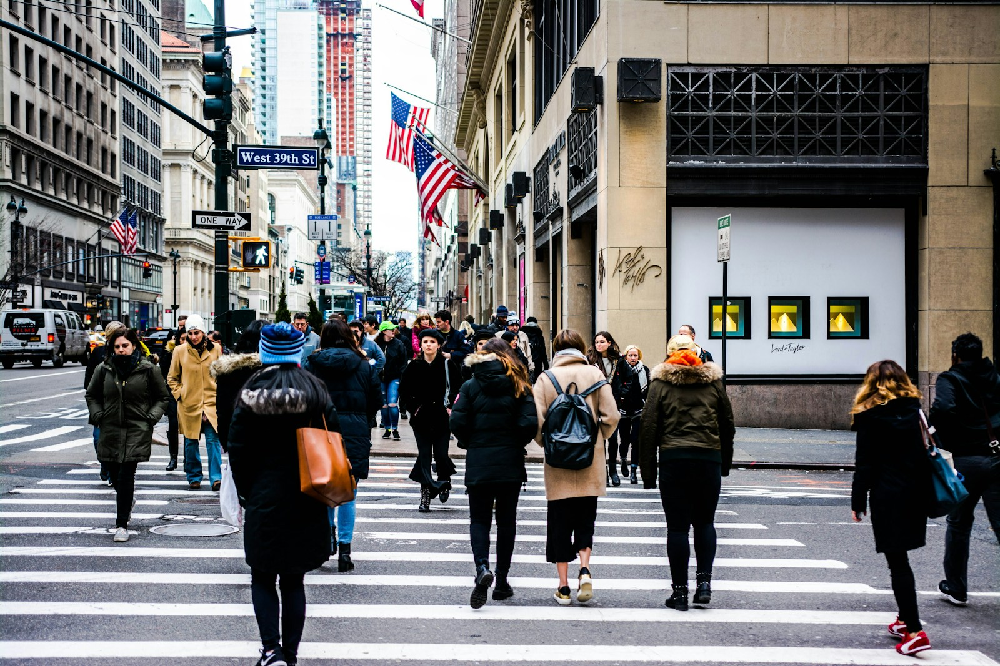
_Transit steps, bold sneakers — Placeholder_

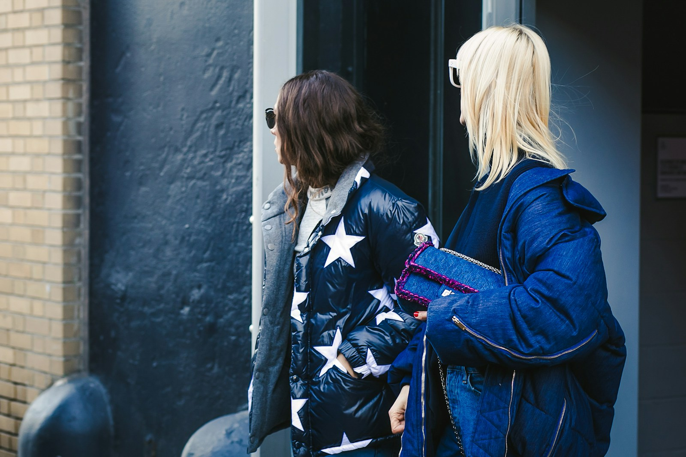
_Laces and lived-in denim — Placeholder_

## Statement Outerwear

The city is a masterclass in coats—trench, leather, puffer, and tailored topcoats. Cuts run oversized and expressive; fabrics swing from glossy technical to heavy wool.

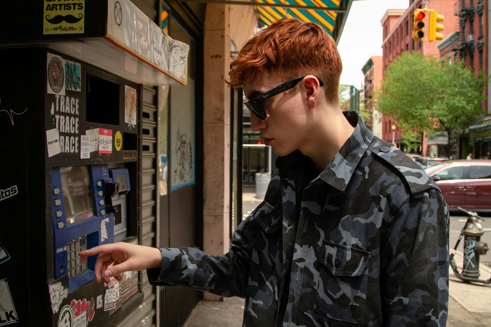
_Oversized coat and tote — Placeholder_

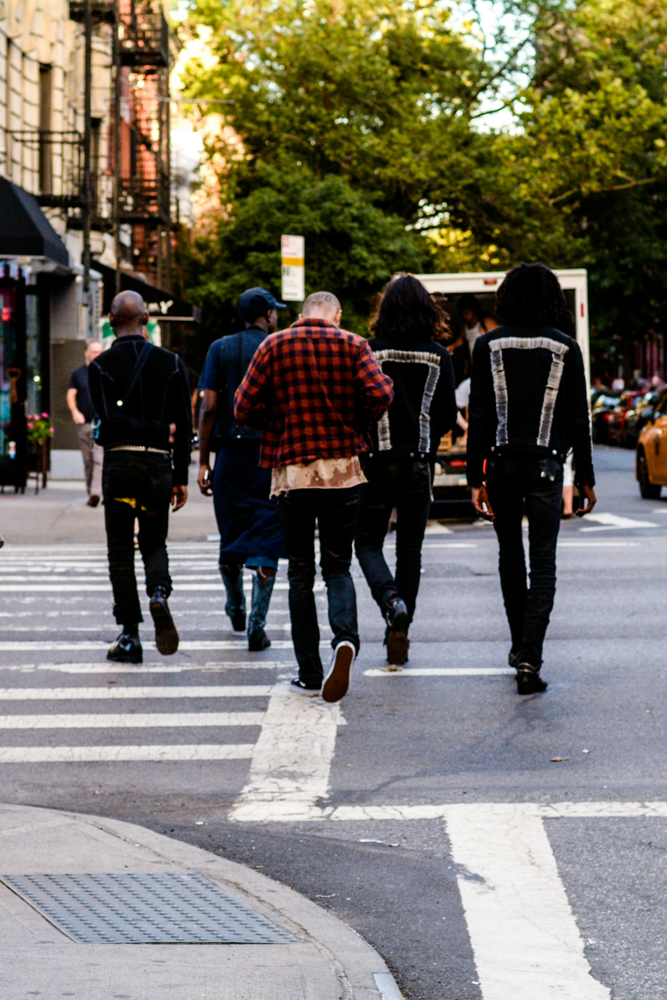
_Leather jacket, clean lines — Placeholder_

## Vintage, Thrift, Remix

Thrift finds meet new-season drops. A quilted liner over a crisp oxford. A varsity jacket paired with pleated trousers. NYC’s thrift racks fuel endless recombinations.

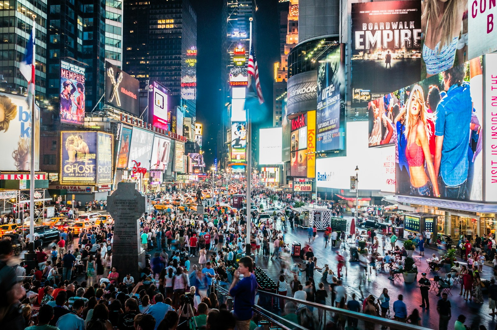
_Varsity jacket on Prince Street — Placeholder_

## Minimal Monochrome

For every loud graphic, there’s a head-to-toe monochrome look with careful proportion play. Black-on-black remains a love language.

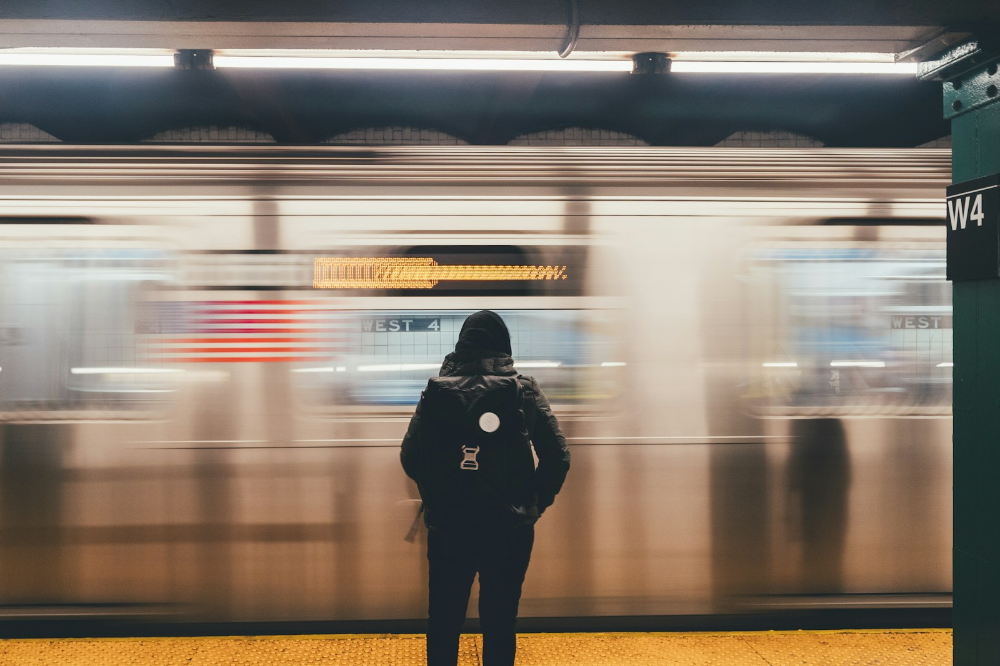
_Monochrome with strong proportions — Placeholder_

## Accessories as Punctuation

Small details—caps, micro bags, stacked necklaces—do heavy lifting. Sunglasses sharpen lines; beanies soften them. Belts and buckles define the silhouette.

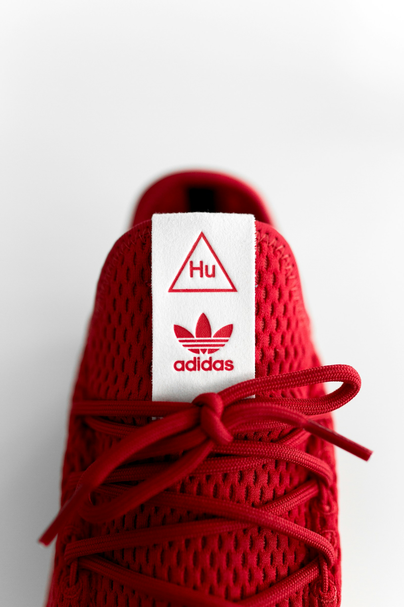
_Micro bag, maximal impact — Placeholder_

## Where to Spot It

- Soho mid-mornings for luxury-streetwear mashups.
- Bushwick and Williamsburg weekends for indie textures.
- Midtown weekday rush for practical tailoring.
- Lower East Side nights for nightlife-forward looks.

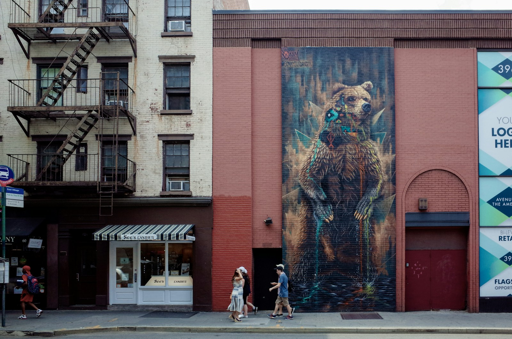
_Crosswalk choreography — Placeholder_

## Seasonal Shifts

Winter: technical layers, scarves, and thick soles. Spring: light trenches and cardigans. Summer: airy fabrics and shorts with loafers. Fall: the grand return of outerwear.

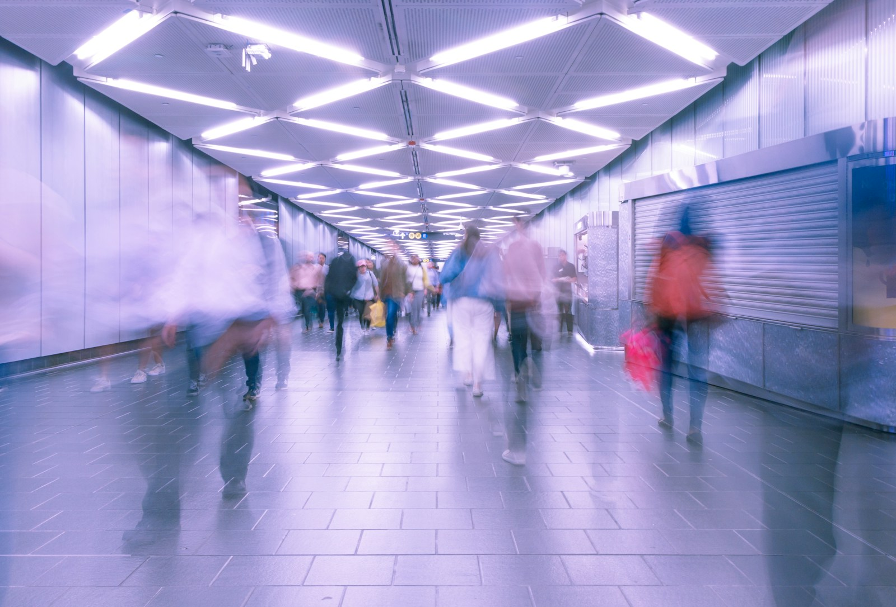
_Autumn layers on Lafayette — Placeholder_

## Quick Style Notes

- Focus on silhouette: balance wide tops with tapered bottoms—or invert it.
- Mix textures: leather with knit, nylon with wool, denim with everything.
- Elevate basics: crisp t-shirts, clean sneakers, quality socks.
- Own the commute: bags and shoes should be built for movement.

NYC street fashion thrives because it’s lived-in, not staged. It’s practical, expressive, and constantly in motion—just like the city.

—

Credits are embedded in each caption (Placeholder). After selecting specific images, replace with photographer names/links as needed.
